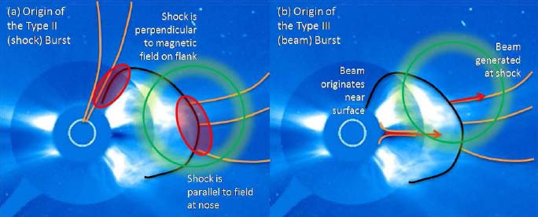

# 01_太空电梯与月球运输 - 图片索引

> 本索引由 arXiv 学术论文图表提取器自动生成
> 生成时间: 2026-02-01 23:08:42

## 统计
- 论文数量: 1
- 图片数量: 4

---

## 📄 Science from the Moon: The NASA/NLSI Lunar University Network for Astrophysics Research (LUNAR)

| 属性 | 值 |
|-----|-----|
| **arXiv ID** | [0909.1509v1](http://arxiv.org/abs/0909.1509v1) |
| **作者** | Jack O. Burns, the LUNAR Consortium |
| **发布日期** | 2009-09-08 |
| **PDF链接** | [下载PDF](https://arxiv.org/pdf/0909.1509v1) |

### 提取的图片 (4张)

| 预览 | 文件名 | 页码 | 格式 |
|------|--------|------|------|
|  | `0909_1509v1_p1_img1.jpeg` | 第1页 | JPEG |
|  | `0909_1509v1_p3_img1.png` | 第3页 | PNG |
|  | `0909_1509v1_p3_img2.png` | 第3页 | PNG |
|  | `0909_1509v1_p6_img1.jpeg` | 第6页 | JPEG |

---

