# 06_生命周期评估LCA - 图片索引

> 本索引由 arXiv 学术论文图表提取器自动生成
> 生成时间: 2026-02-01 23:09:38

## 统计
- 论文数量: 3
- 图片数量: 26

---

## 📄 Large Interferometer For Exoplanets (LIFE): IV. Ideal kernel-nulling array architectures for a space-based mid-infrared nulling interferometer

| 属性 | 值 |
|-----|-----|
| **arXiv ID** | [2201.04891v3](http://arxiv.org/abs/2201.04891v3) |
| **作者** | Jonah T. Hansen, Michael J. Ireland, the LIFE Collaboration et al. |
| **发布日期** | 2022-01-13 |
| **PDF链接** | [下载PDF](https://arxiv.org/pdf/2201.04891v3) |

### 提取的图片 (11张)

| 预览 | 文件名 | 页码 | 格式 |
|------|--------|------|------|
|  | `2201_04891v3_p4_img1.png` | 第4页 | PNG |
| 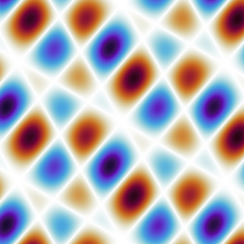 | `2201_04891v3_p4_img3.png` | 第4页 | PNG |
| 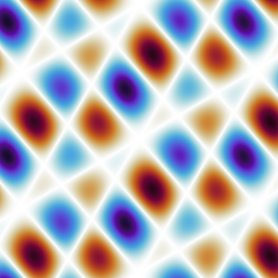 | `2201_04891v3_p4_img5.png` | 第4页 | PNG |
|  | `2201_04891v3_p4_img7.png` | 第4页 | PNG |
| 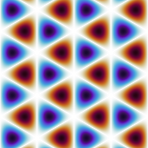 | `2201_04891v3_p4_img9.png` | 第4页 | PNG |
|  | `2201_04891v3_p5_img1.png` | 第5页 | PNG |
| 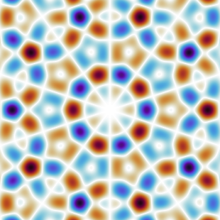 | `2201_04891v3_p5_img3.png` | 第5页 | PNG |
|  | `2201_04891v3_p5_img5.png` | 第5页 | PNG |
| 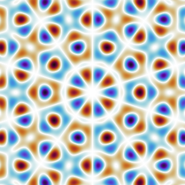 | `2201_04891v3_p5_img7.png` | 第5页 | PNG |
| 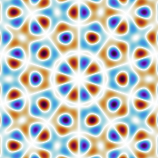 | `2201_04891v3_p5_img9.png` | 第5页 | PNG |
|  | `2201_04891v3_p5_img11.png` | 第5页 | PNG |

---

## 📄 Toxicity of Carbon Nanomaterials

| 属性 | 值 |
|-----|-----|
| **arXiv ID** | [2109.13918v1](http://arxiv.org/abs/2109.13918v1) |
| **作者** | Arpita Adhikari, Joydip Sengupta |
| **发布日期** | 2021-09-20 |
| **PDF链接** | [下载PDF](https://arxiv.org/pdf/2109.13918v1) |

### 提取的图片 (13张)

| 预览 | 文件名 | 页码 | 格式 |
|------|--------|------|------|
|  | `2109_13918v1_p2_img1.jpeg` | 第2页 | JPEG |
|  | `2109_13918v1_p4_img1.jpeg` | 第4页 | JPEG |
|  | `2109_13918v1_p4_img2.jpeg` | 第4页 | JPEG |
|  | `2109_13918v1_p5_img5.jpeg` | 第5页 | JPEG |
| 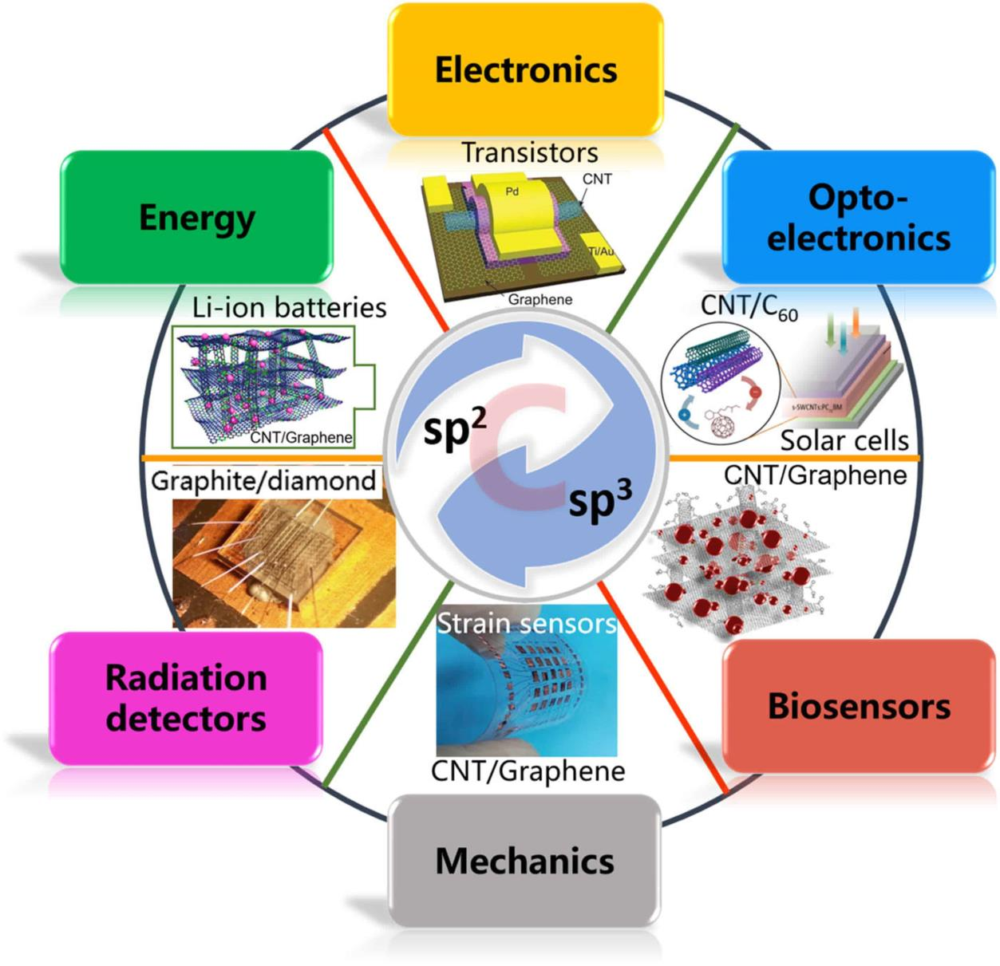 | `2109_13918v1_p6_img1.jpeg` | 第6页 | JPEG |
| 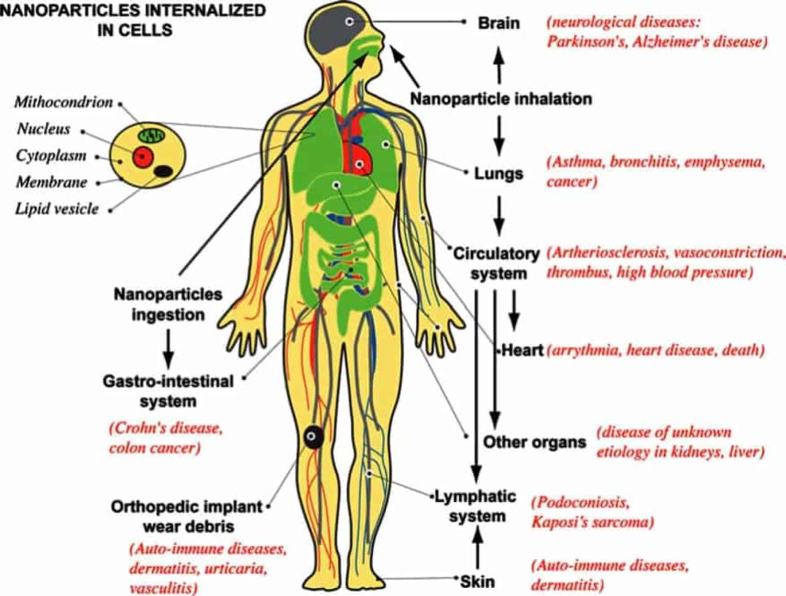 | `2109_13918v1_p9_img1.jpeg` | 第9页 | JPEG |
| 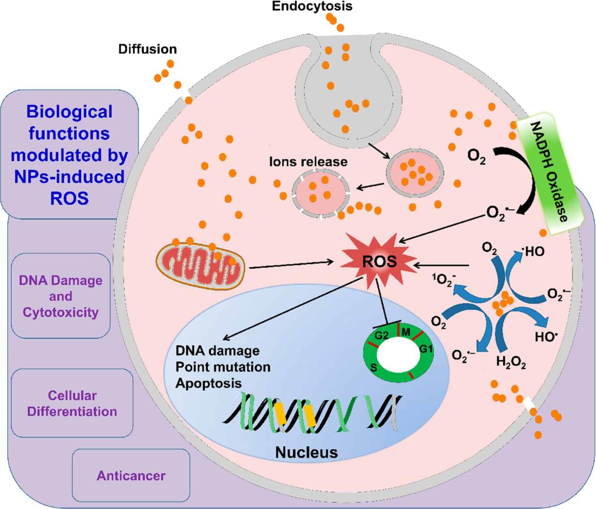 | `2109_13918v1_p12_img1.jpeg` | 第12页 | JPEG |
|  | `2109_13918v1_p13_img1.jpeg` | 第13页 | JPEG |
| 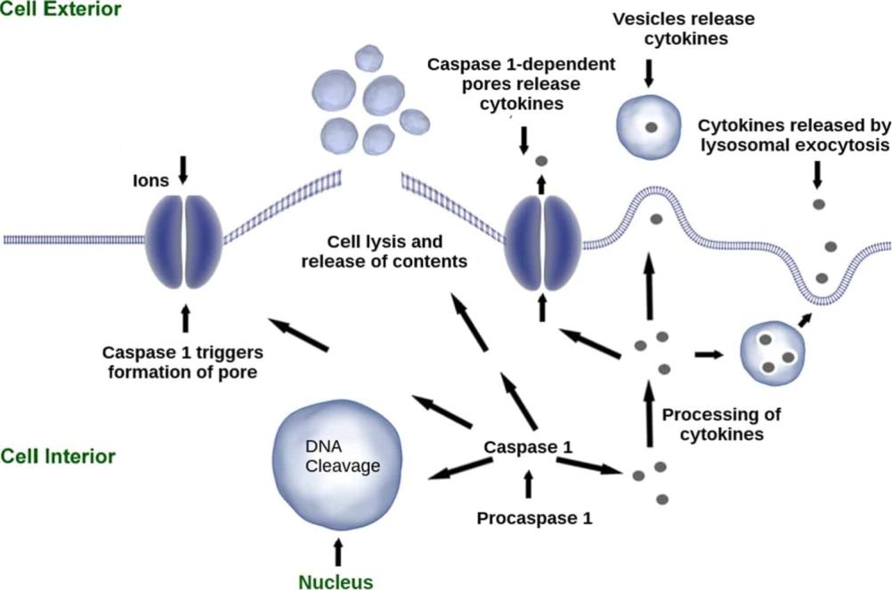 | `2109_13918v1_p13_img2.jpeg` | 第13页 | JPEG |
|  | `2109_13918v1_p14_img1.jpeg` | 第14页 | JPEG |
|  | `2109_13918v1_p14_img2.jpeg` | 第14页 | JPEG |
| 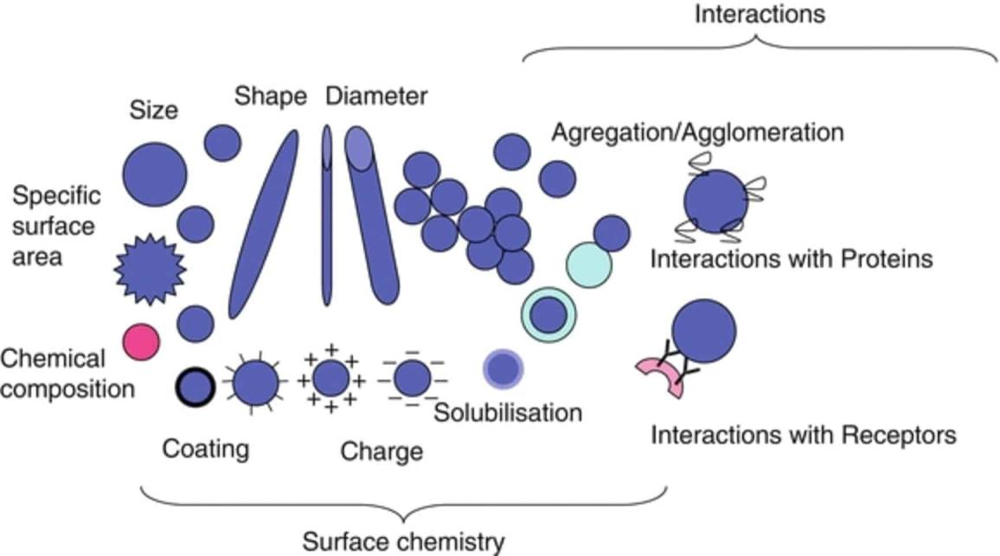 | `2109_13918v1_p15_img1.jpeg` | 第15页 | JPEG |
|  | `2109_13918v1_p15_img2.jpeg` | 第15页 | JPEG |

---

## 📄 Encapsulating C59N azafullerene derivatives inside single-wall carbon nanotubes

| 属性 | 值 |
|-----|-----|
| **arXiv ID** | [0602636v1](http://arxiv.org/abs/cond-mat/0602636v1) |
| **作者** | F. Simon, H. Kuzmany, J. Bernardi et al. |
| **发布日期** | 2006-02-27 |
| **PDF链接** | [下载PDF](https://arxiv.org/pdf/cond-mat/0602636v1) |

### 提取的图片 (2张)

| 预览 | 文件名 | 页码 | 格式 |
|------|--------|------|------|
| 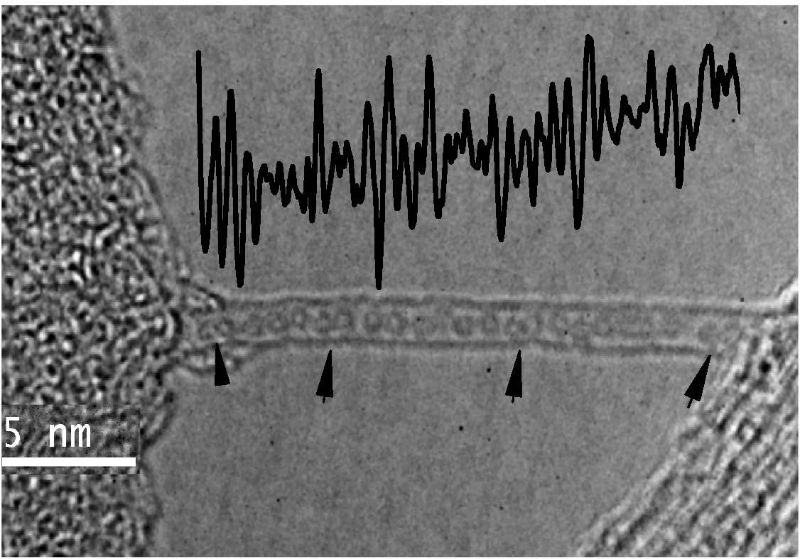 | `0602636v1_p2_img1.jpeg` | 第2页 | JPEG |
| 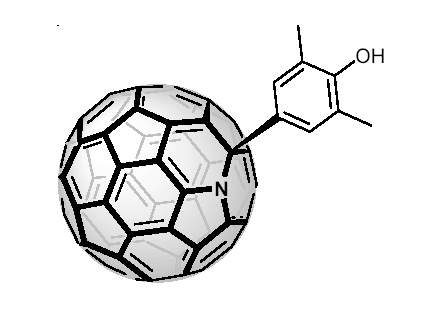 | `0602636v1_p2_img2.png` | 第2页 | PNG |

---

