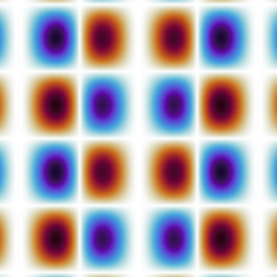
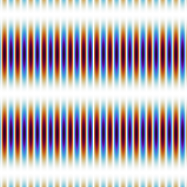
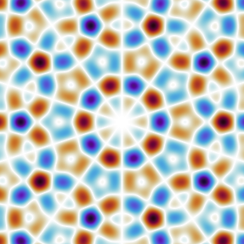
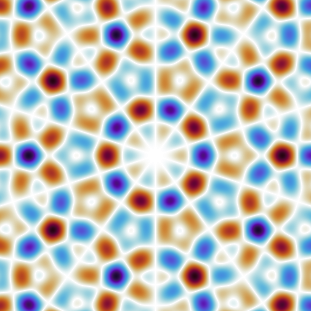
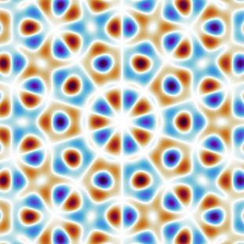
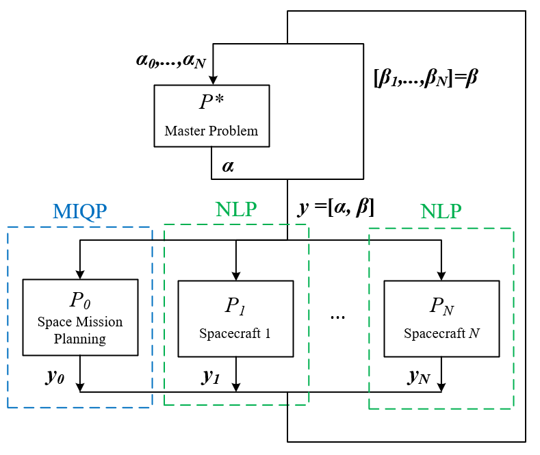
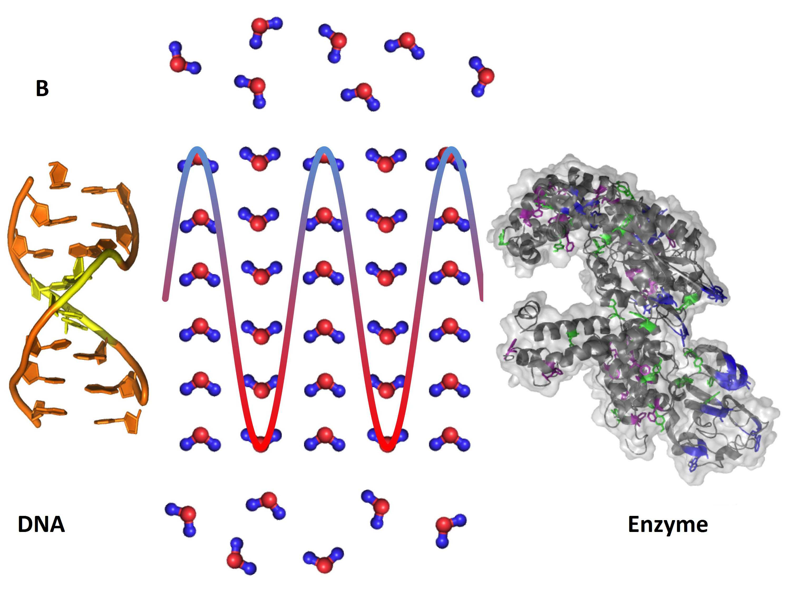
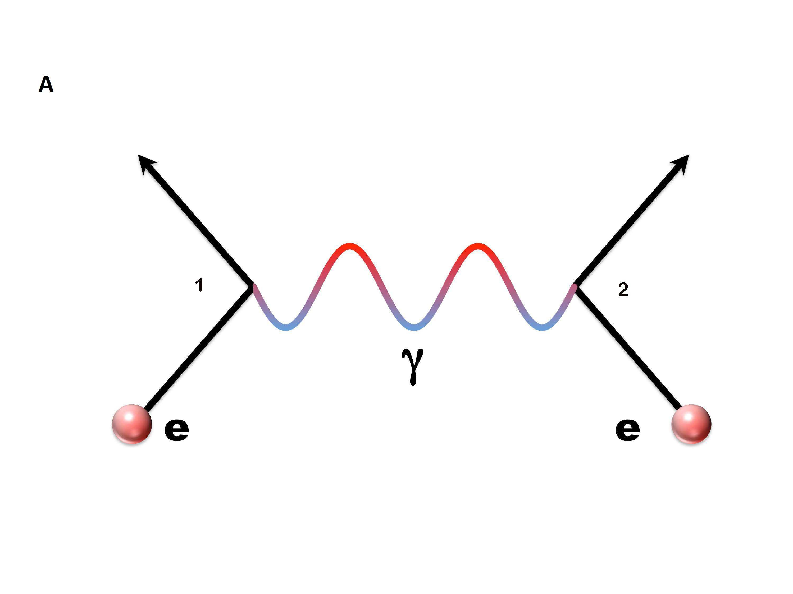
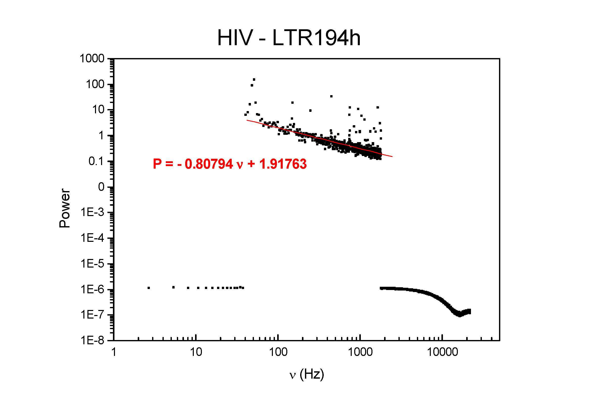
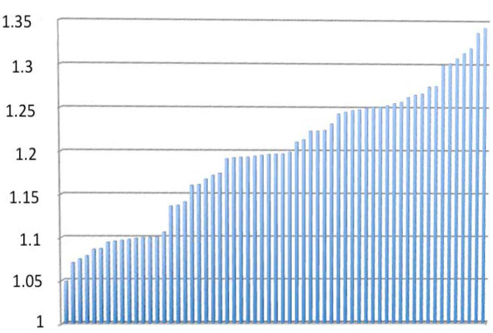

# 07_ECLSS水循环系统 - 图片索引

> 本索引由 arXiv 学术论文图表提取器自动生成
> 生成时间: 2026-02-01 23:09:52

## 统计
- 论文数量: 3
- 图片数量: 20

---

## 📄 Large Interferometer For Exoplanets (LIFE): IV. Ideal kernel-nulling array architectures for a space-based mid-infrared nulling interferometer

| 属性 | 值 |
|-----|-----|
| **arXiv ID** | [2201.04891v3](http://arxiv.org/abs/2201.04891v3) |
| **作者** | Jonah T. Hansen, Michael J. Ireland, the LIFE Collaboration et al. |
| **发布日期** | 2022-01-13 |
| **PDF链接** | [下载PDF](https://arxiv.org/pdf/2201.04891v3) |

### 提取的图片 (11张)

| 预览 | 文件名 | 页码 | 格式 |
|------|--------|------|------|
|  | `2201_04891v3_p4_img1.png` | 第4页 | PNG |
|  | `2201_04891v3_p4_img3.png` | 第4页 | PNG |
|  | `2201_04891v3_p4_img5.png` | 第4页 | PNG |
|  | `2201_04891v3_p4_img7.png` | 第4页 | PNG |
|  | `2201_04891v3_p4_img9.png` | 第4页 | PNG |
|  | `2201_04891v3_p5_img1.png` | 第5页 | PNG |
|  | `2201_04891v3_p5_img3.png` | 第5页 | PNG |
|  | `2201_04891v3_p5_img5.png` | 第5页 | PNG |
|  | `2201_04891v3_p5_img7.png` | 第5页 | PNG |
|  | `2201_04891v3_p5_img9.png` | 第5页 | PNG |
|  | `2201_04891v3_p5_img11.png` | 第5页 | PNG |

---

## 📄 Multidisciplinary Design Optimization Approach to Integrated Space Mission Planning and Spacecraft Design

| 属性 | 值 |
|-----|-----|
| **arXiv ID** | [2110.07323v2](http://arxiv.org/abs/2110.07323v2) |
| **作者** | Masafumi Isaji, Yuji Takubo, Koki Ho et al. |
| **发布日期** | 2021-10-14 |
| **PDF链接** | [下载PDF](https://arxiv.org/pdf/2110.07323v2) |

### 提取的图片 (5张)

| 预览 | 文件名 | 页码 | 格式 |
|------|--------|------|------|
|  | `2110_07323v2_p8_img1.png` | 第8页 | PNG |
|  | `2110_07323v2_p8_img2.png` | 第8页 | PNG |
|  | `2110_07323v2_p12_img1.png` | 第12页 | PNG |
|  | `2110_07323v2_p13_img1.png` | 第13页 | PNG |
|  | `2110_07323v2_p22_img1.png` | 第22页 | PNG |

---

## 📄 Water Bridging Dynamics of Polymerase Chain Reaction in the Gauge Theory Paradigm of Quantum Fields

| 属性 | 值 |
|-----|-----|
| **arXiv ID** | [1804.02436v1](http://arxiv.org/abs/1804.02436v1) |
| **作者** | Luc Montagnier, Jamal Aïssa, Antonio Capolupo et al. |
| **发布日期** | 2018-03-29 |
| **PDF链接** | [下载PDF](https://arxiv.org/pdf/1804.02436v1) |

### 提取的图片 (4张)

| 预览 | 文件名 | 页码 | 格式 |
|------|--------|------|------|
|  | `1804_02436v1_p3_img1.jpeg` | 第3页 | JPEG |
|  | `1804_02436v1_p3_img2.jpeg` | 第3页 | JPEG |
|  | `1804_02436v1_p4_img1.jpeg` | 第4页 | JPEG |
|  | `1804_02436v1_p6_img1.jpeg` | 第6页 | JPEG |

---

