# 11_月球殖民地建设 - 图片索引

> 本索引由 arXiv 学术论文图表提取器自动生成
> 生成时间: 2026-02-01 23:14:16

## 统计
- 论文数量: 7
- 图片数量: 118

---

## 📄 Science from the Moon: The NASA/NLSI Lunar University Network for Astrophysics Research (LUNAR)

| 属性 | 值 |
|-----|-----|
| **arXiv ID** | [0909.1509v1](http://arxiv.org/abs/0909.1509v1) |
| **作者** | Jack O. Burns, the LUNAR Consortium |
| **发布日期** | 2009-09-08 |
| **PDF链接** | [下载PDF](https://arxiv.org/pdf/0909.1509v1) |

### 提取的图片 (12张)

| 预览 | 文件名 | 页码 | 格式 |
|------|--------|------|------|
|  | `0909_1509v1_p1_img1.jpeg` | 第1页 | JPEG |
| 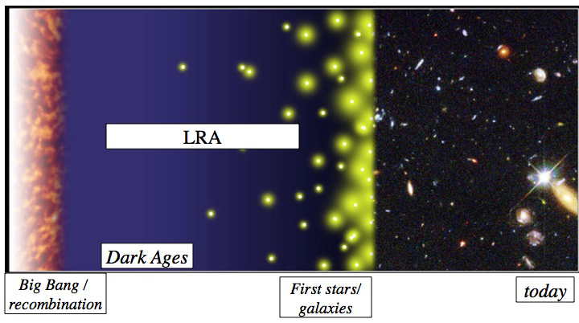 | `0909_1509v1_p3_img1.png` | 第3页 | PNG |
| 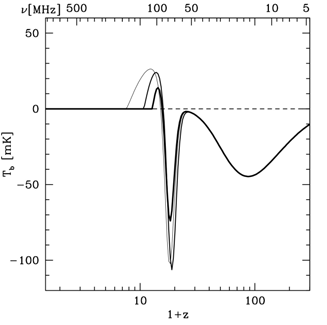 | `0909_1509v1_p3_img2.png` | 第3页 | PNG |
|  | `0909_1509v1_p6_img1.jpeg` | 第6页 | JPEG |
|  | `0909_1509v1_p1_img1.jpeg` | 第1页 | JPEG |
|  | `0909_1509v1_p3_img1.png` | 第3页 | PNG |
|  | `0909_1509v1_p3_img2.png` | 第3页 | PNG |
|  | `0909_1509v1_p6_img1.jpeg` | 第6页 | JPEG |
|  | `0909_1509v1_p1_img1.jpeg` | 第1页 | JPEG |
|  | `0909_1509v1_p3_img1.png` | 第3页 | PNG |
|  | `0909_1509v1_p3_img2.png` | 第3页 | PNG |
|  | `0909_1509v1_p6_img1.jpeg` | 第6页 | JPEG |

---

## 📄 Towards Assessing Spread in Sets of Software Architecture Designs

| 属性 | 值 |
|-----|-----|
| **arXiv ID** | [2402.19171v1](http://arxiv.org/abs/2402.19171v1) |
| **作者** | Vittorio Cortellessa, J. Andres Diaz-Pace, Daniele Di Pompeo et al. |
| **发布日期** | 2024-02-29 |
| **PDF链接** | [下载PDF](https://arxiv.org/pdf/2402.19171v1) |

### 提取的图片 (4张)

| 预览 | 文件名 | 页码 | 格式 |
|------|--------|------|------|
| 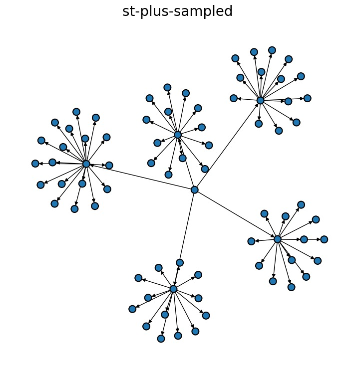 | `2402_19171v1_p3_img1.jpeg` | 第3页 | JPEG |
| 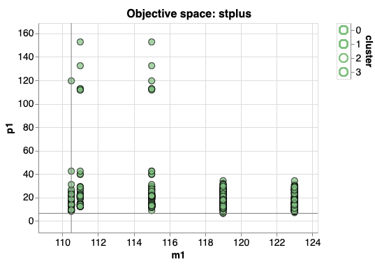 | `2402_19171v1_p3_img2.png` | 第3页 | PNG |
| 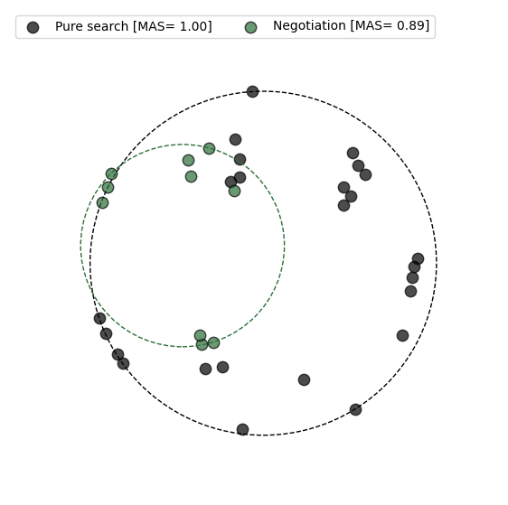 | `2402_19171v1_p6_img1.png` | 第6页 | PNG |
| 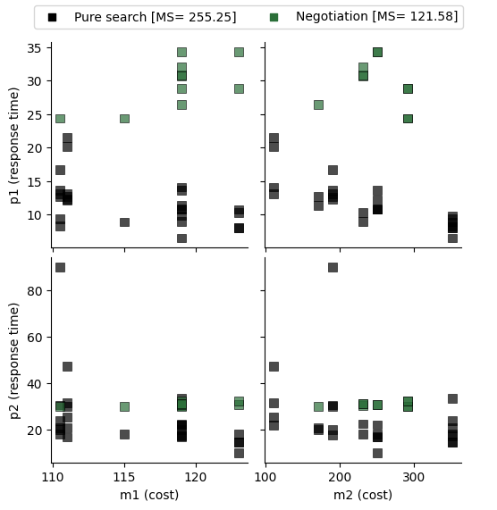 | `2402_19171v1_p6_img2.png` | 第6页 | PNG |

---

## 📄 Astrophysics Conducted by the Lunar University Network for Astrophysics Research (LUNAR) and the Center for Lunar Origins (CLOE)

| 属性 | 值 |
|-----|-----|
| **arXiv ID** | [1209.2233v1](http://arxiv.org/abs/1209.2233v1) |
| **作者** | Jack O. Burns, T. Joseph W. Lazio, William Bottke et al. |
| **发布日期** | 2012-09-11 |
| **PDF链接** | [下载PDF](https://arxiv.org/pdf/1209.2233v1) |

### 提取的图片 (66张)

| 预览 | 文件名 | 页码 | 格式 |
|------|--------|------|------|
| 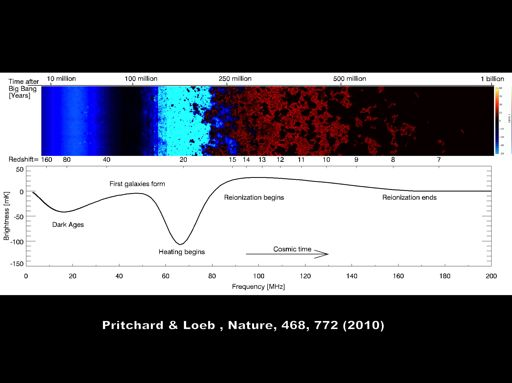 | `1209_2233v1_p1_img1.jpeg` | 第1页 | JPEG |
|  | `1209_2233v1_p1_img2.jpeg` | 第1页 | JPEG |
| 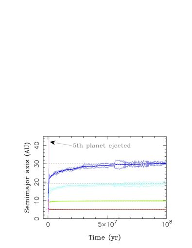 | `1209_2233v1_p1_img3.jpeg` | 第1页 | JPEG |
|  | `1209_2233v1_p4_img1.jpeg` | 第4页 | JPEG |
|  | `1209_2233v1_p6_img1.jpeg` | 第6页 | JPEG |
| 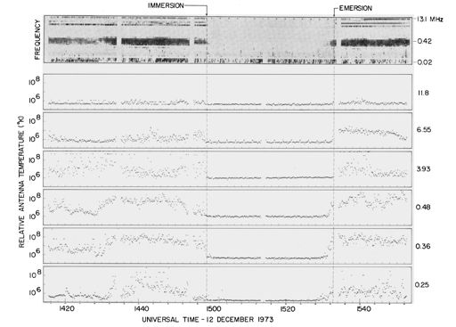 | `1209_2233v1_p6_img2.jpeg` | 第6页 | JPEG |
| 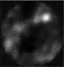 | `1209_2233v1_p6_img3.jpeg` | 第6页 | JPEG |
| 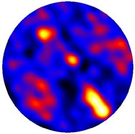 | `1209_2233v1_p7_img1.jpeg` | 第7页 | JPEG |
|  | `1209_2233v1_p7_img2.jpeg` | 第7页 | JPEG |
|  | `1209_2233v1_p11_img1.jpeg` | 第11页 | JPEG |
| 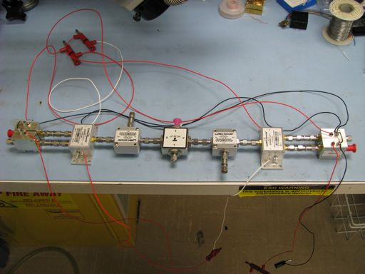 | `1209_2233v1_p11_img2.jpeg` | 第11页 | JPEG |
|  | `1209_2233v1_p11_img3.jpeg` | 第11页 | JPEG |
|  | `1209_2233v1_p13_img1.jpeg` | 第13页 | JPEG |
|  | `1209_2233v1_p13_img2.jpeg` | 第13页 | JPEG |
|  | `1209_2233v1_p15_img1.jpeg` | 第15页 | JPEG |
| 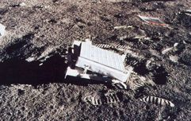 | `1209_2233v1_p18_img1.jpeg` | 第18页 | JPEG |
|  | `1209_2233v1_p18_img2.jpeg` | 第18页 | JPEG |
| 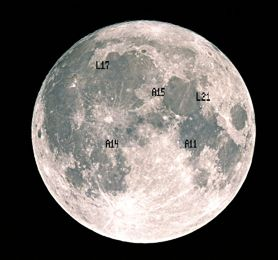 | `1209_2233v1_p19_img1.jpeg` | 第19页 | JPEG |
|  | `1209_2233v1_p19_img2.jpeg` | 第19页 | JPEG |
| 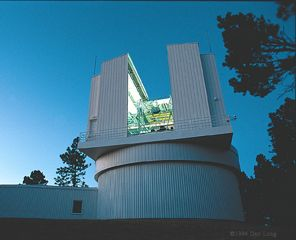 | `1209_2233v1_p19_img3.jpeg` | 第19页 | JPEG |
|  | `1209_2233v1_p20_img1.jpeg` | 第20页 | JPEG |
| 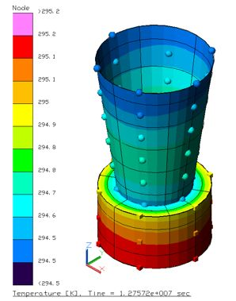 | `1209_2233v1_p22_img1.jpeg` | 第22页 | JPEG |
|  | `1209_2233v1_p1_img1.jpeg` | 第1页 | JPEG |
|  | `1209_2233v1_p1_img2.jpeg` | 第1页 | JPEG |
|  | `1209_2233v1_p1_img3.jpeg` | 第1页 | JPEG |
|  | `1209_2233v1_p4_img1.jpeg` | 第4页 | JPEG |
|  | `1209_2233v1_p6_img1.jpeg` | 第6页 | JPEG |
|  | `1209_2233v1_p6_img2.jpeg` | 第6页 | JPEG |
|  | `1209_2233v1_p6_img3.jpeg` | 第6页 | JPEG |
|  | `1209_2233v1_p7_img1.jpeg` | 第7页 | JPEG |
|  | `1209_2233v1_p7_img2.jpeg` | 第7页 | JPEG |
|  | `1209_2233v1_p11_img1.jpeg` | 第11页 | JPEG |
|  | `1209_2233v1_p11_img2.jpeg` | 第11页 | JPEG |
|  | `1209_2233v1_p11_img3.jpeg` | 第11页 | JPEG |
|  | `1209_2233v1_p13_img1.jpeg` | 第13页 | JPEG |
|  | `1209_2233v1_p13_img2.jpeg` | 第13页 | JPEG |
|  | `1209_2233v1_p15_img1.jpeg` | 第15页 | JPEG |
|  | `1209_2233v1_p18_img1.jpeg` | 第18页 | JPEG |
|  | `1209_2233v1_p18_img2.jpeg` | 第18页 | JPEG |
|  | `1209_2233v1_p19_img1.jpeg` | 第19页 | JPEG |
|  | `1209_2233v1_p19_img2.jpeg` | 第19页 | JPEG |
|  | `1209_2233v1_p19_img3.jpeg` | 第19页 | JPEG |
|  | `1209_2233v1_p20_img1.jpeg` | 第20页 | JPEG |
|  | `1209_2233v1_p22_img1.jpeg` | 第22页 | JPEG |
|  | `1209_2233v1_p1_img1.jpeg` | 第1页 | JPEG |
|  | `1209_2233v1_p1_img2.jpeg` | 第1页 | JPEG |
|  | `1209_2233v1_p1_img3.jpeg` | 第1页 | JPEG |
|  | `1209_2233v1_p4_img1.jpeg` | 第4页 | JPEG |
|  | `1209_2233v1_p6_img1.jpeg` | 第6页 | JPEG |
|  | `1209_2233v1_p6_img2.jpeg` | 第6页 | JPEG |
|  | `1209_2233v1_p6_img3.jpeg` | 第6页 | JPEG |
|  | `1209_2233v1_p7_img1.jpeg` | 第7页 | JPEG |
|  | `1209_2233v1_p7_img2.jpeg` | 第7页 | JPEG |
|  | `1209_2233v1_p11_img1.jpeg` | 第11页 | JPEG |
|  | `1209_2233v1_p11_img2.jpeg` | 第11页 | JPEG |
|  | `1209_2233v1_p11_img3.jpeg` | 第11页 | JPEG |
|  | `1209_2233v1_p13_img1.jpeg` | 第13页 | JPEG |
|  | `1209_2233v1_p13_img2.jpeg` | 第13页 | JPEG |
|  | `1209_2233v1_p15_img1.jpeg` | 第15页 | JPEG |
|  | `1209_2233v1_p18_img1.jpeg` | 第18页 | JPEG |
|  | `1209_2233v1_p18_img2.jpeg` | 第18页 | JPEG |
|  | `1209_2233v1_p19_img1.jpeg` | 第19页 | JPEG |
|  | `1209_2233v1_p19_img2.jpeg` | 第19页 | JPEG |
|  | `1209_2233v1_p19_img3.jpeg` | 第19页 | JPEG |
|  | `1209_2233v1_p20_img1.jpeg` | 第20页 | JPEG |
|  | `1209_2233v1_p22_img1.jpeg` | 第22页 | JPEG |

---

## 📄 Lunar-G2R: Geometry-to-Reflectance Learning for High-Fidelity Lunar BRDF Estimation

| 属性 | 值 |
|-----|-----|
| **arXiv ID** | [2601.10449v1](http://arxiv.org/abs/2601.10449v1) |
| **作者** | Clementine Grethen, Nicolas Menga, Roland Brochard et al. |
| **发布日期** | 2026-01-15 |
| **PDF链接** | [下载PDF](https://arxiv.org/pdf/2601.10449v1) |

### 提取的图片 (26张)

| 预览 | 文件名 | 页码 | 格式 |
|------|--------|------|------|
| 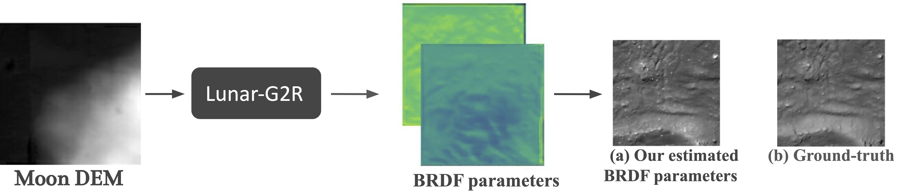 | `2601_10449v1_p1_img1.png` | 第1页 | PNG |
| 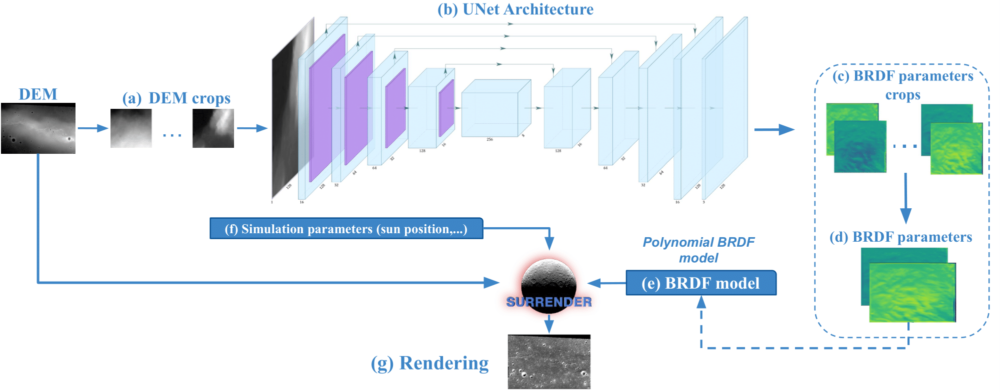 | `2601_10449v1_p6_img1.png` | 第6页 | PNG |
| 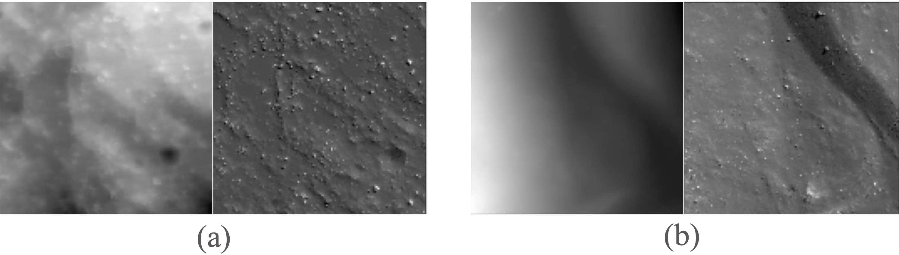 | `2601_10449v1_p9_img1.jpeg` | 第9页 | JPEG |
| 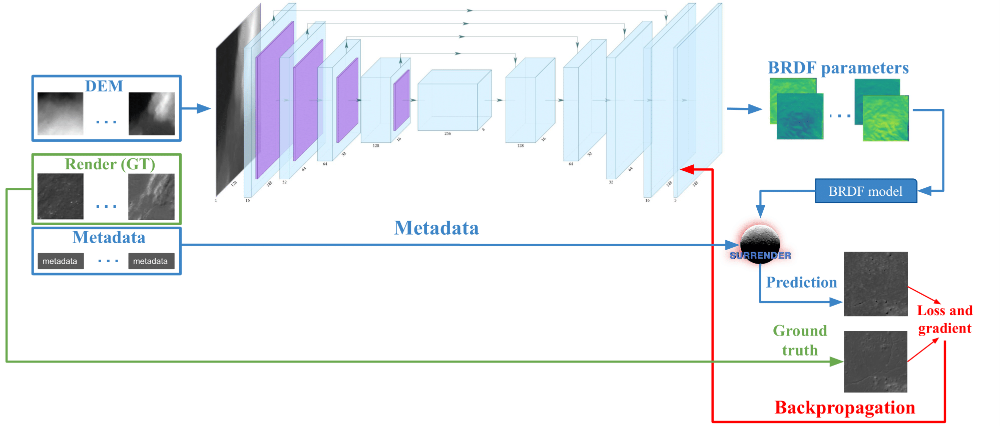 | `2601_10449v1_p10_img1.png` | 第10页 | PNG |
| 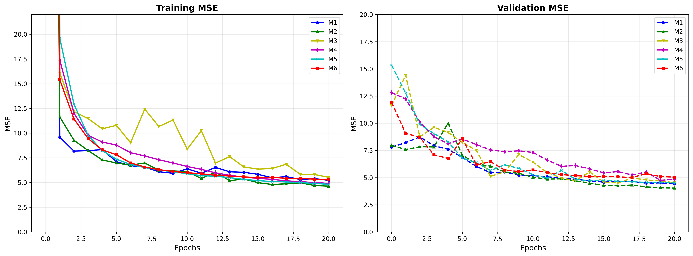 | `2601_10449v1_p11_img1.png` | 第11页 | PNG |
| 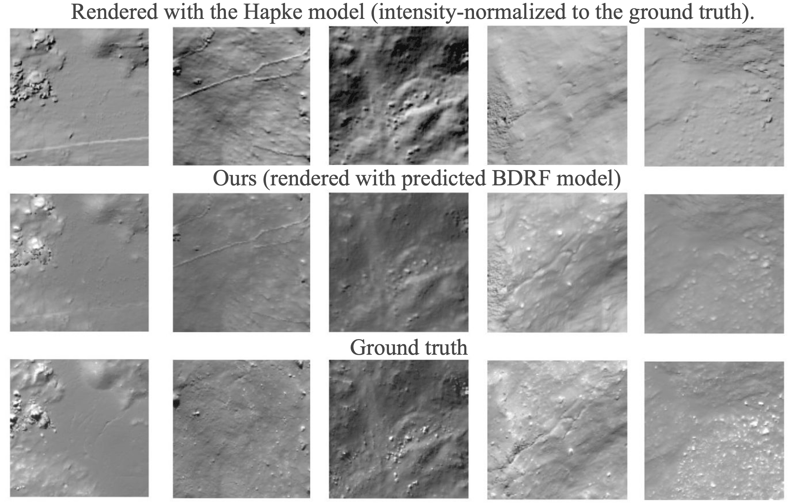 | `2601_10449v1_p12_img1.png` | 第12页 | PNG |
| 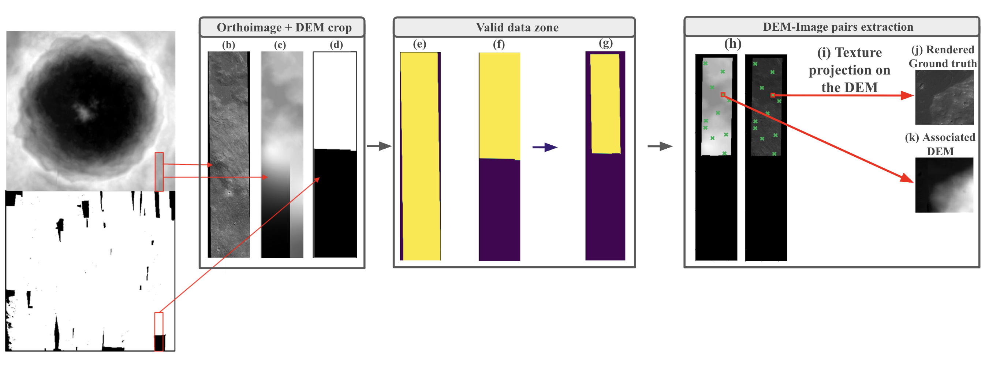 | `2601_10449v1_p15_img1.png` | 第15页 | PNG |
| 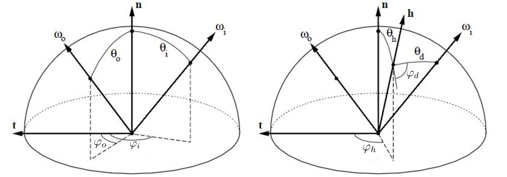 | `2601_10449v1_p16_img1.png` | 第16页 | PNG |
| 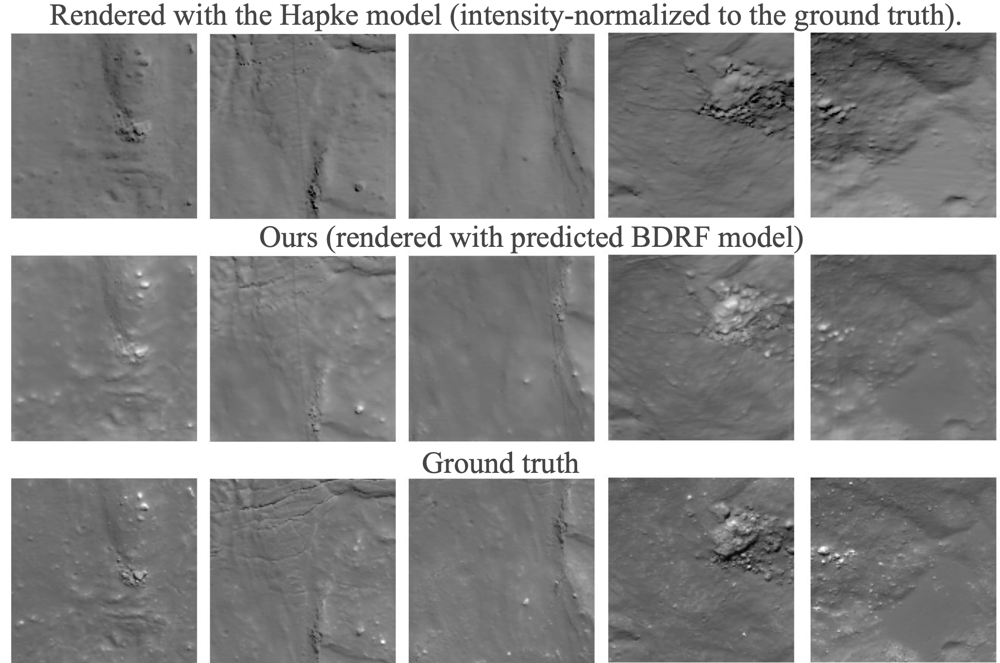 | `2601_10449v1_p17_img1.png` | 第17页 | PNG |
|  | `2601_10449v1_p18_img1.png` | 第18页 | PNG |
|  | `2601_10449v1_p19_img1.png` | 第19页 | PNG |
| 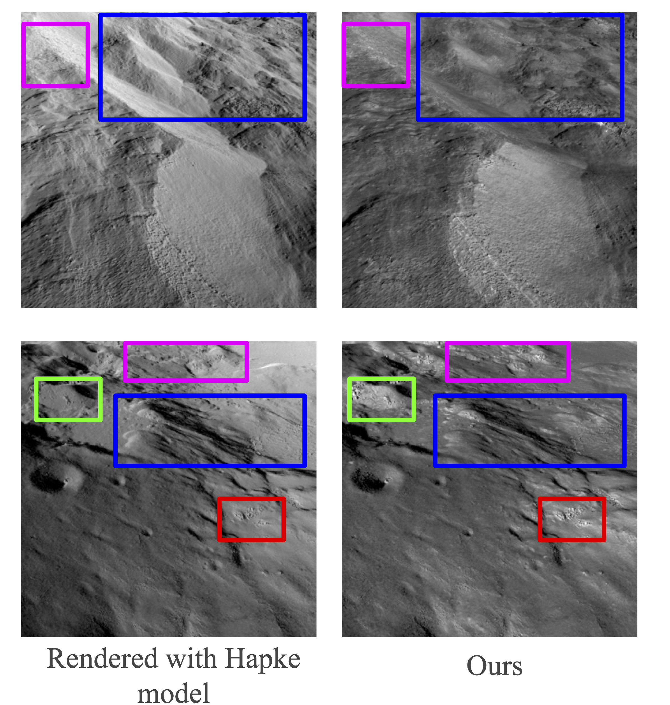 | `2601_10449v1_p20_img1.png` | 第20页 | PNG |
|  | `2601_10449v1_p21_img1.png` | 第21页 | PNG |
|  | `2601_10449v1_p1_img1.png` | 第1页 | PNG |
|  | `2601_10449v1_p6_img1.png` | 第6页 | PNG |
|  | `2601_10449v1_p9_img1.jpeg` | 第9页 | JPEG |
|  | `2601_10449v1_p10_img1.png` | 第10页 | PNG |
|  | `2601_10449v1_p11_img1.png` | 第11页 | PNG |
|  | `2601_10449v1_p12_img1.png` | 第12页 | PNG |
|  | `2601_10449v1_p15_img1.png` | 第15页 | PNG |
|  | `2601_10449v1_p16_img1.png` | 第16页 | PNG |
|  | `2601_10449v1_p17_img1.png` | 第17页 | PNG |
|  | `2601_10449v1_p18_img1.png` | 第18页 | PNG |
|  | `2601_10449v1_p19_img1.png` | 第19页 | PNG |
|  | `2601_10449v1_p20_img1.png` | 第20页 | PNG |
|  | `2601_10449v1_p21_img1.png` | 第21页 | PNG |

---

## 📄 The moon and the origin of life

| 属性 | 值 |
|-----|-----|
| **arXiv ID** | [0112399v1](http://arxiv.org/abs/astro-ph/0112399v1) |
| **作者** | C. R. Benn |
| **发布日期** | 2001-12-17 |
| **PDF链接** | [下载PDF](https://arxiv.org/pdf/astro-ph/0112399v1) |

### 提取的图片 (1张)

| 预览 | 文件名 | 页码 | 格式 |
|------|--------|------|------|
|  | `0112399v1_p1_img1.png` | 第1页 | PNG |

---

## 📄 Origin of the Moon

| 属性 | 值 |
|-----|-----|
| **arXiv ID** | [2103.02045v1](http://arxiv.org/abs/2103.02045v1) |
| **作者** | Robin M. Canup, Kevin Righter, Nicolas Dauphas et al. |
| **发布日期** | 2021-03-02 |
| **PDF链接** | [下载PDF](https://arxiv.org/pdf/2103.02045v1) |

### 提取的图片 (8张)

| 预览 | 文件名 | 页码 | 格式 |
|------|--------|------|------|
| 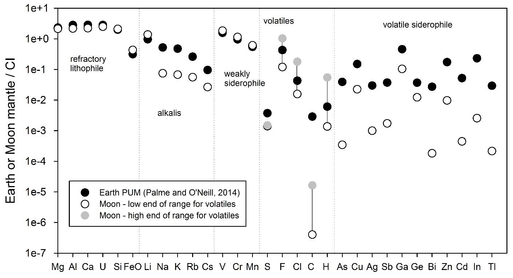 | `2103_02045v1_p44_img1.jpeg` | 第44页 | JPEG |
| 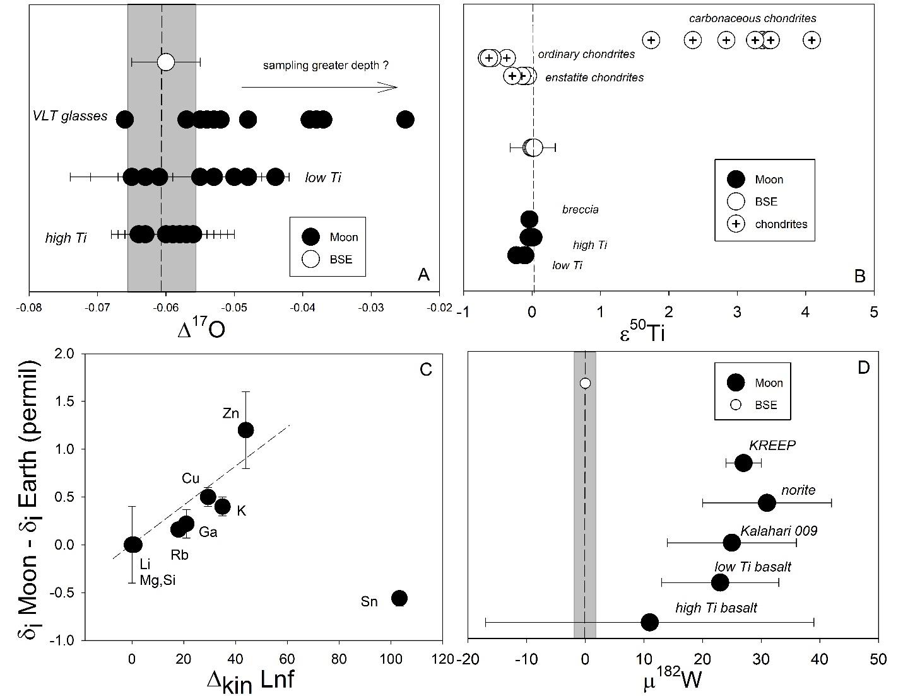 | `2103_02045v1_p45_img1.jpeg` | 第45页 | JPEG |
|  | `2103_02045v1_p47_img1.jpeg` | 第47页 | JPEG |
| 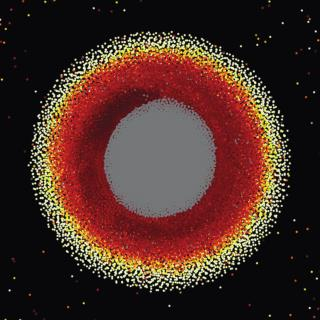 | `2103_02045v1_p47_img2.jpeg` | 第47页 | JPEG |
| 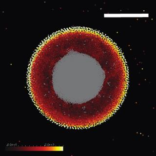 | `2103_02045v1_p47_img3.jpeg` | 第47页 | JPEG |
| 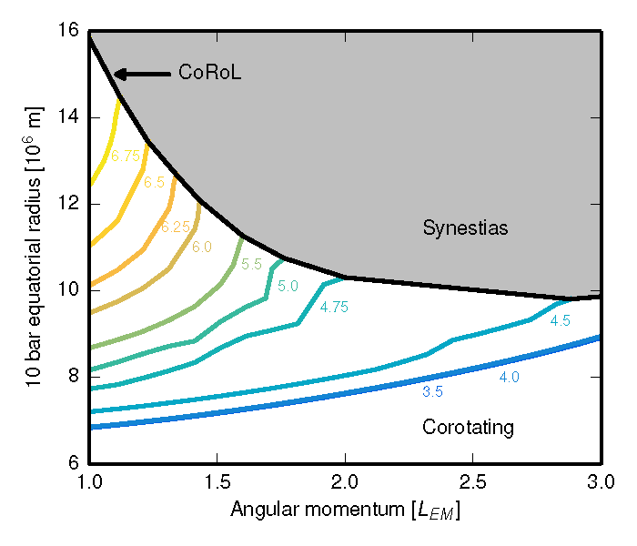 | `2103_02045v1_p48_img1.png` | 第48页 | PNG |
| 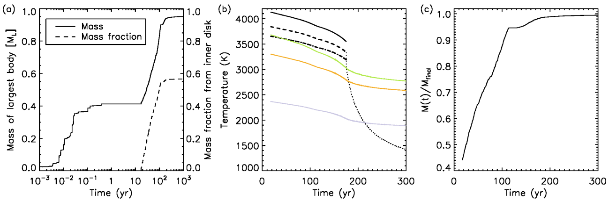 | `2103_02045v1_p50_img1.png` | 第50页 | PNG |
| 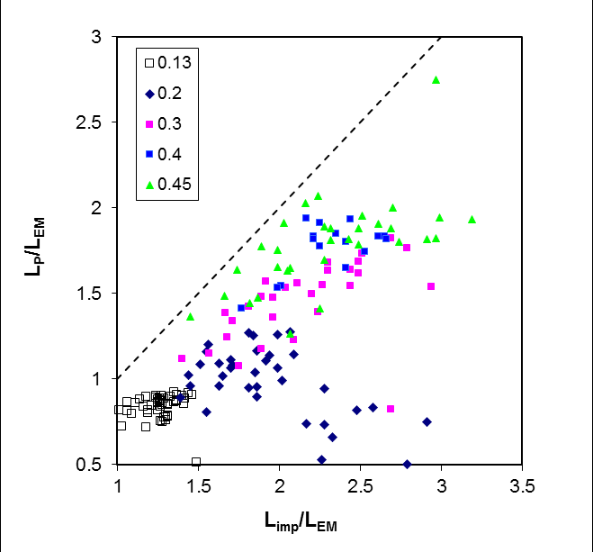 | `2103_02045v1_p51_img1.png` | 第51页 | PNG |

---

## 📄 Science enabled by a Moon Village

| 属性 | 值 |
|-----|-----|
| **arXiv ID** | [1706.06698v1](http://arxiv.org/abs/1706.06698v1) |
| **作者** | Ian A. Crawford |
| **发布日期** | 2017-06-20 |
| **PDF链接** | [下载PDF](https://arxiv.org/pdf/1706.06698v1) |

### 提取的图片 (1张)

| 预览 | 文件名 | 页码 | 格式 |
|------|--------|------|------|
|  | `1706_06698v1_p1_img2.png` | 第1页 | PNG |

---

