# 12_同步轨道与航天器设计 - 图片索引

> 本索引由 arXiv 学术论文图表提取器自动生成
> 生成时间: 2026-02-01 23:15:11

## 统计
- 论文数量: 6
- 图片数量: 87

---

## 📄 Call to Protect the Dark and Quiet Sky from Harmful Interference by Satellite Constellations

| 属性 | 值 |
|-----|-----|
| **arXiv ID** | [2412.08244v2](http://arxiv.org/abs/2412.08244v2) |
| **作者** | IAU Centre for the Protection of the Dark, Quiet Sky from Satellite Constellation Interference, Gyula I. G. Józsa et al. |
| **发布日期** | 2024-12-11 |
| **PDF链接** | [下载PDF](https://arxiv.org/pdf/2412.08244v2) |

### 提取的图片 (3张)

| 预览 | 文件名 | 页码 | 格式 |
|------|--------|------|------|
|  | `2412_08244v2_p1_img1.png` | 第1页 | PNG |
|  | `2412_08244v2_p8_img1.png` | 第8页 | PNG |
| 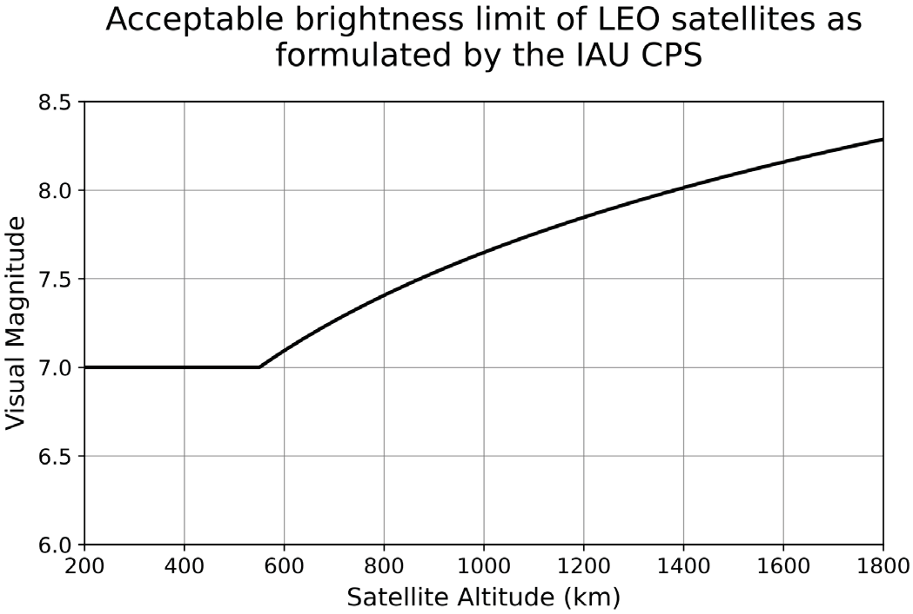 | `2412_08244v2_p15_img1.png` | 第15页 | PNG |

---

## 📄 Orbit analysis of a geostationary gravitational wave interferometer detector array

| 属性 | 值 |
|-----|-----|
| **arXiv ID** | [1410.3023v1](http://arxiv.org/abs/1410.3023v1) |
| **作者** | Massimo Tinto, Jose C. N. de Araujo, Helio K. Kuga et al. |
| **发布日期** | 2014-10-11 |
| **PDF链接** | [下载PDF](https://arxiv.org/pdf/1410.3023v1) |

### 提取的图片 (5张)

| 预览 | 文件名 | 页码 | 格式 |
|------|--------|------|------|
| 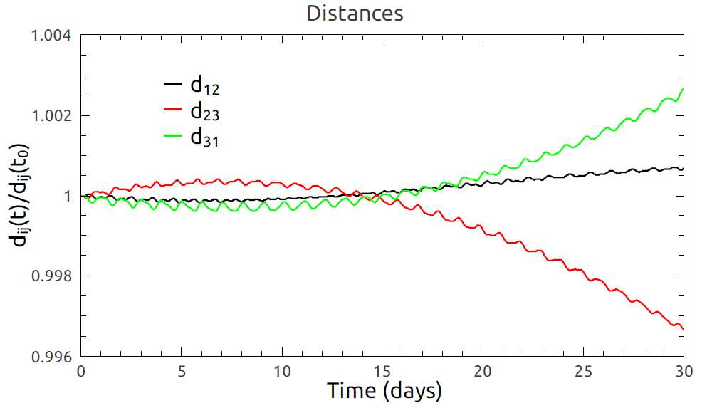 | `1410_3023v1_p8_img1.jpeg` | 第8页 | JPEG |
| 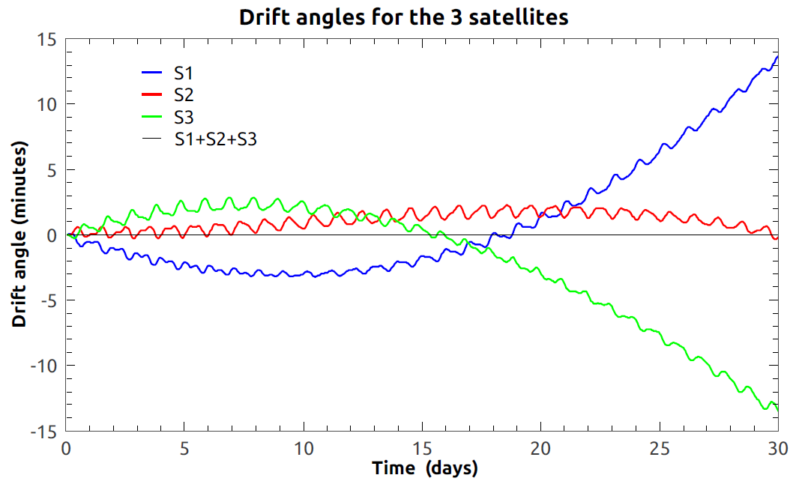 | `1410_3023v1_p9_img1.png` | 第9页 | PNG |
| 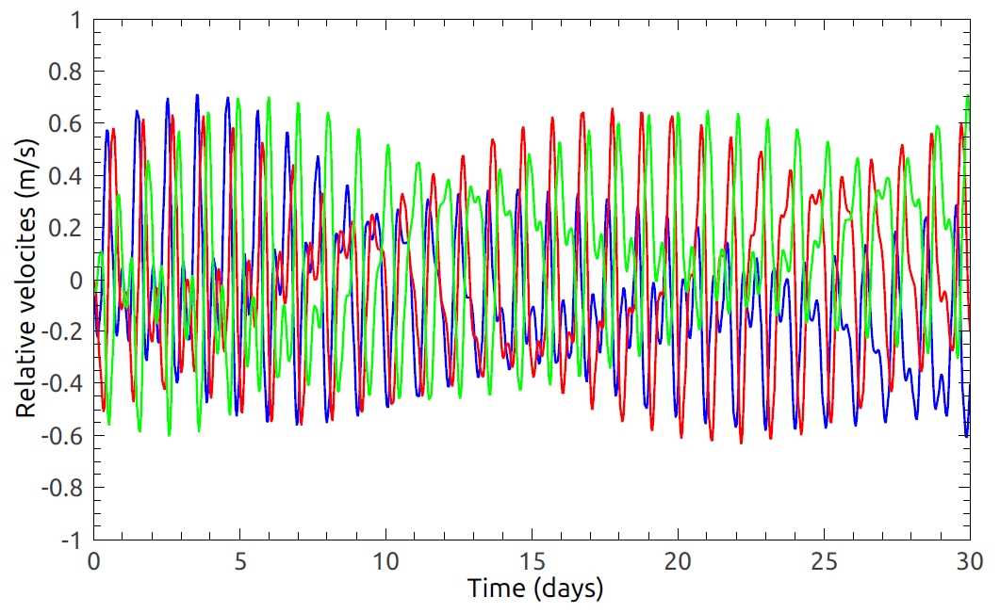 | `1410_3023v1_p9_img2.png` | 第9页 | PNG |
| 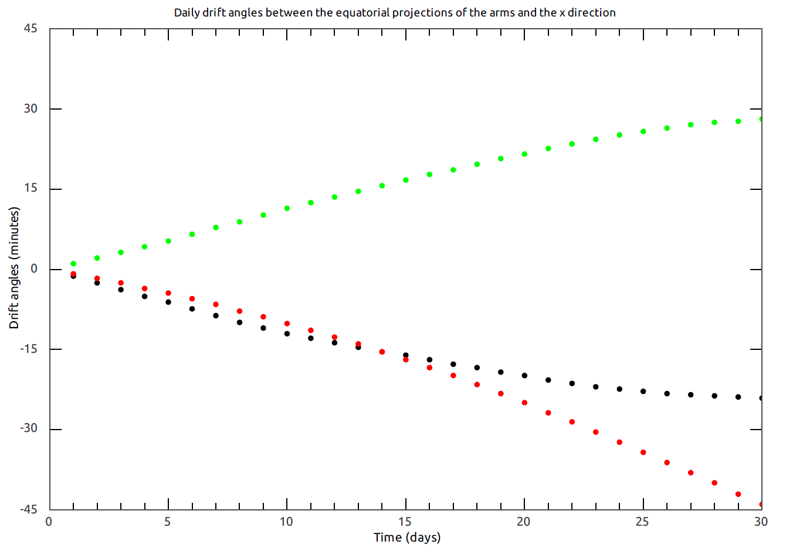 | `1410_3023v1_p10_img1.png` | 第10页 | PNG |
| 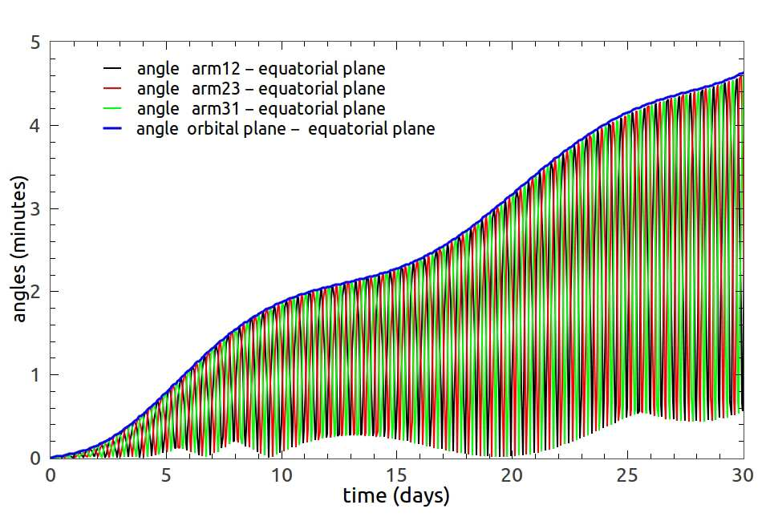 | `1410_3023v1_p10_img2.jpeg` | 第10页 | JPEG |

---

## 📄 Simulative Comparison of DVB-S2X/RCS2 and 3GPP 5G NR NTN Technologies in a Geostationary Satellite Scenario

| 属性 | 值 |
|-----|-----|
| **arXiv ID** | [2502.13704v1](http://arxiv.org/abs/2502.13704v1) |
| **作者** | Lauri Sormunen, Tuomas Huikko, Verneri Rönty et al. |
| **发布日期** | 2025-02-19 |
| **PDF链接** | [下载PDF](https://arxiv.org/pdf/2502.13704v1) |

### 提取的图片 (5张)

| 预览 | 文件名 | 页码 | 格式 |
|------|--------|------|------|
| 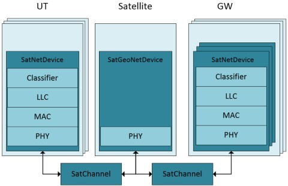 | `2502_13704v1_p2_img1.jpeg` | 第2页 | JPEG |
| 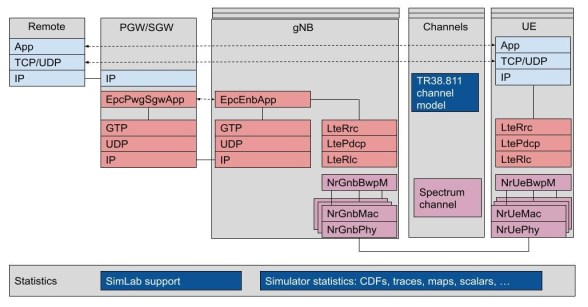 | `2502_13704v1_p2_img2.jpeg` | 第2页 | JPEG |
| 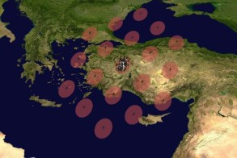 | `2502_13704v1_p4_img1.jpeg` | 第4页 | JPEG |
| 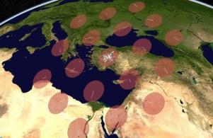 | `2502_13704v1_p4_img2.jpeg` | 第4页 | JPEG |
| 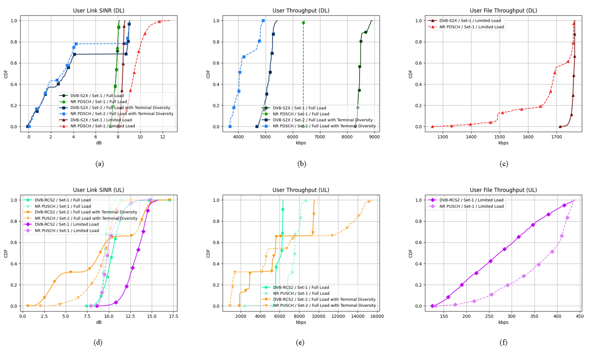 | `2502_13704v1_p6_img1.png` | 第6页 | PNG |

---

## 📄 Multidisciplinary Design Optimization Approach to Integrated Space Mission Planning and Spacecraft Design

| 属性 | 值 |
|-----|-----|
| **arXiv ID** | [2110.07323v2](http://arxiv.org/abs/2110.07323v2) |
| **作者** | Masafumi Isaji, Yuji Takubo, Koki Ho et al. |
| **发布日期** | 2021-10-14 |
| **PDF链接** | [下载PDF](https://arxiv.org/pdf/2110.07323v2) |

### 提取的图片 (5张)

| 预览 | 文件名 | 页码 | 格式 |
|------|--------|------|------|
| 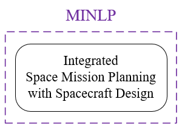 | `2110_07323v2_p8_img1.png` | 第8页 | PNG |
| 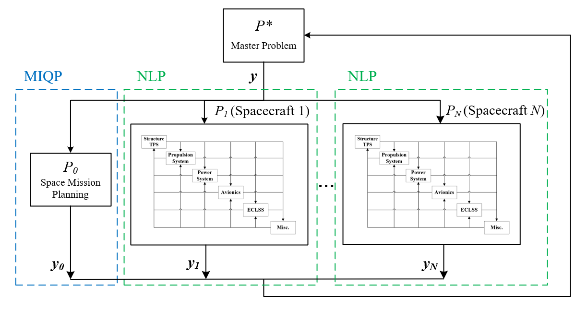 | `2110_07323v2_p8_img2.png` | 第8页 | PNG |
|  | `2110_07323v2_p12_img1.png` | 第12页 | PNG |
| 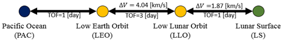 | `2110_07323v2_p13_img1.png` | 第13页 | PNG |
| 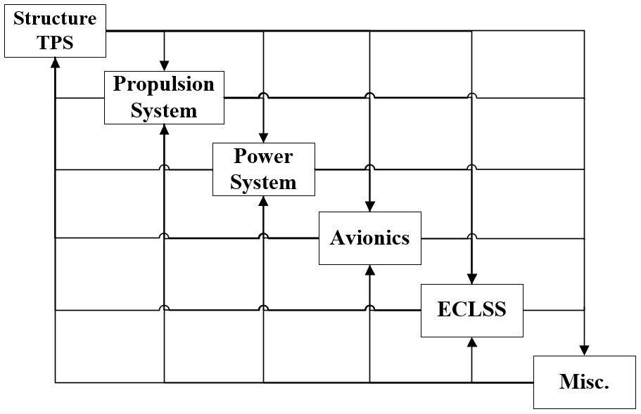 | `2110_07323v2_p22_img1.png` | 第22页 | PNG |

---

## 📄 Optimal design of frame structures with mixed categorical and continuous design variables using the Gumbel-Softmax method

| 属性 | 值 |
|-----|-----|
| **arXiv ID** | [2501.00258v1](http://arxiv.org/abs/2501.00258v1) |
| **作者** | Mehran Ebrahimi, Hyunmin Cheong, Pradeep Kumar Jayaraman et al. |
| **发布日期** | 2024-12-31 |
| **PDF链接** | [下载PDF](https://arxiv.org/pdf/2501.00258v1) |

### 提取的图片 (20张)

| 预览 | 文件名 | 页码 | 格式 |
|------|--------|------|------|
|  | `2501_00258v1_p15_img1.jpeg` | 第15页 | JPEG |
|  | `2501_00258v1_p15_img2.jpeg` | 第15页 | JPEG |
|  | `2501_00258v1_p15_img3.jpeg` | 第15页 | JPEG |
|  | `2501_00258v1_p15_img4.jpeg` | 第15页 | JPEG |
| 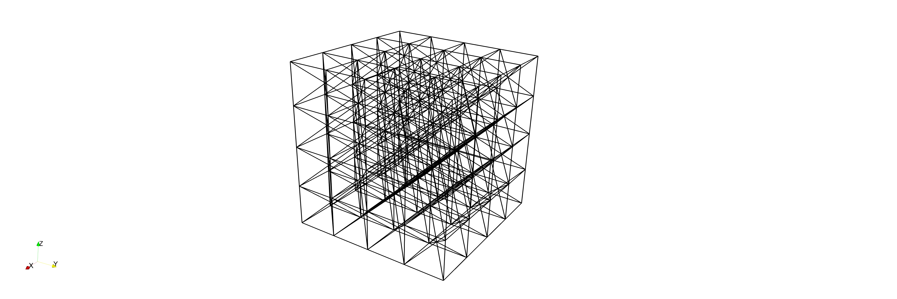 | `2501_00258v1_p18_img1.jpeg` | 第18页 | JPEG |
|  | `2501_00258v1_p18_img2.jpeg` | 第18页 | JPEG |
|  | `2501_00258v1_p19_img1.jpeg` | 第19页 | JPEG |
|  | `2501_00258v1_p19_img2.jpeg` | 第19页 | JPEG |
|  | `2501_00258v1_p19_img3.jpeg` | 第19页 | JPEG |
|  | `2501_00258v1_p19_img4.jpeg` | 第19页 | JPEG |
|  | `2501_00258v1_p19_img5.jpeg` | 第19页 | JPEG |
|  | `2501_00258v1_p19_img6.jpeg` | 第19页 | JPEG |
|  | `2501_00258v1_p20_img1.jpeg` | 第20页 | JPEG |
|  | `2501_00258v1_p20_img2.jpeg` | 第20页 | JPEG |
|  | `2501_00258v1_p24_img1.jpeg` | 第24页 | JPEG |
|  | `2501_00258v1_p24_img2.jpeg` | 第24页 | JPEG |
| 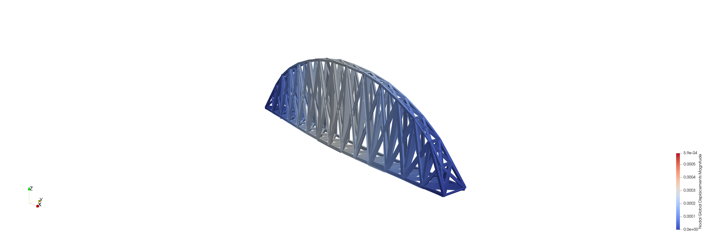 | `2501_00258v1_p24_img3.jpeg` | 第24页 | JPEG |
|  | `2501_00258v1_p24_img4.jpeg` | 第24页 | JPEG |
| 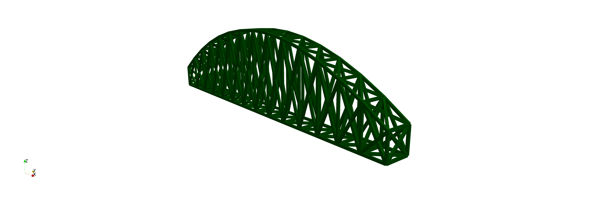 | `2501_00258v1_p24_img5.jpeg` | 第24页 | JPEG |
|  | `2501_00258v1_p24_img6.jpeg` | 第24页 | JPEG |

---

## 📄 An FFT based chemo-mechanical framework with fracture: application to mesoscopic electrode degradation

| 属性 | 值 |
|-----|-----|
| **arXiv ID** | [2411.16583v1](http://arxiv.org/abs/2411.16583v1) |
| **作者** | Gabriel Zarzoso, Eduardo Roque, Francisco Montero-Chacón et al. |
| **发布日期** | 2024-11-25 |
| **PDF链接** | [下载PDF](https://arxiv.org/pdf/2411.16583v1) |

### 提取的图片 (49张)

| 预览 | 文件名 | 页码 | 格式 |
|------|--------|------|------|
| 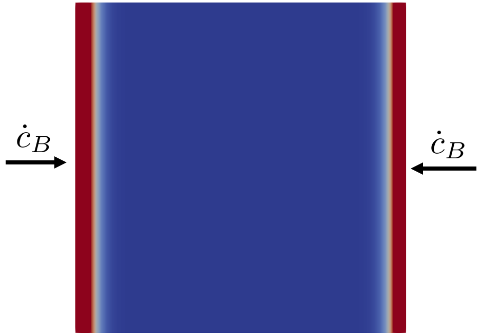 | `2411_16583v1_p19_img1.png` | 第19页 | PNG |
| 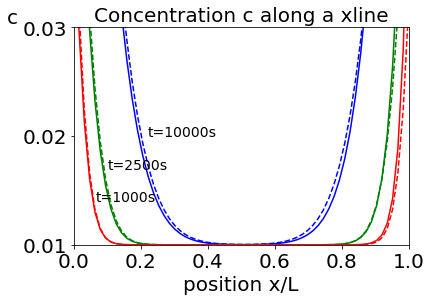 | `2411_16583v1_p19_img3.png` | 第19页 | PNG |
| 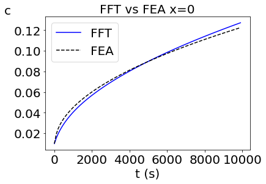 | `2411_16583v1_p19_img5.png` | 第19页 | PNG |
|  | `2411_16583v1_p19_img6.png` | 第19页 | PNG |
| 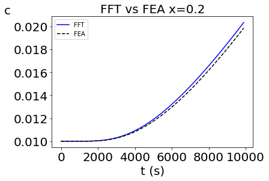 | `2411_16583v1_p19_img7.png` | 第19页 | PNG |
| 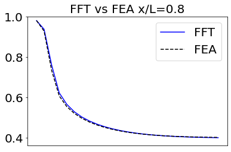 | `2411_16583v1_p21_img1.png` | 第21页 | PNG |
| 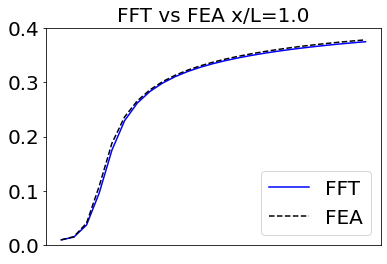 | `2411_16583v1_p21_img2.png` | 第21页 | PNG |
|  | `2411_16583v1_p21_img3.png` | 第21页 | PNG |
|  | `2411_16583v1_p21_img4.png` | 第21页 | PNG |
| 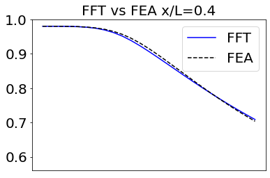 | `2411_16583v1_p21_img5.png` | 第21页 | PNG |
| 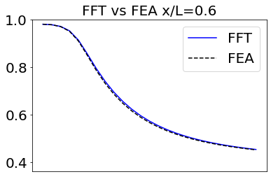 | `2411_16583v1_p21_img6.png` | 第21页 | PNG |
|  | `2411_16583v1_p22_img1.png` | 第22页 | PNG |
|  | `2411_16583v1_p22_img2.png` | 第22页 | PNG |
| 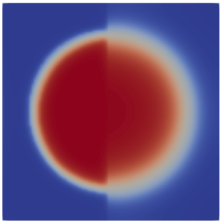 | `2411_16583v1_p22_img3.png` | 第22页 | PNG |
| 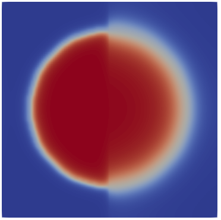 | `2411_16583v1_p22_img4.png` | 第22页 | PNG |
| 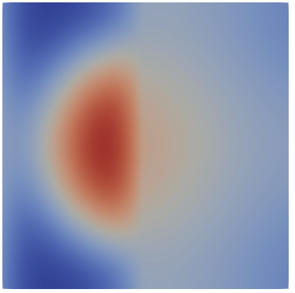 | `2411_16583v1_p22_img5.png` | 第22页 | PNG |
| 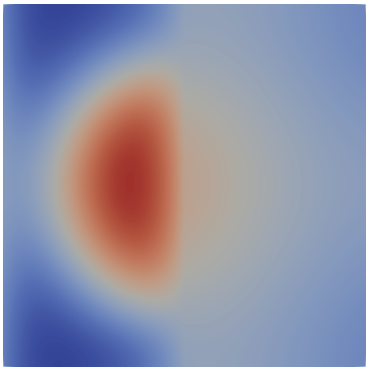 | `2411_16583v1_p22_img6.png` | 第22页 | PNG |
|  | `2411_16583v1_p22_img7.png` | 第22页 | PNG |
|  | `2411_16583v1_p22_img8.png` | 第22页 | PNG |
| 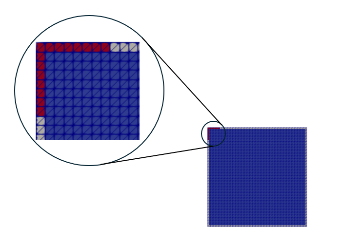 | `2411_16583v1_p25_img1.png` | 第25页 | PNG |
| 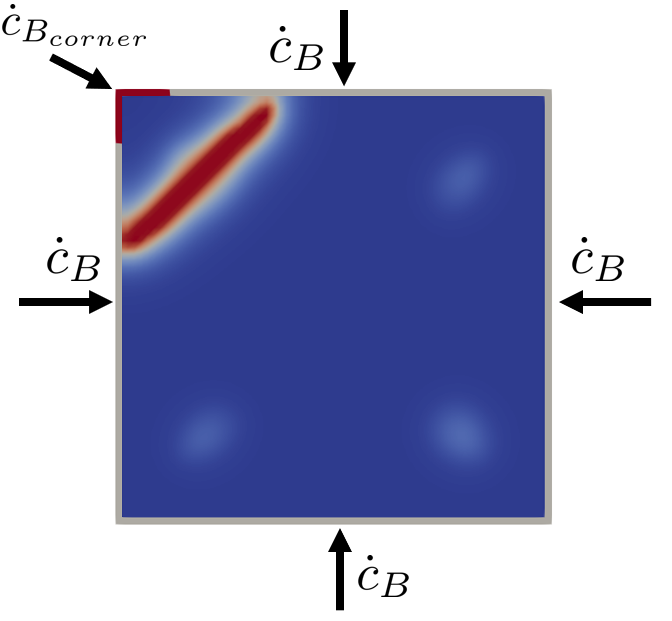 | `2411_16583v1_p25_img2.png` | 第25页 | PNG |
| 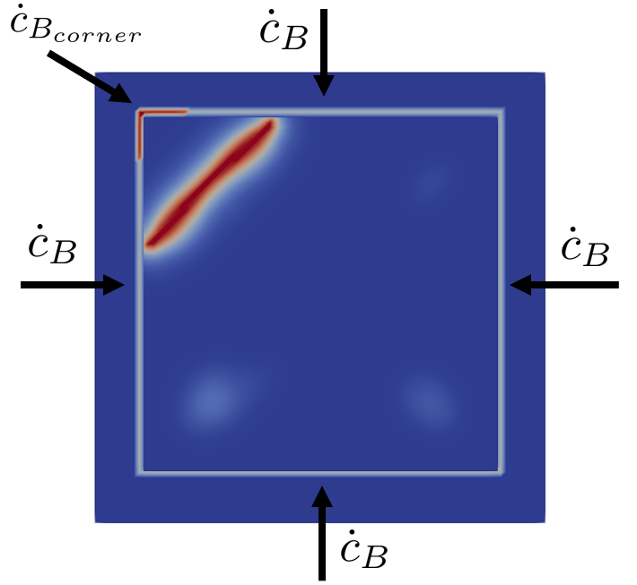 | `2411_16583v1_p25_img3.png` | 第25页 | PNG |
| 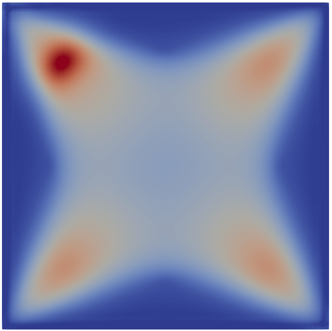 | `2411_16583v1_p26_img1.png` | 第26页 | PNG |
| 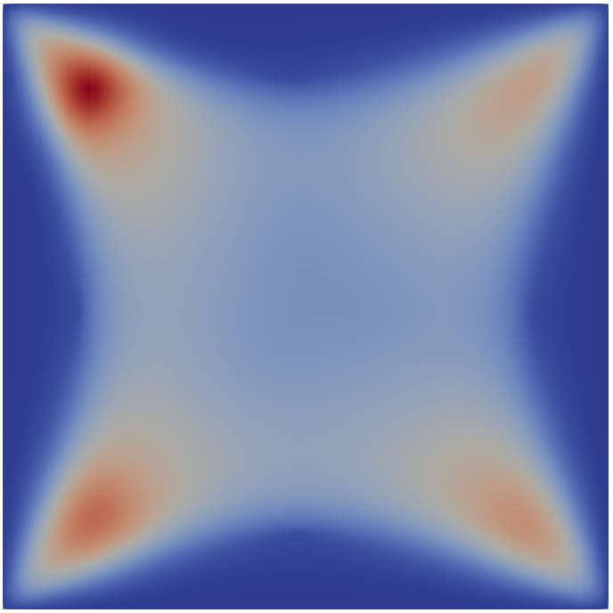 | `2411_16583v1_p26_img2.png` | 第26页 | PNG |
| 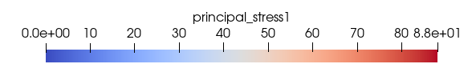 | `2411_16583v1_p26_img3.png` | 第26页 | PNG |
| 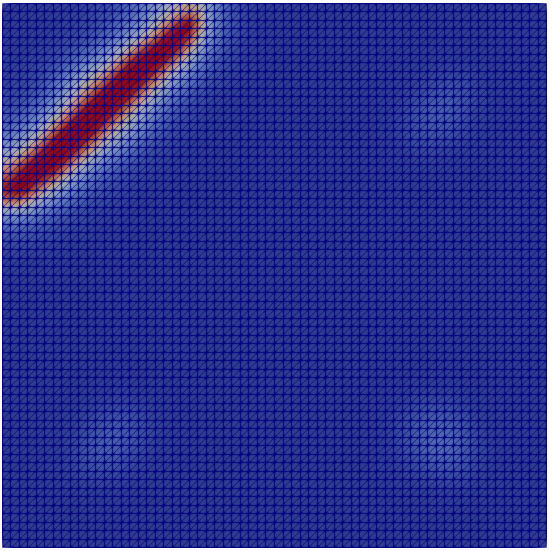 | `2411_16583v1_p27_img1.png` | 第27页 | PNG |
| 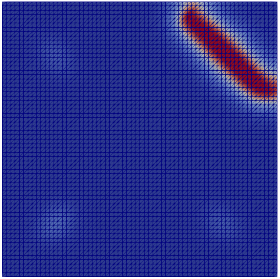 | `2411_16583v1_p27_img2.png` | 第27页 | PNG |
| 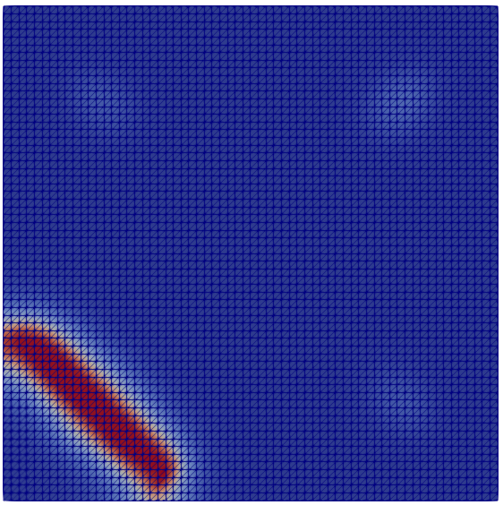 | `2411_16583v1_p27_img3.png` | 第27页 | PNG |
| 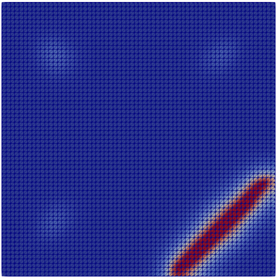 | `2411_16583v1_p27_img4.png` | 第27页 | PNG |
|  | `2411_16583v1_p28_img2.png` | 第28页 | PNG |
| 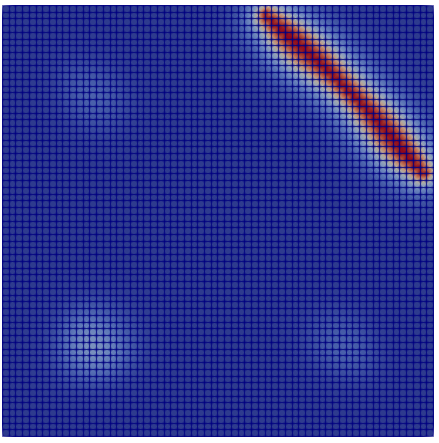 | `2411_16583v1_p28_img3.png` | 第28页 | PNG |
| 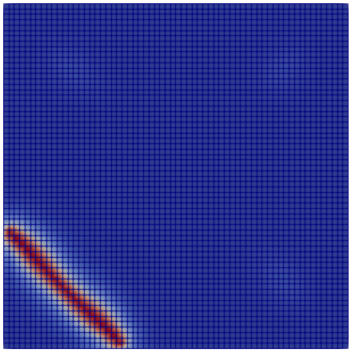 | `2411_16583v1_p28_img4.png` | 第28页 | PNG |
| 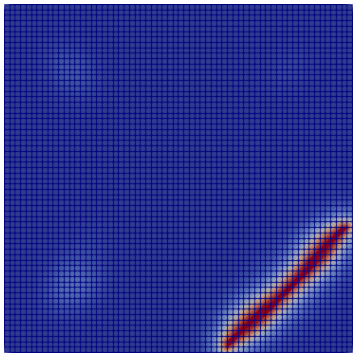 | `2411_16583v1_p28_img5.png` | 第28页 | PNG |
|  | `2411_16583v1_p30_img1.png` | 第30页 | PNG |
| 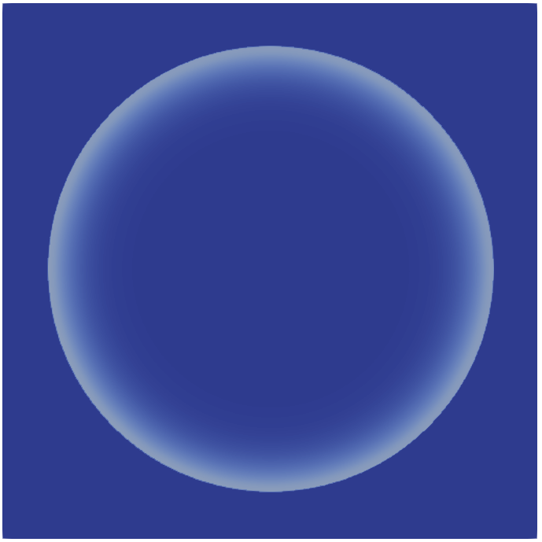 | `2411_16583v1_p31_img2.png` | 第31页 | PNG |
|  | `2411_16583v1_p31_img3.png` | 第31页 | PNG |
| 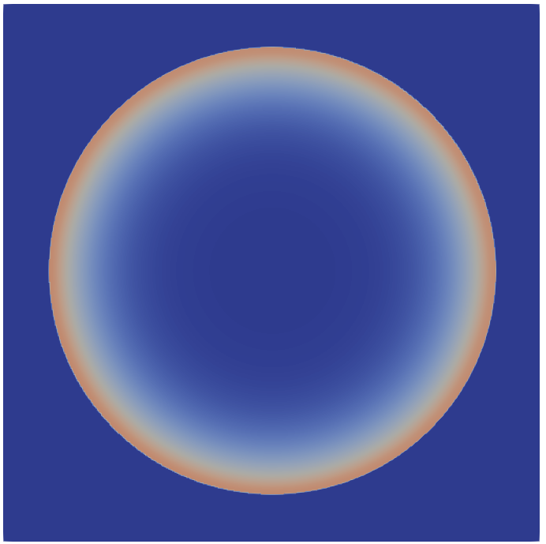 | `2411_16583v1_p31_img4.png` | 第31页 | PNG |
| 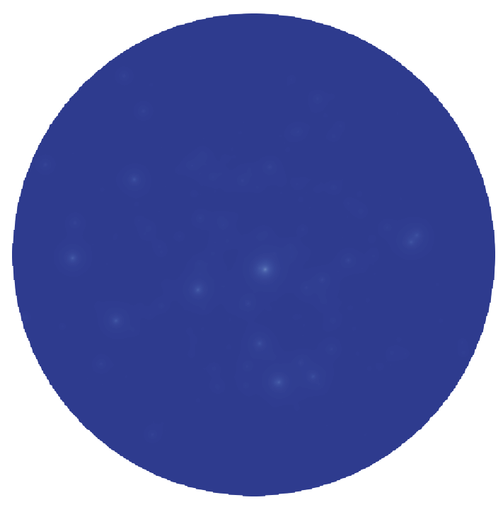 | `2411_16583v1_p31_img5.png` | 第31页 | PNG |
| 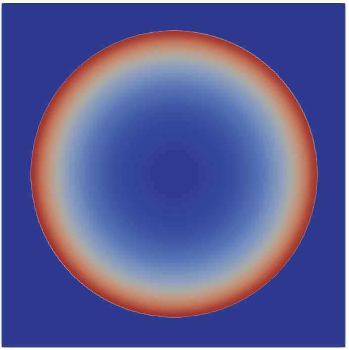 | `2411_16583v1_p31_img6.png` | 第31页 | PNG |
| 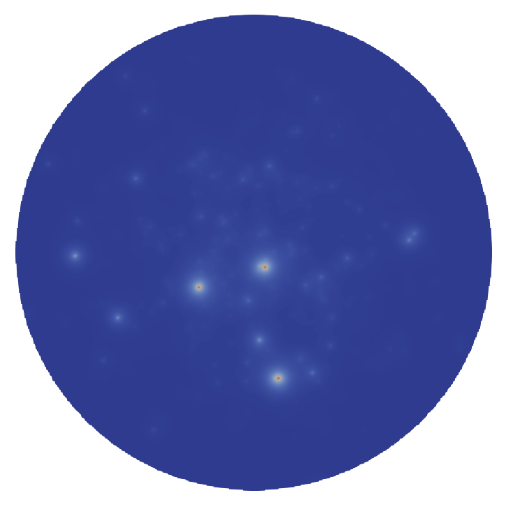 | `2411_16583v1_p31_img7.png` | 第31页 | PNG |
| 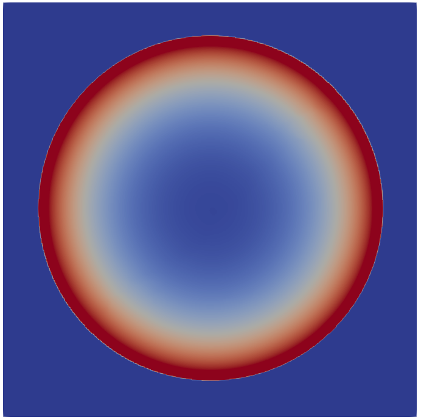 | `2411_16583v1_p31_img8.png` | 第31页 | PNG |
| 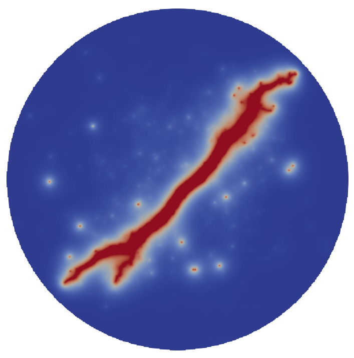 | `2411_16583v1_p31_img9.png` | 第31页 | PNG |
|  | `2411_16583v1_p32_img1.png` | 第32页 | PNG |
|  | `2411_16583v1_p33_img2.png` | 第33页 | PNG |
|  | `2411_16583v1_p33_img3.png` | 第33页 | PNG |
|  | `2411_16583v1_p33_img4.png` | 第33页 | PNG |
|  | `2411_16583v1_p33_img5.png` | 第33页 | PNG |
|  | `2411_16583v1_p33_img6.png` | 第33页 | PNG |
|  | `2411_16583v1_p33_img7.png` | 第33页 | PNG |

---

