# 14_物流调度优化 - 图片索引

> 本索引由 arXiv 学术论文图表提取器自动生成
> 生成时间: 2026-02-01 23:16:46

## 统计
- 论文数量: 6
- 图片数量: 69

---

## 📄 An Exact Algorithm for a Fuel-Constrained Autonomous Vehicle Path Planning Problem

| 属性 | 值 |
|-----|-----|
| **arXiv ID** | [1604.08464v3](http://arxiv.org/abs/1604.08464v3) |
| **作者** | Kaarthik Sundar, Saravanan Venkatachalam, Sivakumar Rathinam et al. |
| **发布日期** | 2016-04-28 |
| **PDF链接** | [下载PDF](https://arxiv.org/pdf/1604.08464v3) |

### 提取的图片 (1张)

| 预览 | 文件名 | 页码 | 格式 |
|------|--------|------|------|
| 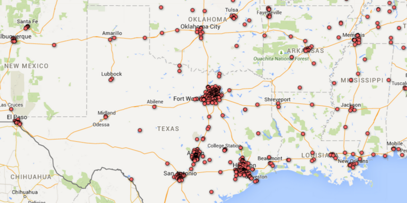 | `1604_08464v3_p2_img1.png` | 第2页 | PNG |

---

## 📄 Joint vehicle state and parameters estimation via Twin-in-the-Loop observers

| 属性 | 值 |
|-----|-----|
| **arXiv ID** | [2309.01461v1](http://arxiv.org/abs/2309.01461v1) |
| **作者** | Federico Dettù, Simone Formentin, Sergio Matteo Savaresi et al. |
| **发布日期** | 2023-09-04 |
| **PDF链接** | [下载PDF](https://arxiv.org/pdf/2309.01461v1) |

### 提取的图片 (4张)

| 预览 | 文件名 | 页码 | 格式 |
|------|--------|------|------|
| 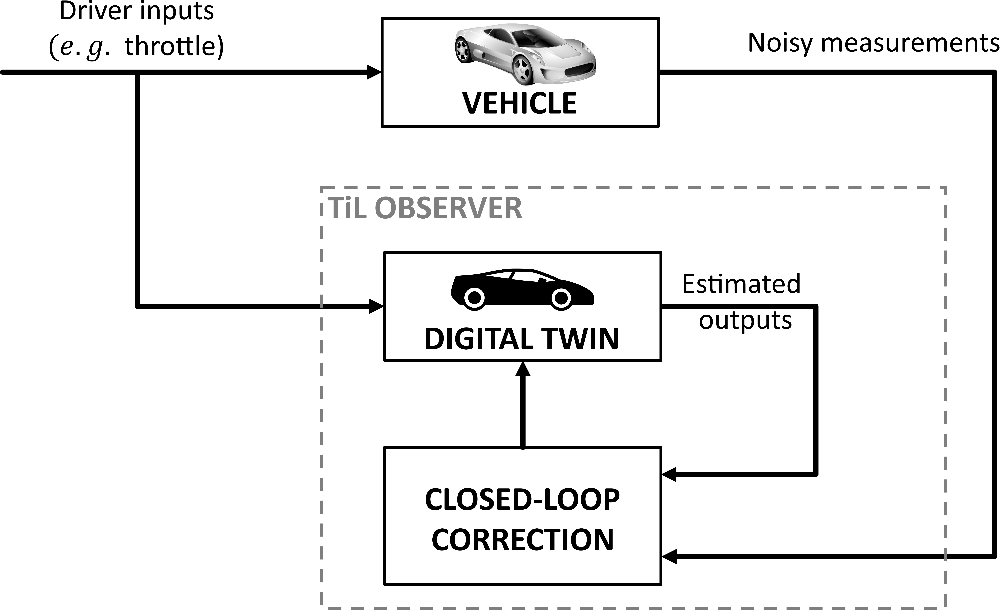 | `2309_01461v1_p4_img1.png` | 第4页 | PNG |
|  | `2309_01461v1_p5_img1.png` | 第5页 | PNG |
|  | `2309_01461v1_p5_img2.png` | 第5页 | PNG |
| 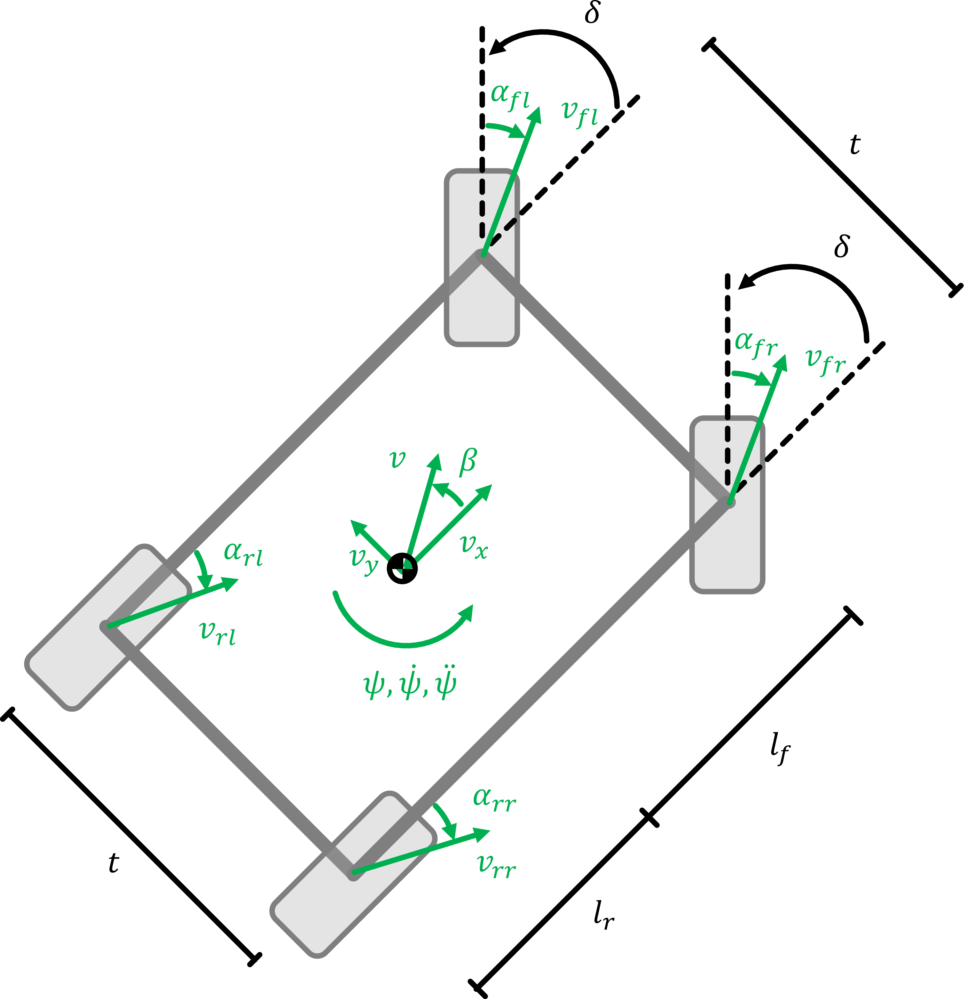 | `2309_01461v1_p19_img1.png` | 第19页 | PNG |

---

## 📄 Electric Vehicle Charging Scheduling in Green Logistics: Challenges, Approaches and Opportunities

| 属性 | 值 |
|-----|-----|
| **arXiv ID** | [2103.07635v1](http://arxiv.org/abs/2103.07635v1) |
| **作者** | Luyang Hou, Chun Wang, Jun Yan et al. |
| **发布日期** | 2021-03-13 |
| **PDF链接** | [下载PDF](https://arxiv.org/pdf/2103.07635v1) |

### 提取的图片 (1张)

| 预览 | 文件名 | 页码 | 格式 |
|------|--------|------|------|
| 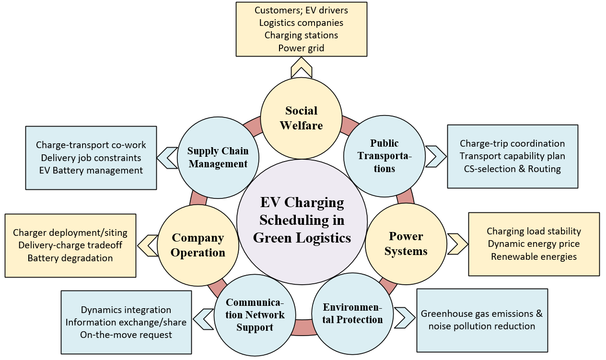 | `2103_07635v1_p3_img1.png` | 第3页 | PNG |

---

## 📄 Multi-Agent Deep Q-Network with Layer-based Communication Channel for Autonomous Internal Logistics Vehicle Scheduling in Smart Manufacturing

| 属性 | 值 |
|-----|-----|
| **arXiv ID** | [2411.00728v1](http://arxiv.org/abs/2411.00728v1) |
| **作者** | Mohammad Feizabadi, Arman Hosseini, Zakaria Yahouni et al. |
| **发布日期** | 2024-11-01 |
| **PDF链接** | [下载PDF](https://arxiv.org/pdf/2411.00728v1) |

### 提取的图片 (6张)

| 预览 | 文件名 | 页码 | 格式 |
|------|--------|------|------|
| 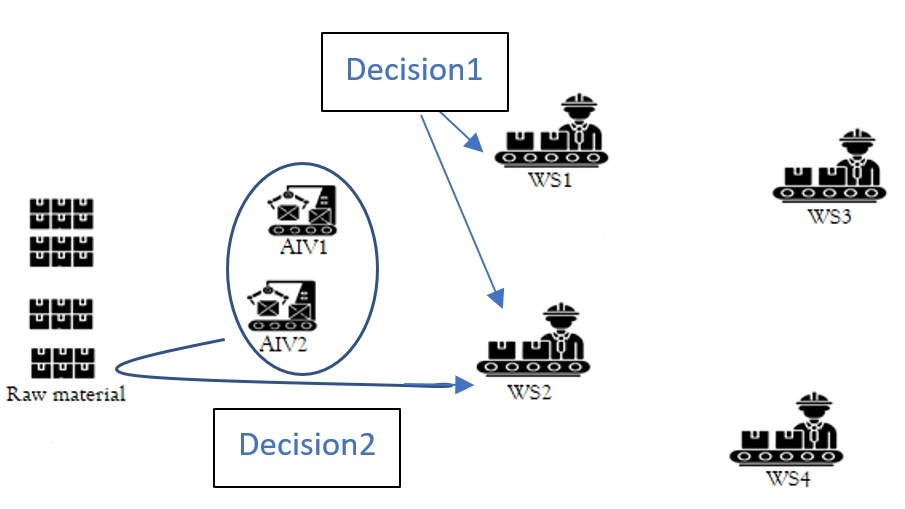 | `2411_00728v1_p7_img1.jpeg` | 第7页 | JPEG |
| 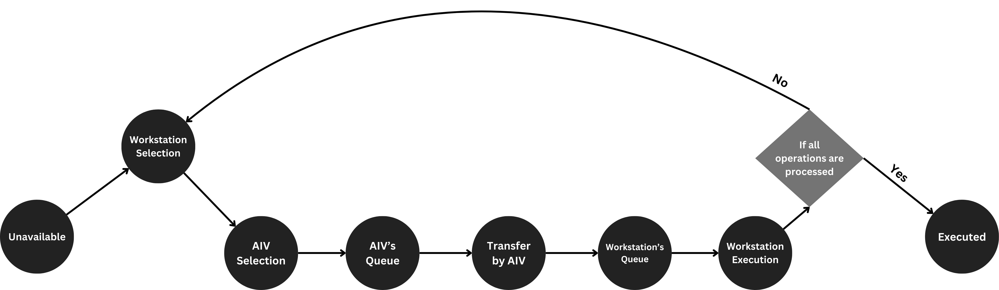 | `2411_00728v1_p8_img1.png` | 第8页 | PNG |
| 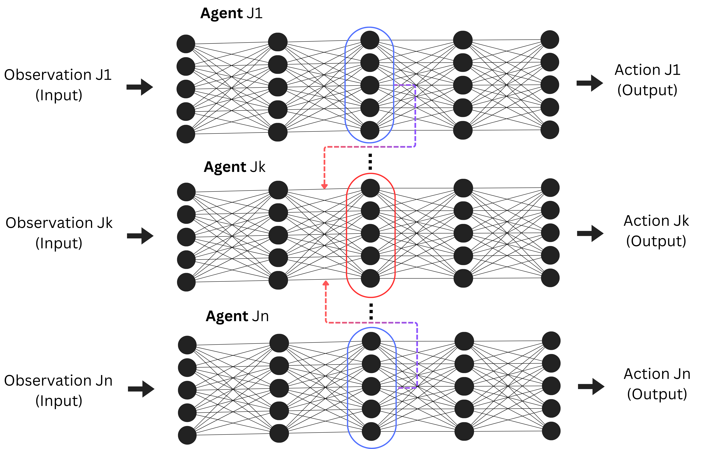 | `2411_00728v1_p10_img1.png` | 第10页 | PNG |
| 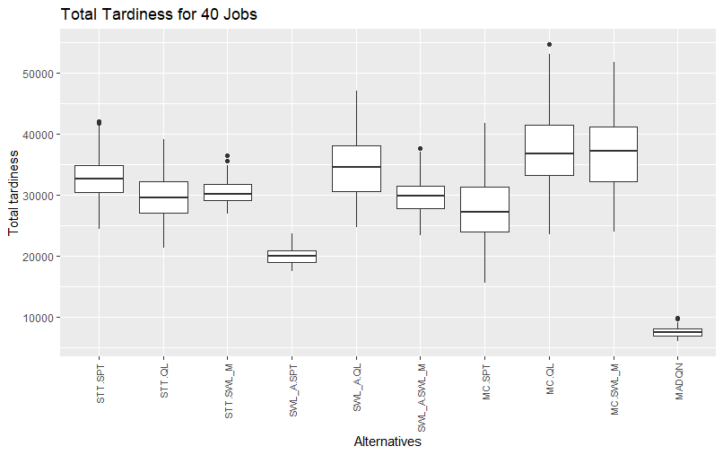 | `2411_00728v1_p14_img1.png` | 第14页 | PNG |
| 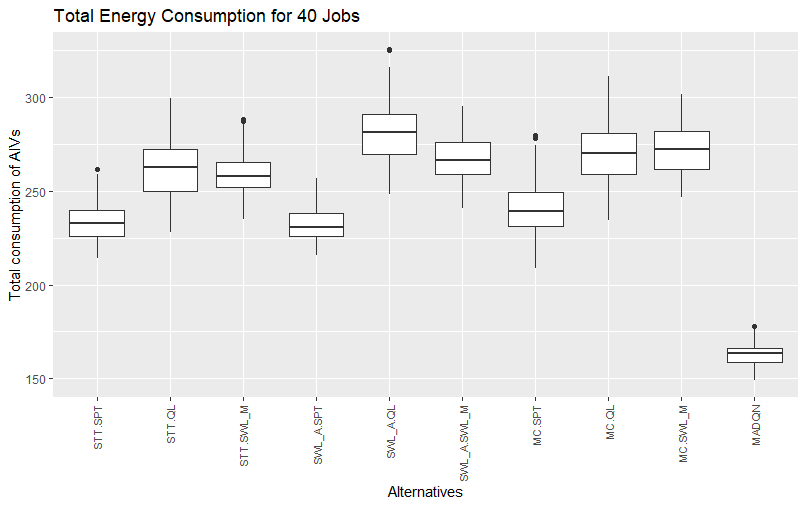 | `2411_00728v1_p14_img2.png` | 第14页 | PNG |
| 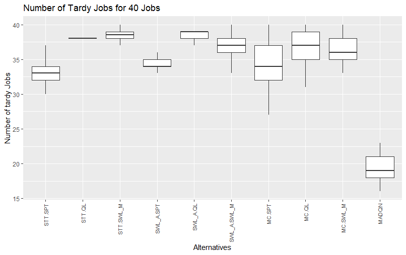 | `2411_00728v1_p15_img1.png` | 第15页 | PNG |

---

## 📄 Optimal design of frame structures with mixed categorical and continuous design variables using the Gumbel-Softmax method

| 属性 | 值 |
|-----|-----|
| **arXiv ID** | [2501.00258v1](http://arxiv.org/abs/2501.00258v1) |
| **作者** | Mehran Ebrahimi, Hyunmin Cheong, Pradeep Kumar Jayaraman et al. |
| **发布日期** | 2024-12-31 |
| **PDF链接** | [下载PDF](https://arxiv.org/pdf/2501.00258v1) |

### 提取的图片 (20张)

| 预览 | 文件名 | 页码 | 格式 |
|------|--------|------|------|
|  | `2501_00258v1_p15_img1.jpeg` | 第15页 | JPEG |
|  | `2501_00258v1_p15_img2.jpeg` | 第15页 | JPEG |
|  | `2501_00258v1_p15_img3.jpeg` | 第15页 | JPEG |
|  | `2501_00258v1_p15_img4.jpeg` | 第15页 | JPEG |
|  | `2501_00258v1_p18_img1.jpeg` | 第18页 | JPEG |
|  | `2501_00258v1_p18_img2.jpeg` | 第18页 | JPEG |
|  | `2501_00258v1_p19_img1.jpeg` | 第19页 | JPEG |
|  | `2501_00258v1_p19_img2.jpeg` | 第19页 | JPEG |
|  | `2501_00258v1_p19_img3.jpeg` | 第19页 | JPEG |
|  | `2501_00258v1_p19_img4.jpeg` | 第19页 | JPEG |
|  | `2501_00258v1_p19_img5.jpeg` | 第19页 | JPEG |
|  | `2501_00258v1_p19_img6.jpeg` | 第19页 | JPEG |
|  | `2501_00258v1_p20_img1.jpeg` | 第20页 | JPEG |
|  | `2501_00258v1_p20_img2.jpeg` | 第20页 | JPEG |
|  | `2501_00258v1_p24_img1.jpeg` | 第24页 | JPEG |
|  | `2501_00258v1_p24_img2.jpeg` | 第24页 | JPEG |
|  | `2501_00258v1_p24_img3.jpeg` | 第24页 | JPEG |
| 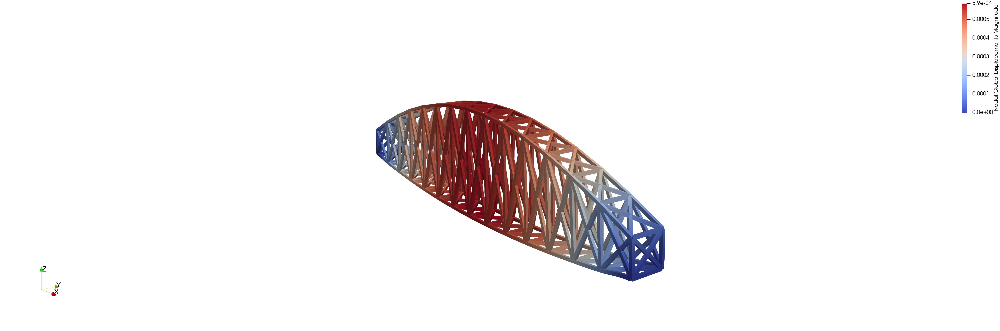 | `2501_00258v1_p24_img4.jpeg` | 第24页 | JPEG |
|  | `2501_00258v1_p24_img5.jpeg` | 第24页 | JPEG |
| 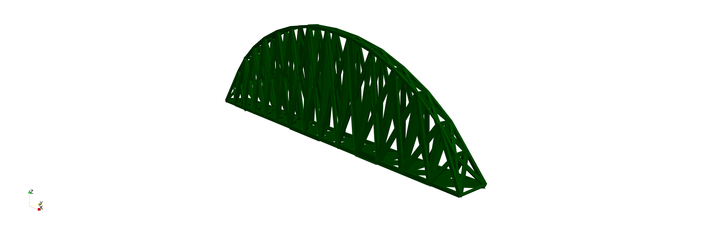 | `2501_00258v1_p24_img6.jpeg` | 第24页 | JPEG |

---

## 📄 Two-Scale Optimization of Graded Lattice Structures respecting Buckling on Micro- and Macroscale

| 属性 | 值 |
|-----|-----|
| **arXiv ID** | [2303.08710v1](http://arxiv.org/abs/2303.08710v1) |
| **作者** | Daniel Hübner, Fabian Wein, Michael Stingl et al. |
| **发布日期** | 2023-03-15 |
| **PDF链接** | [下载PDF](https://arxiv.org/pdf/2303.08710v1) |

### 提取的图片 (37张)

| 预览 | 文件名 | 页码 | 格式 |
|------|--------|------|------|
|  | `2303_08710v1_p9_img1.png` | 第9页 | PNG |
| 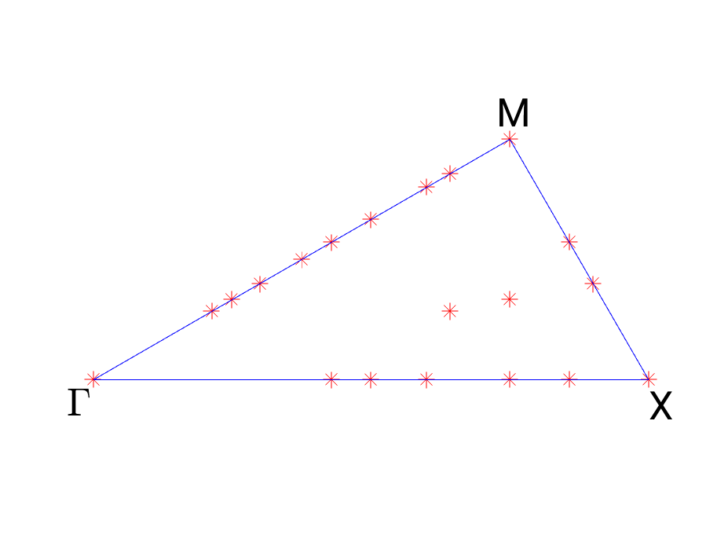 | `2303_08710v1_p9_img2.png` | 第9页 | PNG |
| 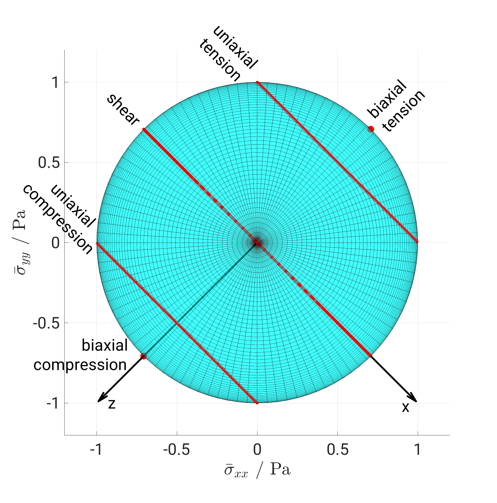 | `2303_08710v1_p10_img1.png` | 第10页 | PNG |
|  | `2303_08710v1_p14_img1.png` | 第14页 | PNG |
|  | `2303_08710v1_p14_img2.png` | 第14页 | PNG |
| 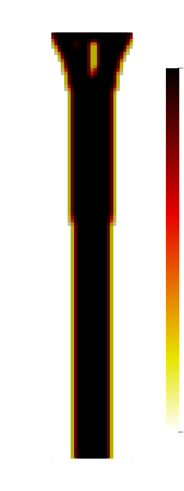 | `2303_08710v1_p14_img3.png` | 第14页 | PNG |
|  | `2303_08710v1_p14_img4.png` | 第14页 | PNG |
| 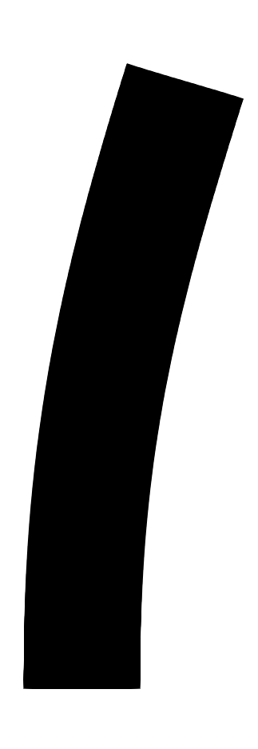 | `2303_08710v1_p14_img5.png` | 第14页 | PNG |
| 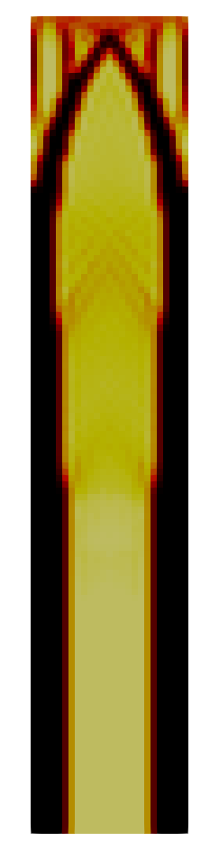 | `2303_08710v1_p15_img1.png` | 第15页 | PNG |
| 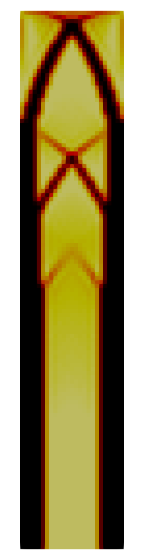 | `2303_08710v1_p15_img2.png` | 第15页 | PNG |
| 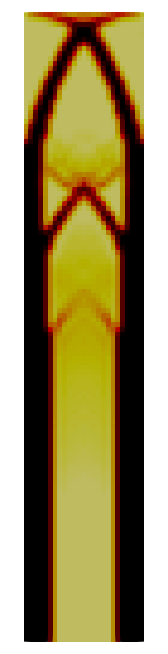 | `2303_08710v1_p15_img3.png` | 第15页 | PNG |
| 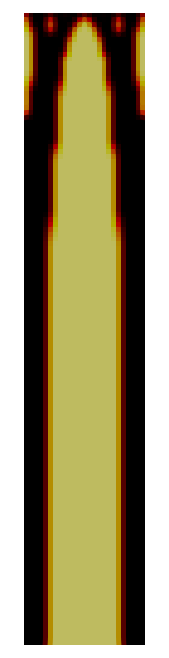 | `2303_08710v1_p15_img4.png` | 第15页 | PNG |
|  | `2303_08710v1_p15_img5.png` | 第15页 | PNG |
| 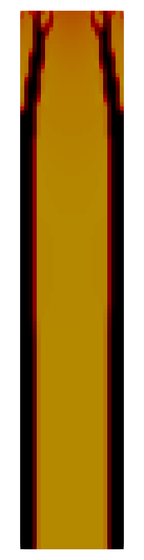 | `2303_08710v1_p16_img1.png` | 第16页 | PNG |
|  | `2303_08710v1_p16_img2.png` | 第16页 | PNG |
|  | `2303_08710v1_p16_img3.png` | 第16页 | PNG |
|  | `2303_08710v1_p16_img4.png` | 第16页 | PNG |
|  | `2303_08710v1_p16_img5.png` | 第16页 | PNG |
| 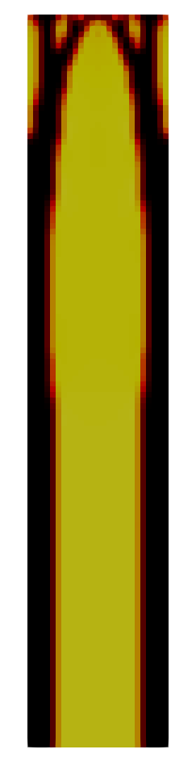 | `2303_08710v1_p17_img1.png` | 第17页 | PNG |
| 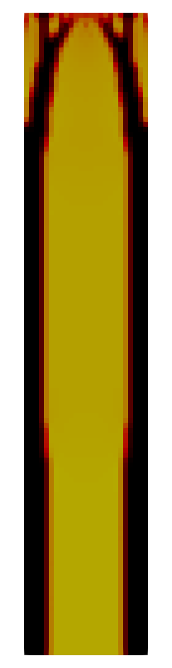 | `2303_08710v1_p17_img2.png` | 第17页 | PNG |
| 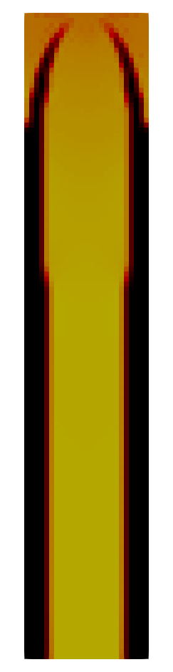 | `2303_08710v1_p17_img3.png` | 第17页 | PNG |
| 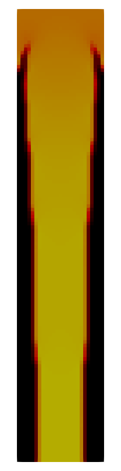 | `2303_08710v1_p17_img4.png` | 第17页 | PNG |
|  | `2303_08710v1_p17_img5.png` | 第17页 | PNG |
|  | `2303_08710v1_p18_img1.png` | 第18页 | PNG |
| 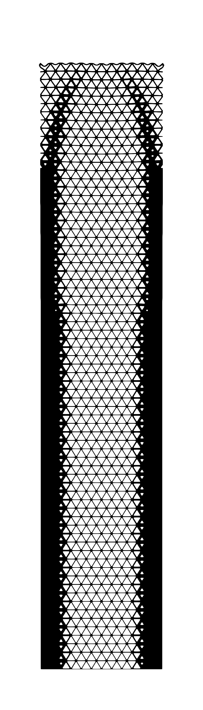 | `2303_08710v1_p18_img2.png` | 第18页 | PNG |
| 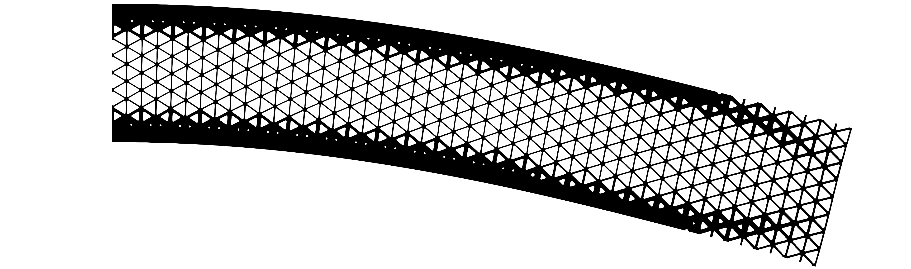 | `2303_08710v1_p18_img3.png` | 第18页 | PNG |
|  | `2303_08710v1_p18_img4.png` | 第18页 | PNG |
| 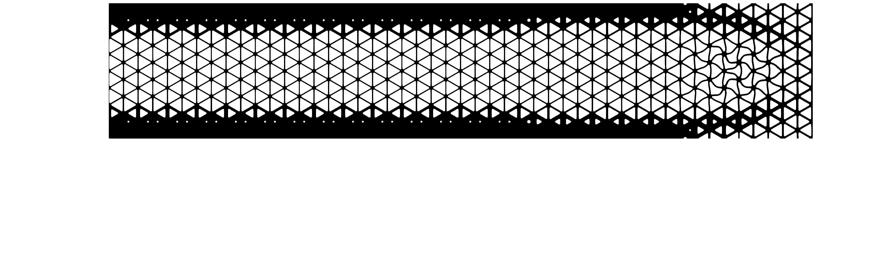 | `2303_08710v1_p18_img5.png` | 第18页 | PNG |
| 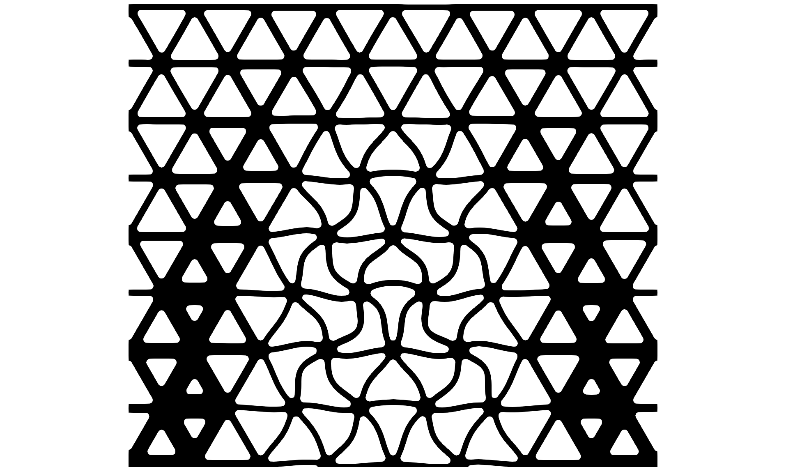 | `2303_08710v1_p18_img6.png` | 第18页 | PNG |
| 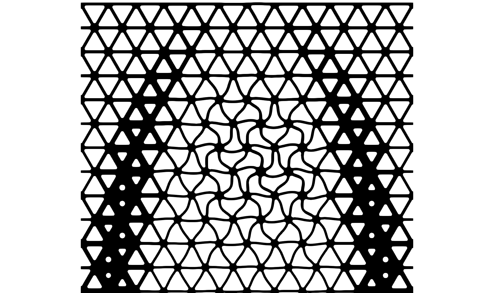 | `2303_08710v1_p18_img7.png` | 第18页 | PNG |
| 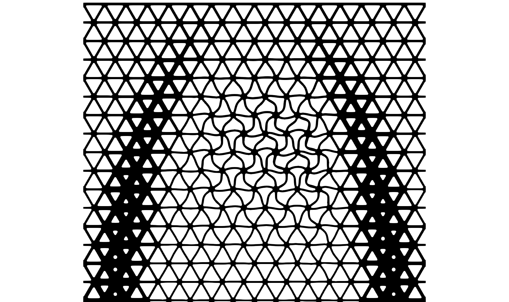 | `2303_08710v1_p18_img8.png` | 第18页 | PNG |
| 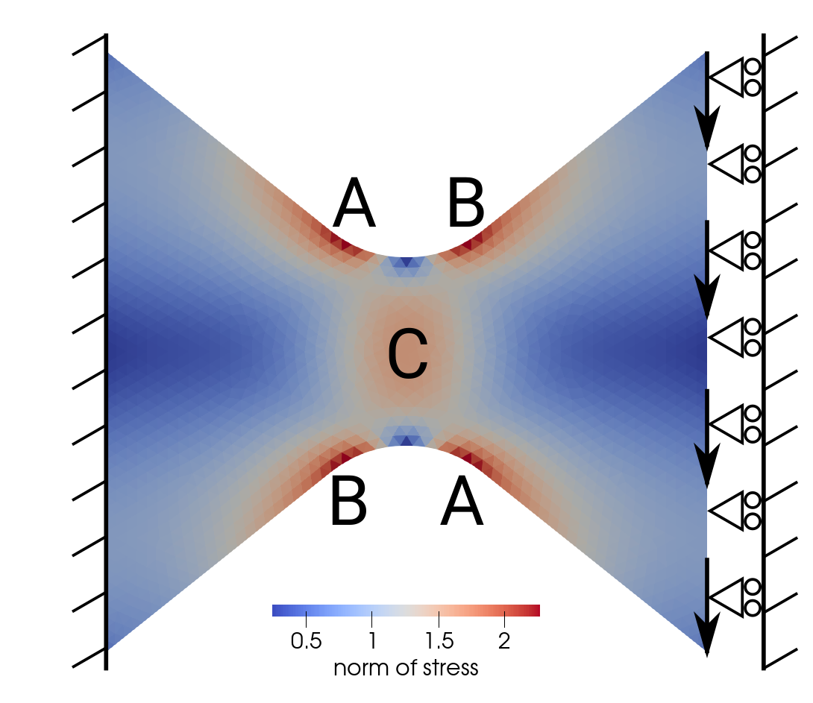 | `2303_08710v1_p19_img1.png` | 第19页 | PNG |
| 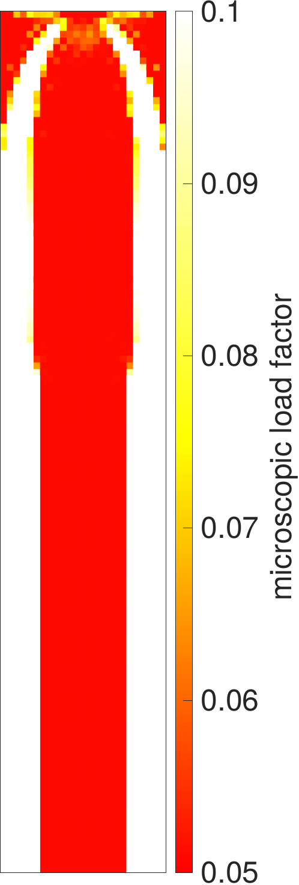 | `2303_08710v1_p19_img2.png` | 第19页 | PNG |
| 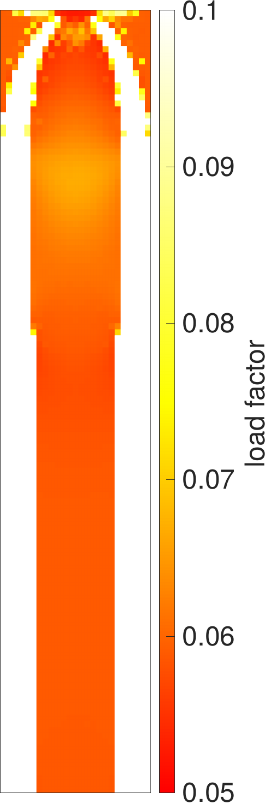 | `2303_08710v1_p19_img3.png` | 第19页 | PNG |
|  | `2303_08710v1_p19_img4.png` | 第19页 | PNG |
| 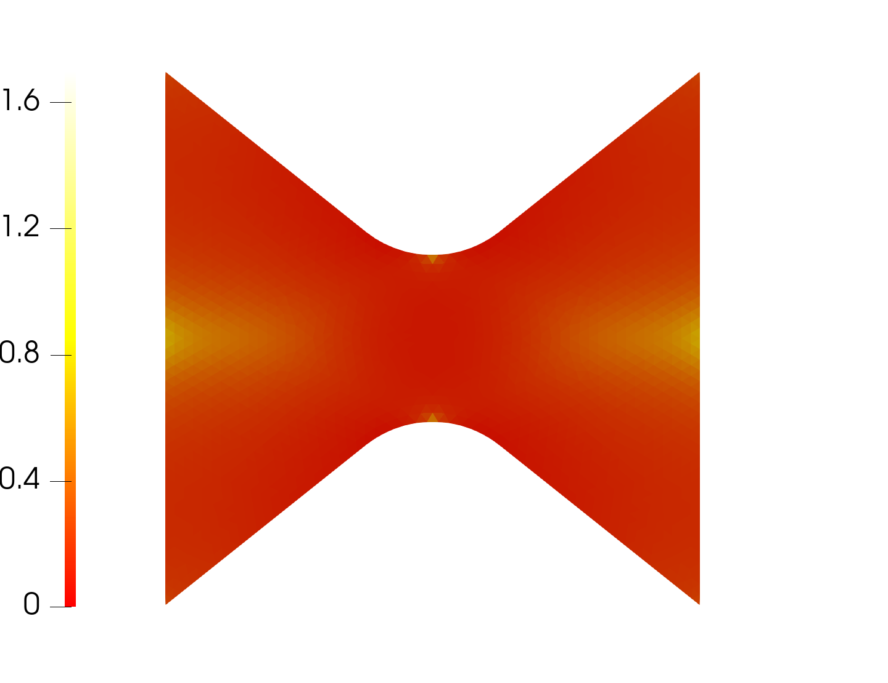 | `2303_08710v1_p20_img1.png` | 第20页 | PNG |
|  | `2303_08710v1_p20_img2.png` | 第20页 | PNG |

---

