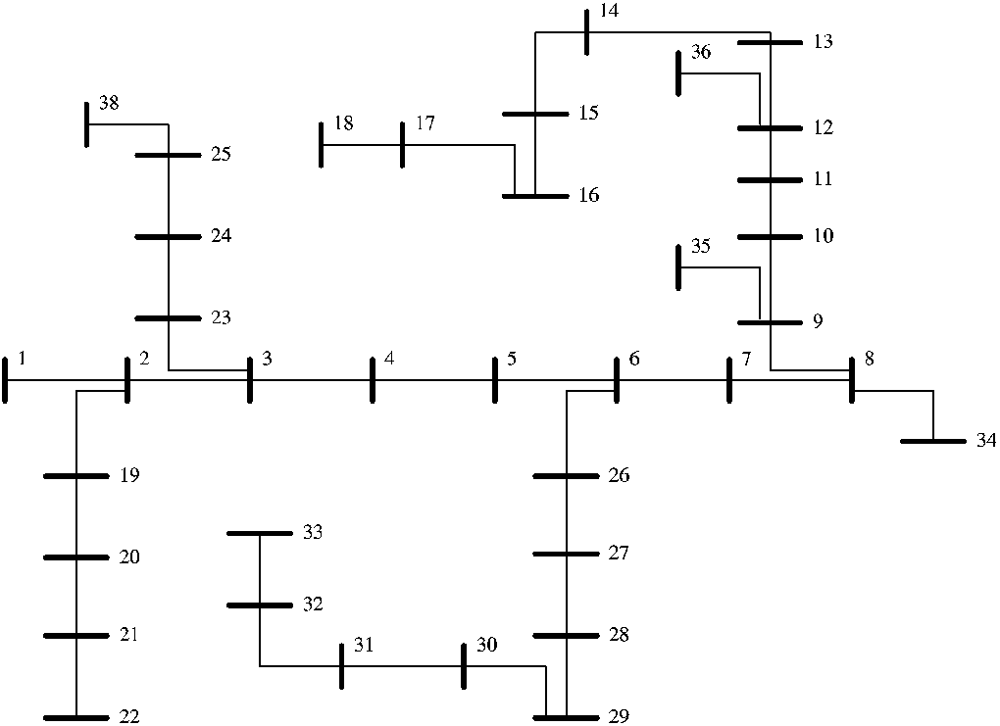
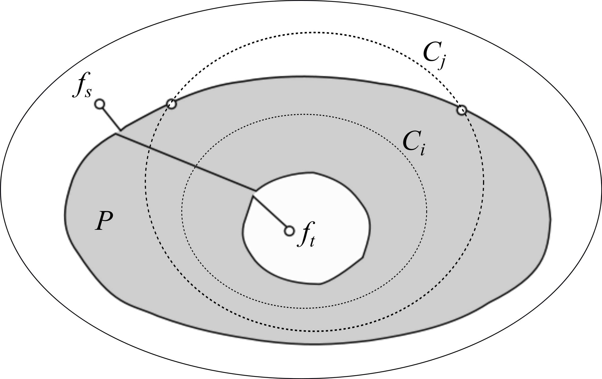

# 20_网络流优化 - 图片索引

> 本索引由 arXiv 学术论文图表提取器自动生成
> 生成时间: 2026-02-01 23:21:32

## 统计
- 论文数量: 2
- 图片数量: 2

---

## 📄 Optimal Power Flow with Inelastic Demands for Demand Response in Radial Distribution Networks

| 属性 | 值 |
|-----|-----|
| **arXiv ID** | [1601.02323v3](http://arxiv.org/abs/1601.02323v3) |
| **作者** | Majid Khonji, Chi-Kin Chau, Khaled Elbassioni et al. |
| **发布日期** | 2016-01-11 |
| **PDF链接** | [下载PDF](https://arxiv.org/pdf/1601.02323v3) |

### 提取的图片 (1张)

| 预览 | 文件名 | 页码 | 格式 |
|------|--------|------|------|
|  | `1601_02323v3_p8_img1.png` | 第8页 | PNG |

---

## 📄 Improved Minimum Cuts and Maximum Flows in Undirected Planar Graphs

| 属性 | 值 |
|-----|-----|
| **arXiv ID** | [1011.2843v2](http://arxiv.org/abs/1011.2843v2) |
| **作者** | Giuseppe F. Italiano, Piotr Sankowski |
| **发布日期** | 2010-11-12 |
| **PDF链接** | [下载PDF](https://arxiv.org/pdf/1011.2843v2) |

### 提取的图片 (1张)

| 预览 | 文件名 | 页码 | 格式 |
|------|--------|------|------|
|  | `1011_2843v2_p22_img1.jpeg` | 第22页 | JPEG |

---

