# 21_NASA官方图片 - 图片来源索引

> **来源**: NASA Images API (https://images.nasa.gov)  
> **许可**: 所有NASA图片均为Public Domain，可自由使用  
> **生成时间**: 2026-02-01 23:55:41

## 📊 统计

| 指标 | 数量 |
|-----|------|
| 成功下载 | 32 |
| 下载失败 | 0 |
| 总计 | 32 |

---

## ✅ 已下载图片

### Astronaut Alan Bean deploys Lunar Surface Magnetometer on lunar surface

| 属性 | 值 |
|-----|-----|
| **文件名** | `as12-46-6813.jpg` |
| **来源** | [JSC](https://images.nasa.gov/details-as12-46-6813) |
| **日期** | 1969-11-19 |
| **摄影师** | NASA |
| **许可** | Public Domain (NASA) |
| **文件大小** | 232 KB |

Astronaut Alan L. Bean, lunar module pilot, deploys the Lunar Surface Magnetometer (LSM) during the first Apollo 12 extravehicular activity on the Moon. The LSM is a component of the Apollo Lunar Surface Experiments Package (ALSEP). The Lunar Module can be seen in the left background.

---

### Photovoltaic Investigation on the Lunar Surface – PILS

| 属性 | 值 |
|-----|-----|
| **文件名** | `GRC-2020-C-01436.jpg` |
| **来源** | [GRC](https://images.nasa.gov/details-GRC-2020-C-01436) |
| **日期** | 2020-02-26 |
| **摄影师** | NASA/GRC/Bridget Caswell |
| **许可** | Public Domain (NASA) |
| **文件大小** | 134 KB |

Photovoltaic Investigation on the Lunar Surface – PILS

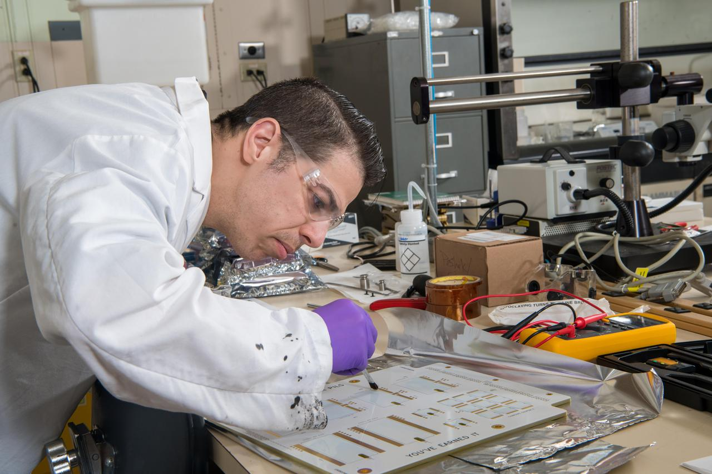

---

### Photovoltaic Investigation on the Lunar Surface – PILS

| 属性 | 值 |
|-----|-----|
| **文件名** | `GRC-2020-C-01432.jpg` |
| **来源** | [GRC](https://images.nasa.gov/details-GRC-2020-C-01432) |
| **日期** | 2020-02-26 |
| **摄影师** | NASA/GRC/Bridget Caswell |
| **许可** | Public Domain (NASA) |
| **文件大小** | 135 KB |

Photovoltaic Investigation on the Lunar Surface – PILS

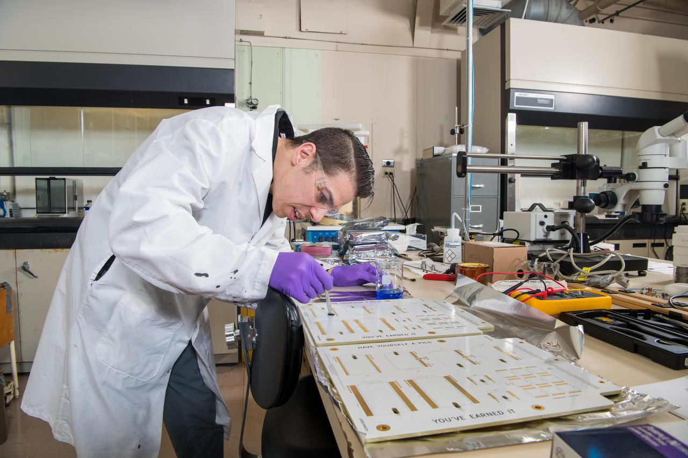

---

### Photovoltaic Investigation on the Lunar Surface – PILS

| 属性 | 值 |
|-----|-----|
| **文件名** | `GRC-2020-C-01429.jpg` |
| **来源** | [GRC](https://images.nasa.gov/details-GRC-2020-C-01429) |
| **日期** | 2020-02-26 |
| **摄影师** | NASA/GRC/Bridget Caswell |
| **许可** | Public Domain (NASA) |
| **文件大小** | 140 KB |

Photovoltaic Investigation on the Lunar Surface – PILS

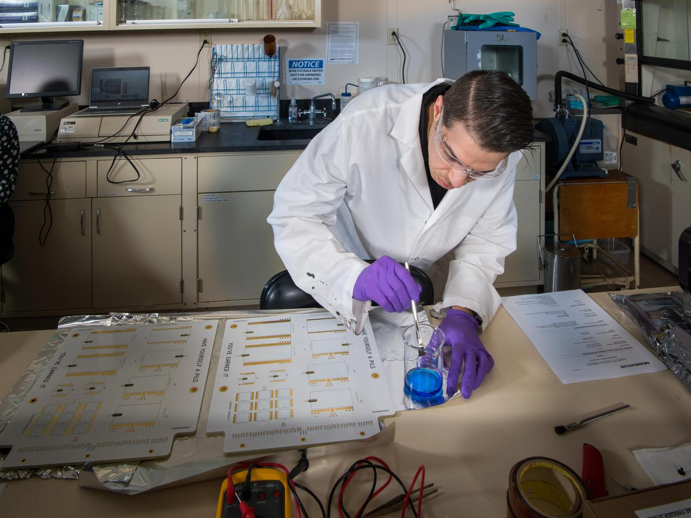

---

### Photovoltaic Investigation on the Lunar Surface – PILS

| 属性 | 值 |
|-----|-----|
| **文件名** | `GRC-2020-C-01409.jpg` |
| **来源** | [GRC](https://images.nasa.gov/details-GRC-2020-C-01409) |
| **日期** | 2020-02-26 |
| **摄影师** | NASA/GRC/Bridget Caswell |
| **许可** | Public Domain (NASA) |
| **文件大小** | 126 KB |

Photovoltaic Investigation on the Lunar Surface – PILS

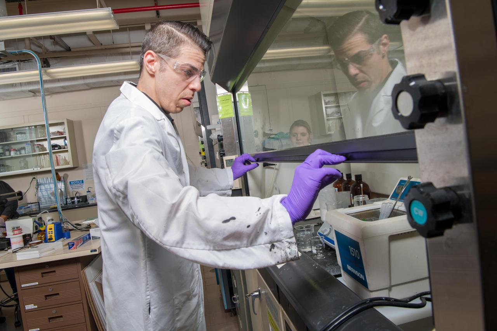

---

### View of the Apollo 16 Lunar Module on the lunar surface

| 属性 | 值 |
|-----|-----|
| **文件名** | `as16-113-18334.jpg` |
| **来源** | [JSC](https://images.nasa.gov/details-as16-113-18334) |
| **日期** | 1971-04-20 |
| **摄影师** | NASA |
| **许可** | Public Domain (NASA) |
| **文件大小** | 127 KB |

AS16-113-18334 (21 April 1972) --- View of the Lunar Module (LM) "Orion" parked on the lunar surface. During their post mission press conference, the Apollo 16 crewmembers called attention to the steerable S-band antenna, which was "frozen" in a yaw axis during much of the flight. This view of the L

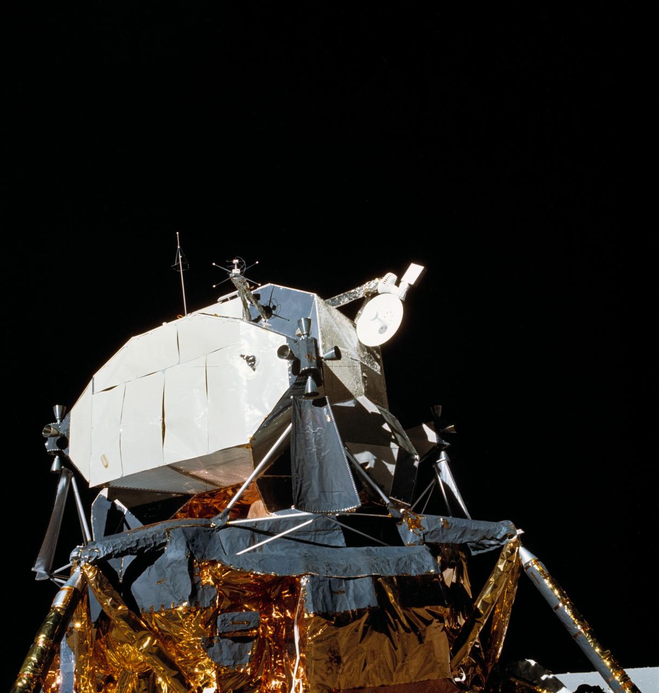

---

### View of footpad of Apollo 11 Lunar Module as it rested on lunar surface

| 属性 | 值 |
|-----|-----|
| **文件名** | `as11-40-5917.jpg` |
| **来源** | [JSC](https://images.nasa.gov/details-as11-40-5917) |
| **日期** | 1969-07-20 |
| **摄影师** | NASA |
| **许可** | Public Domain (NASA) |
| **文件大小** | 251 KB |

A close-up view of a footpad of the Apollo 11 Lunar Module as it rested on the surface of the Moon. The stick-like protruding object is a lunar surface sensing probe. This photograph was take with a 70mm lunar surface camera during the extravehicular activity of Astronauts Neil Armstrong and Edwin A

---

### Astronaut Eugene Cernan inside the lunar module on lunar surface after EVA

| 属性 | 值 |
|-----|-----|
| **文件名** | `AS17-145-22224.jpg` |
| **来源** | [JSC](https://images.nasa.gov/details-AS17-145-22224) |
| **日期** | 1972-12-12 |
| **摄影师** | NASA |
| **许可** | Public Domain (NASA) |
| **文件大小** | 197 KB |

AS17-145-22224 (12 Dec. 1972) --- Astronaut Eugene A. Cernan, Apollo 17 commander, is photographed inside the lunar module on the lunar surface following the second extravehicular activity (EVA) of his mission. Note lunar dust on his suit. The photograph was taken by astronaut Harrison H. Schmitt, l

---

### NASA Uses Colorado Mountains for Simulated Artemis Moon Landing Course

| 属性 | 值 |
|-----|-----|
| **文件名** | `MAF_20250828_HATTS_MD37.jpg` |
| **来源** | [MSFC](https://images.nasa.gov/details-MAF_20250828_HATTS_MD37) |
| **日期** | 2025-09-12 |
| **摄影师** | NASA/Michael DeMocker |
| **许可** | Public Domain (NASA) |
| **文件大小** | 192 KB |

These photos and videos show how NASA certified a new lander flight training course using helicopters in the mountains of northern Colorado. NASA is partnering with the Colorado Army National Guard at its High-Altitude Army National Guard Aviation Training Site near Gypsum, Colorado, to develop the 

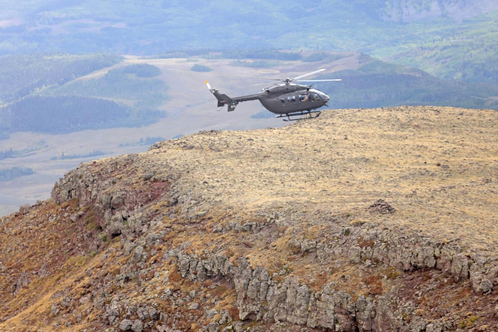

---

### NASA Uses Colorado Mountains for Simulated Artemis Moon Landing Course

| 属性 | 值 |
|-----|-----|
| **文件名** | `MAF_20250826_HAATS_MD27.jpg` |
| **来源** | [MSFC](https://images.nasa.gov/details-MAF_20250826_HAATS_MD27) |
| **日期** | 2025-09-12 |
| **摄影师** | NASA/Michael DeMocker |
| **许可** | Public Domain (NASA) |
| **文件大小** | 140 KB |

These photos and videos show how NASA certified a new lander flight training course using helicopters in the mountains of northern Colorado. NASA is partnering with the Colorado Army National Guard at its High-Altitude Army National Guard Aviation Training Site near Gypsum, Colorado, to develop the 

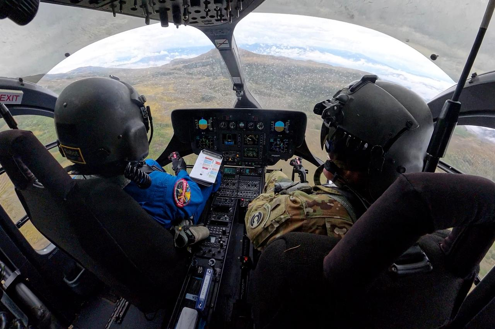

---

### NASA Uses Colorado Mountains for Simulated Artemis Moon Landing Course

| 属性 | 值 |
|-----|-----|
| **文件名** | `MAF_20250826_HATTS_MD03.jpg` |
| **来源** | [MSFC](https://images.nasa.gov/details-MAF_20250826_HATTS_MD03) |
| **日期** | 2025-09-12 |
| **摄影师** | NASA/Michael DeMocker |
| **许可** | Public Domain (NASA) |
| **文件大小** | 83 KB |

These photos and videos show how NASA certified a new lander flight training course using helicopters in the mountains of northern Colorado. NASA is partnering with the Colorado Army National Guard at its High-Altitude Army National Guard Aviation Training Site near Gypsum, Colorado, to develop the 

---

### NASA Uses Colorado Mountains for Simulated Artemis Moon Landing Course

| 属性 | 值 |
|-----|-----|
| **文件名** | `MAF_20250828_HATTS_MD21.jpg` |
| **来源** | [MSFC](https://images.nasa.gov/details-MAF_20250828_HATTS_MD21) |
| **日期** | 2025-09-12 |
| **摄影师** | NASA/Michael DeMocker |
| **许可** | Public Domain (NASA) |
| **文件大小** | 131 KB |

These photos and videos show how NASA certified a new lander flight training course using helicopters in the mountains of northern Colorado. NASA is partnering with the Colorado Army National Guard at its High-Altitude Army National Guard Aviation Training Site near Gypsum, Colorado, to develop the 

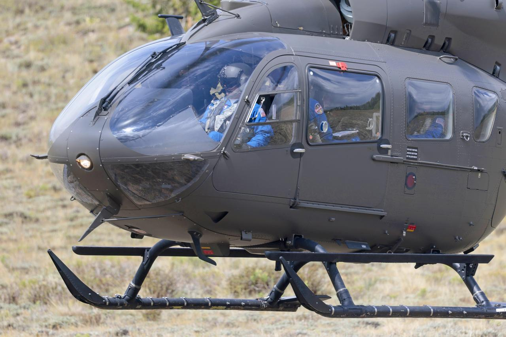

---

### NASA Uses Colorado Mountains for Simulated Artemis Moon Landing Course

| 属性 | 值 |
|-----|-----|
| **文件名** | `MAF_20250828_HATTS_MD23.jpg` |
| **来源** | [MSFC](https://images.nasa.gov/details-MAF_20250828_HATTS_MD23) |
| **日期** | 2025-09-12 |
| **摄影师** | NASA/Michael DeMocker |
| **许可** | Public Domain (NASA) |
| **文件大小** | 147 KB |

These photos and videos show how NASA certified a new lander flight training course using helicopters in the mountains of northern Colorado. NASA is partnering with the Colorado Army National Guard at its High-Altitude Army National Guard Aviation Training Site near Gypsum, Colorado, to develop the 

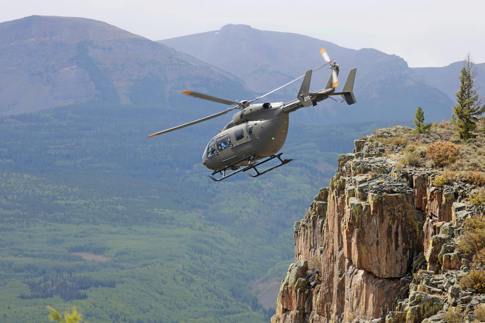

---

### NASA Uses Colorado Mountains for Simulated Artemis Moon Landing Course

| 属性 | 值 |
|-----|-----|
| **文件名** | `MAF_20250826_HATTS_MD22.jpg` |
| **来源** | [MSFC](https://images.nasa.gov/details-MAF_20250826_HATTS_MD22) |
| **日期** | 2025-09-12 |
| **摄影师** | NASA/Michael DeMocker |
| **许可** | Public Domain (NASA) |
| **文件大小** | 230 KB |

These photos and videos show how NASA certified a new lander flight training course using helicopters in the mountains of northern Colorado. NASA is partnering with the Colorado Army National Guard at its High-Altitude Army National Guard Aviation Training Site near Gypsum, Colorado, to develop the 

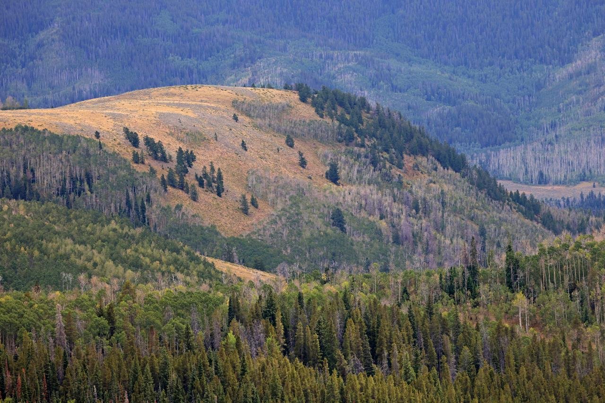

---

### Interior views of the Mir Space Station

| 属性 | 值 |
|-----|-----|
| **文件名** | `sts084-305-018.jpg` |
| **来源** | [JSC](https://images.nasa.gov/details-sts084-305-018) |
| **日期** | 1997-06-02 |
| **摄影师** | NASA |
| **许可** | Public Domain (NASA) |
| **文件大小** | 188 KB |

STS084-305-018 (15-24 May 1997) --- As seen from the docked Soyuz hatchway, this 35mm view shows the interior of a Russian Mir Space Station node connected to Kristall (bottom), Priroda (top), Mir Core Module (center), Kvant-2 (left) and Spektr (right). The Mir-23 and STS-84 crew members spent sever

---

### KENNEDY SPACE CENTER, FLA. -  NASA astronaut Steven W. Lindsey (second from right) views the interio

| 属性 | 值 |
|-----|-----|
| **文件名** | `KSC-03pd2029.jpg` |
| **来源** | [KSC](https://images.nasa.gov/details-KSC-03pd2029) |
| **日期** | 2003-06-24 |
| **摄影师** | NASA |
| **许可** | Public Domain (NASA) |
| **文件大小** | 145 KB |

KENNEDY SPACE CENTER, FLA. -  NASA astronaut Steven W. Lindsey (second from right) views the interior of the pressurized module of the Japanese Experiment Module (JEM) on a television monitor in the Space Station Processing Facility.  This major component of JEM, named "Kibo" (Hope), is Japan's prim

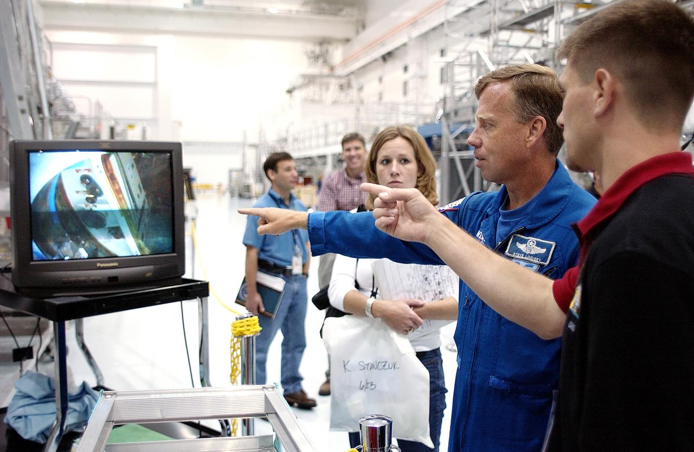

---

### SpaceX Crew-9 Mission Specialist Aleksandr Gorbunov

| 属性 | 值 |
|-----|-----|
| **文件名** | `jsc2024e052330.jpg` |
| **来源** | [JSC](https://images.nasa.gov/details-jsc2024e052330) |
| **日期** | 2024-07-22 |
| **摄影师** | SpaceX |
| **许可** | Public Domain (NASA) |
| **文件大小** | 96 KB |

jsc2024e052330 (July 22, 2024) --- NASA’s SpaceX Crew-9 Mission Specialist Aleksandr Gorbunov is pictured familiarizing himself with the interior of the Dragon spacecraft, which will take him and the rest of the crew to the International Space Station no earlier than mid-August. Credit: SpaceX

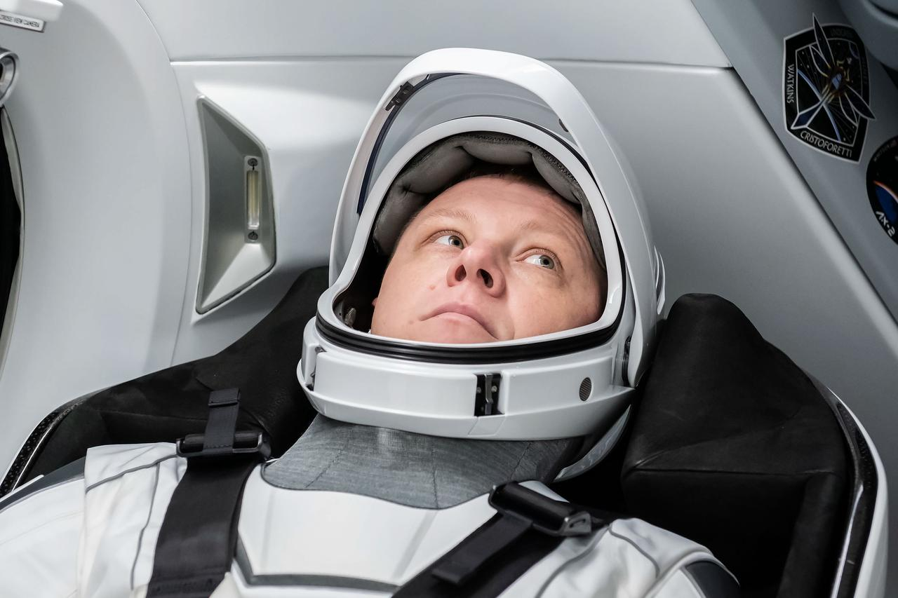

---

### The crew of NASA’s SpaceX Crew-9 mission

| 属性 | 值 |
|-----|-----|
| **文件名** | `jsc2024e052322.jpg` |
| **来源** | [JSC](https://images.nasa.gov/details-jsc2024e052322) |
| **日期** | 2024-07-22 |
| **摄影师** | SpaceX |
| **许可** | Public Domain (NASA) |
| **文件大小** | 175 KB |

jsc2024e052322 (July 22, 2024) --- The crew of NASA’s SpaceX Crew-9 mission to the International Space Station poses for a photo during a crew equipment interface test (CEIT), which plays an important role in familiarizing crew members with the interior of the Dragon

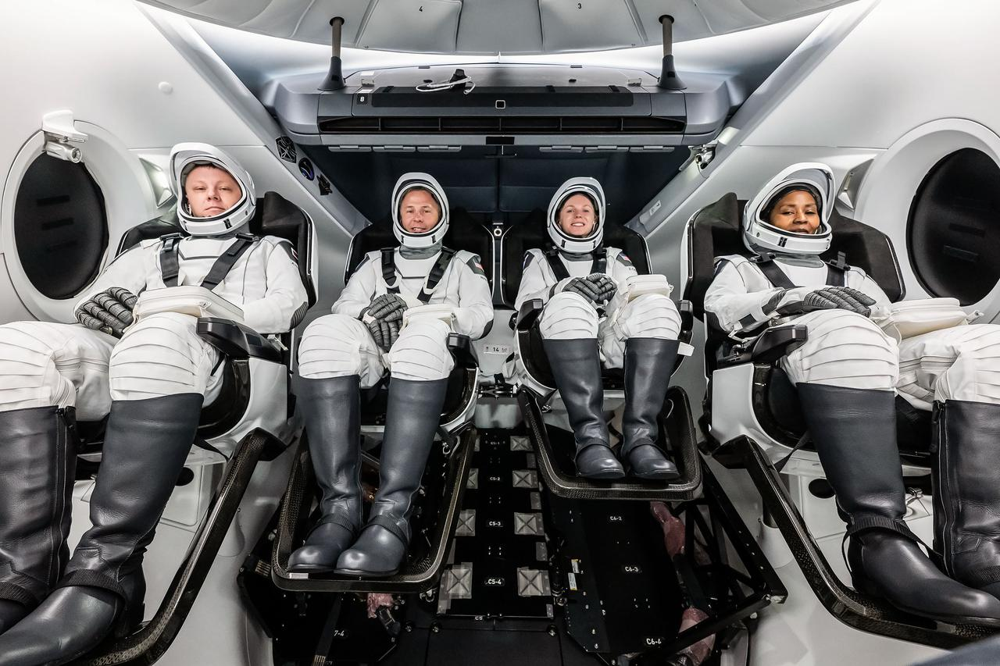

---

### KENNEDY SPACE CENTER, FLA. - In the Orbiter Processing Facility (OPF), United Space Alliance technic

| 属性 | 值 |
|-----|-----|
| **文件名** | `KSC-03pd2489.jpg` |
| **来源** | [KSC](https://images.nasa.gov/details-KSC-03pd2489) |
| **日期** | 2003-09-03 |
| **摄影师** | NASA |
| **许可** | Public Domain (NASA) |
| **文件大小** | 136 KB |

KENNEDY SPACE CENTER, FLA. - In the Orbiter Processing Facility (OPF), United Space Alliance technicians replace the attachment points for the spars on the interior of a wing of Space Shuttle Atlantis. Reinforced Carbon Carbon (RCC) panels are mechanically attached to the wing with a series of float

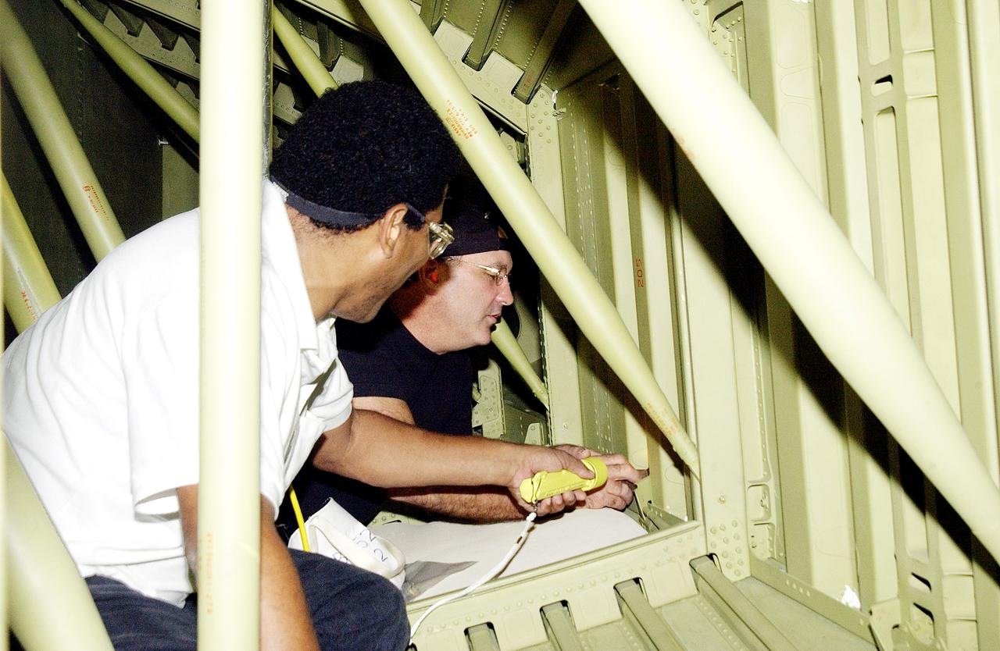

---

### Mars InSight Post Landing Press Conference

| 属性 | 值 |
|-----|-----|
| **文件名** | `NHQ201811260046.jpg` |
| **来源** | [HQ](https://images.nasa.gov/details-NHQ201811260046) |
| **日期** | 2018-11-26 |
| **摄影师** | NASA/Bill Ingalls |
| **许可** | Public Domain (NASA) |
| **文件大小** | 94 KB |

NASA Administrator Jim Bridenstine, left, JPL Director Michael Watkins, InSight Project Manager Tom Hoffman, InSight Principal Investigator Bruce Banerdt, MarCO chief engineer Andy Klesh, and InSight Instrument Operations Lead Elizabeth Barrett, listen to comments given by the International Space St

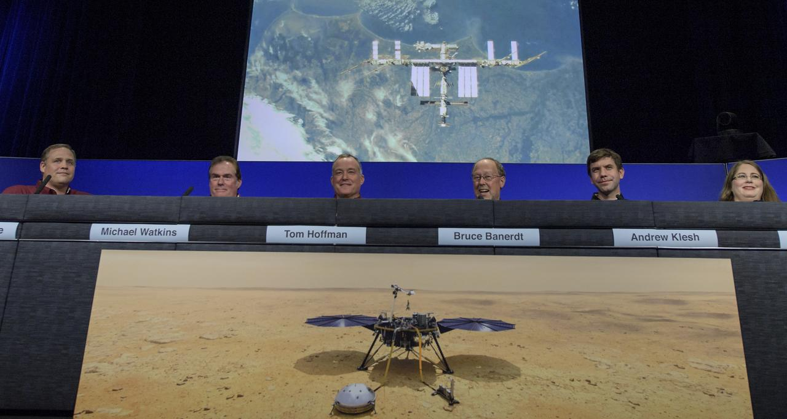

---

### Artemis I Mission Briefing from JSC

| 属性 | 值 |
|-----|-----|
| **文件名** | `KSC-20220805-PH-KLS01_0001.jpg` |
| **来源** | [KSC](https://images.nasa.gov/details-KSC-20220805-PH-KLS01_0001) |
| **日期** | 2022-08-05 |
| **摄影师** | NASA/Kim Shiflett |
| **许可** | Public Domain (NASA) |
| **文件大小** | 84 KB |

Melissa Jones, NASA Landing and Recovery Director for Exploration Ground Systems, participates in an Artemis I detailed mission briefing inside the Press Site auditorium at NASA’s Kennedy Space Center in Florida on Aug. 5, 2022. Jones leads the Artemis I Recovery Team partnered with the U.S. Navy th

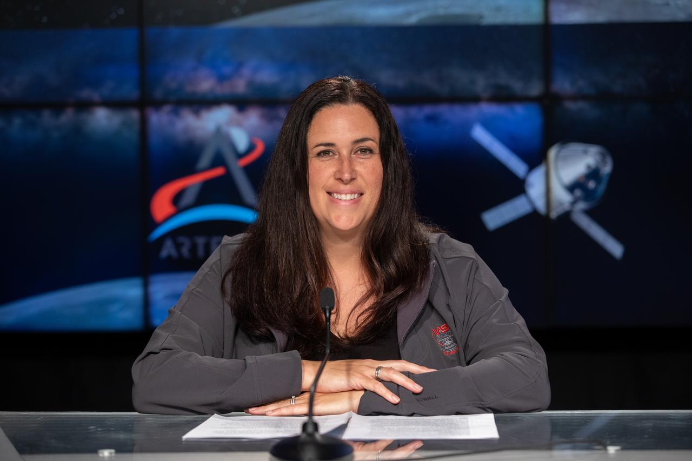

---

### Artemis I Mission Briefing from JSC

| 属性 | 值 |
|-----|-----|
| **文件名** | `KSC-20220805-PH-KLS01_0014.jpg` |
| **来源** | [KSC](https://images.nasa.gov/details-KSC-20220805-PH-KLS01_0014) |
| **日期** | 2022-08-05 |
| **摄影师** | NASA/Kim Shiflett |
| **许可** | Public Domain (NASA) |
| **文件大小** | 82 KB |

Melissa Jones, NASA Landing and Recovery Director for Exploration Ground Systems, participates in an Artemis I detailed mission briefing inside the Press Site auditorium at NASA’s Kennedy Space Center in Florida on Aug. 5, 2022. Jones leads the Artemis I Recovery Team partnered with the U.S. Navy th

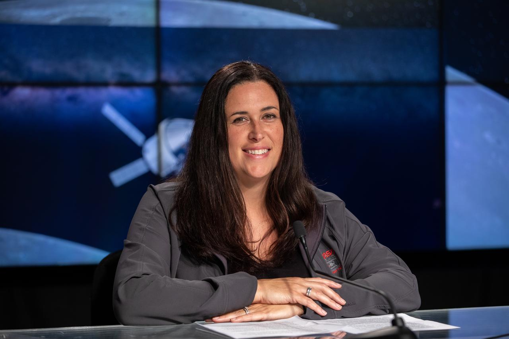

---

### Artemis I Mission Management Briefing 

| 属性 | 值 |
|-----|-----|
| **文件名** | `KSC-20220901-PH-SBS01_0005.jpg` |
| **来源** | [KSC](https://images.nasa.gov/details-KSC-20220901-PH-SBS01_0005) |
| **日期** | 2022-09-01 |
| **摄影师** | NASA/Steven Seipel |
| **许可** | Public Domain (NASA) |
| **文件大小** | 95 KB |

Mike Sarafin, Artemis mission manager, participates in a prelaunch media briefing following a mission management team meeting for Artemis I on Sept. 1, 2022, at NASA’s Kennedy Space Center in Florida. Artemis I is scheduled to launch at 2:17 p.m. EDT on Sept. 3, from Kennedy’s Launch Complex 39B. La

---

### Artemis I Mission Management Briefing 

| 属性 | 值 |
|-----|-----|
| **文件名** | `KSC-20220901-PH-SBS01_0013.jpg` |
| **来源** | [KSC](https://images.nasa.gov/details-KSC-20220901-PH-SBS01_0013) |
| **日期** | 2022-09-01 |
| **摄影师** | NASA/Steven Seipel |
| **许可** | Public Domain (NASA) |
| **文件大小** | 100 KB |

Charlie Blackwell-Thompson, Artemis I launch director, participates in a prelaunch media briefing following a mission management team meeting for Artemis I on Sept. 1, 2022, at NASA’s Kennedy Space Center in Florida. Artemis I is scheduled to launch at 2:17 p.m. EDT on Sept. 3, from Kennedy’s Launch

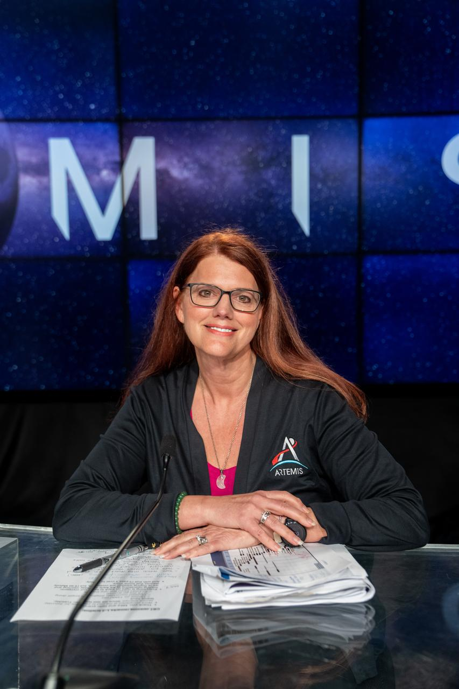

---

### Artemis I Mission Management Briefing

| 属性 | 值 |
|-----|-----|
| **文件名** | `KSC-20220827-PH-KLS01_0066.jpg` |
| **来源** | [KSC](https://images.nasa.gov/details-KSC-20220827-PH-KLS01_0066) |
| **日期** | 2022-08-27 |
| **摄影师** | NASA/Kim Shiflett |
| **许可** | Public Domain (NASA) |
| **文件大小** | 100 KB |

From left, Megan Cruz, NASA Communications; Mike Sarafin, Artemis mission manager, NASA Headquarters; and Charlie Blackwell-Thompson, Artemis launch director, Kennedy Space Center, participate in an Artemis I mission status press briefing at Kennedy on Aug. 27, 2022. NASA’s Space Launch System rocke

---

### Artemis I Mission Management Briefing 

| 属性 | 值 |
|-----|-----|
| **文件名** | `KSC-20220901-PH-SBS01_0033.jpg` |
| **来源** | [KSC](https://images.nasa.gov/details-KSC-20220901-PH-SBS01_0033) |
| **日期** | 2022-09-01 |
| **摄影师** | NASA/Steven Seipel |
| **许可** | Public Domain (NASA) |
| **文件大小** | 151 KB |

A prelaunch media briefing is held following a mission management team meeting for Artemis I on Sept. 1, 2022, at NASA’s Kennedy Space Center in Florida. Participants are, from left, Rachel Kraft, NASA Communications; Mike Sarafin, Artemis mission manager; John Honeycutt, Space Launch System (SLS) p

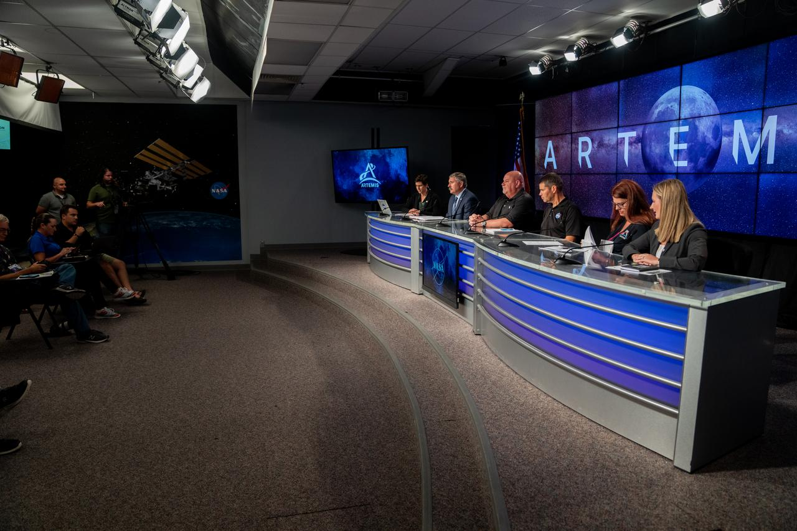

---

### NASA's SLS Rocket and Orion Spacecraft Rollout to Launch Pad 39B

| 属性 | 值 |
|-----|-----|
| **文件名** | `SLS_KSC_ArtemisIIRollout1172026_11.jpg` |
| **来源** | [MSFC](https://images.nasa.gov/details-SLS_KSC_Artemis II Rollout 1172026_11) |
| **日期** | 2026-01-18 |
| **摄影师** | NASA/Sam Lott |
| **许可** | Public Domain (NASA) |
| **文件大小** | 116 KB |

This image shows NASA’s SLS (Space Launch System) and Orion spacecraft rolling out of the Vehicle Assembly Building at NASA’s Kennedy Space Center. NASA's massive Crawler-Transporter, upgraded for the Artemis program, carries the powerful SLS rocket and Orion spacecraft on the Mobile Launcher from t

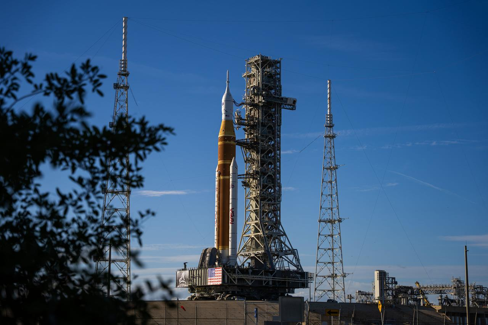

---

### NASA's SLS Rocket and Orion Spacecraft Rollout to Launch Pad 39B

| 属性 | 值 |
|-----|-----|
| **文件名** | `SLS_KSC_ArtemisIIRollout1172026_2.jpg` |
| **来源** | [MSFC](https://images.nasa.gov/details-SLS_KSC_Artemis II Rollout 1172026_2) |
| **日期** | 2026-01-18 |
| **摄影师** | NASA/Sam Lott |
| **许可** | Public Domain (NASA) |
| **文件大小** | 113 KB |

This image shows NASA’s SLS (Space Launch System) and Orion spacecraft rolling out of the Vehicle Assembly Building at NASA’s Kennedy Space Center. NASA's massive Crawler-Transporter, upgraded for the Artemis program, carries the powerful SLS rocket and Orion spacecraft on the Mobile Launcher from t

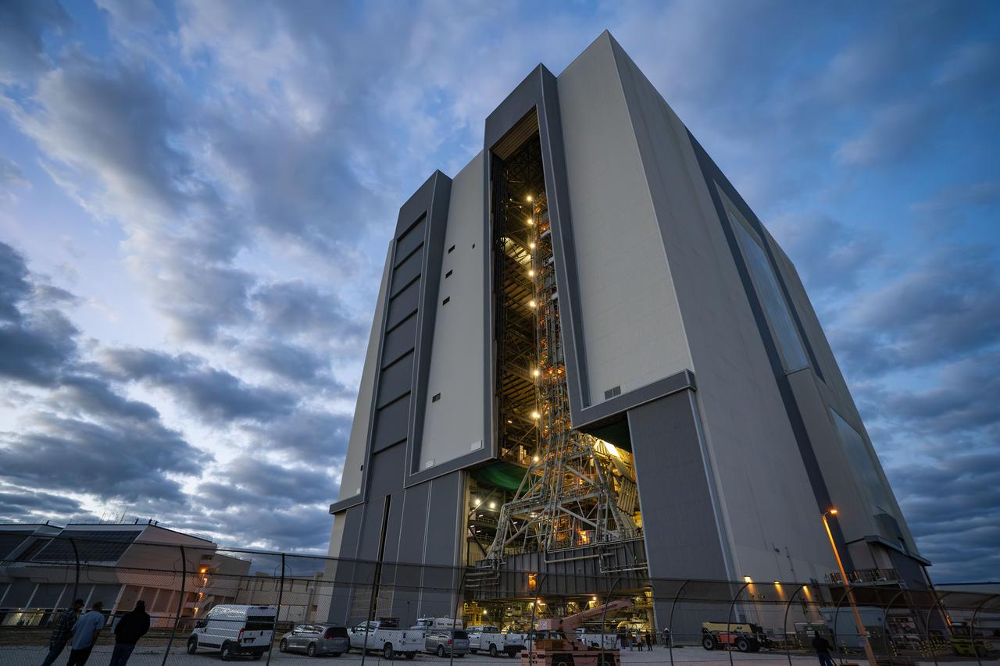

---

### NASA's SLS Rocket and Orion Spacecraft Rollout to Launch Pad 39B

| 属性 | 值 |
|-----|-----|
| **文件名** | `SLS_KSC_ArtemisIIRollout1172026_4.jpg` |
| **来源** | [MSFC](https://images.nasa.gov/details-SLS_KSC_Artemis II Rollout 1172026_4) |
| **日期** | 2026-01-18 |
| **摄影师** | NASA/Sam Lott |
| **许可** | Public Domain (NASA) |
| **文件大小** | 190 KB |

This image shows NASA’s SLS (Space Launch System) and Orion spacecraft rolling out of the Vehicle Assembly Building at NASA’s Kennedy Space Center. NASA's massive Crawler-Transporter, upgraded for the Artemis program, carries the powerful SLS rocket and Orion spacecraft on the Mobile Launcher from t

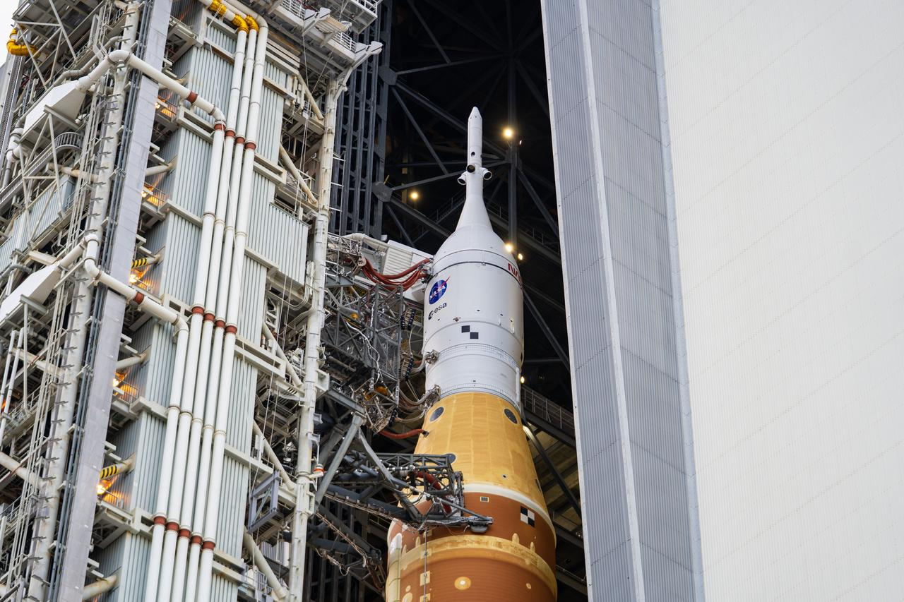

---

### NASA's SLS Rocket and Orion Spacecraft Rollout to Launch Pad 39B

| 属性 | 值 |
|-----|-----|
| **文件名** | `SLS_KSC_ArtemisIIRollout1172026_7.jpg` |
| **来源** | [MSFC](https://images.nasa.gov/details-SLS_KSC_Artemis II Rollout 1172026_7) |
| **日期** | 2026-01-18 |
| **摄影师** | NASA/Sam Lott |
| **许可** | Public Domain (NASA) |
| **文件大小** | 97 KB |

This image shows NASA’s SLS (Space Launch System) and Orion spacecraft rolling out of the Vehicle Assembly Building at NASA’s Kennedy Space Center. NASA's massive Crawler-Transporter, upgraded for the Artemis program, carries the powerful SLS rocket and Orion spacecraft on the Mobile Launcher from t

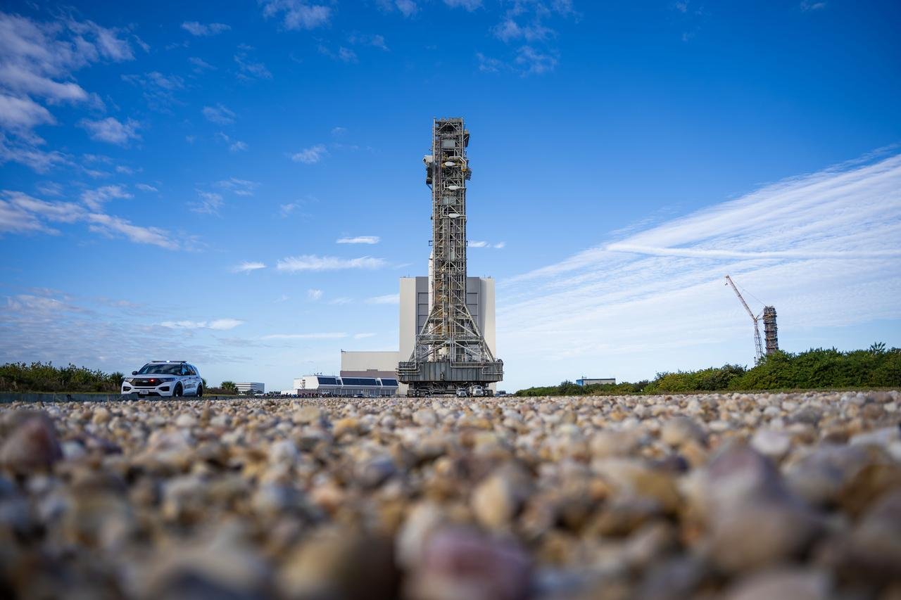

---

### NASA's SLS Rocket and Orion Spacecraft Rollout to Launch Pad 39B

| 属性 | 值 |
|-----|-----|
| **文件名** | `SLS_KSC_ArtemisIIRollout1172026_12.jpg` |
| **来源** | [MSFC](https://images.nasa.gov/details-SLS_KSC_Artemis II Rollout 1172026_12) |
| **日期** | 2026-01-18 |
| **摄影师** | NASA/Sam Lott |
| **许可** | Public Domain (NASA) |
| **文件大小** | 134 KB |

This image shows NASA’s SLS (Space Launch System) and Orion spacecraft rolling out of the Vehicle Assembly Building at NASA’s Kennedy Space Center. NASA's massive Crawler-Transporter, upgraded for the Artemis program, carries the powerful SLS rocket and Orion spacecraft on the Mobile Launcher from t

---

### NASA's SLS Rocket and Orion Spacecraft Rollout to Launch Pad 39B

| 属性 | 值 |
|-----|-----|
| **文件名** | `SLS_KSC_ArtemisIIRollout1172026_8.jpg` |
| **来源** | [MSFC](https://images.nasa.gov/details-SLS_KSC_Artemis II Rollout 1172026_8) |
| **日期** | 2026-01-18 |
| **摄影师** | NASA/Sam Lott |
| **许可** | Public Domain (NASA) |
| **文件大小** | 138 KB |

This image shows NASA’s SLS (Space Launch System) and Orion spacecraft rolling out of the Vehicle Assembly Building at NASA’s Kennedy Space Center. NASA's massive Crawler-Transporter, upgraded for the Artemis program, carries the powerful SLS rocket and Orion spacecraft on the Mobile Launcher from t

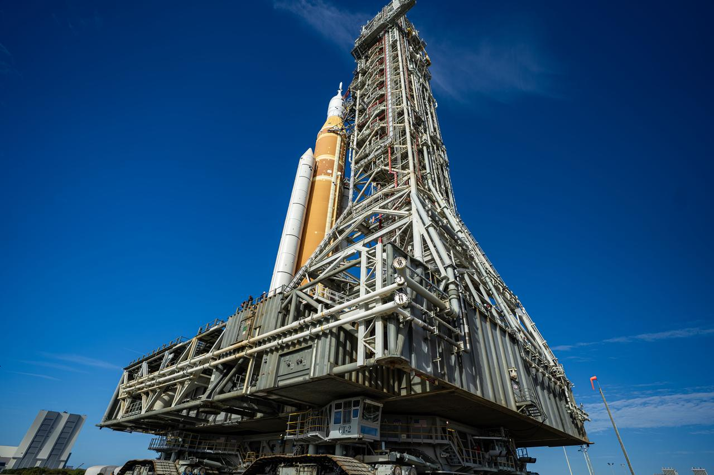

---

