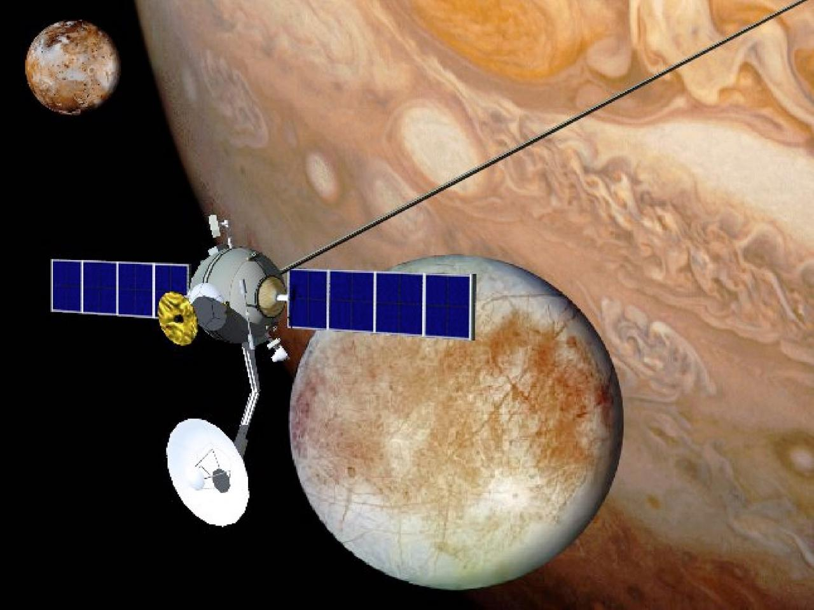
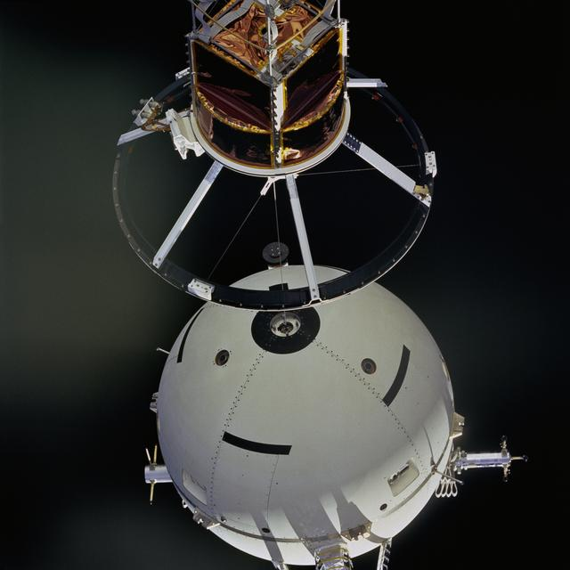
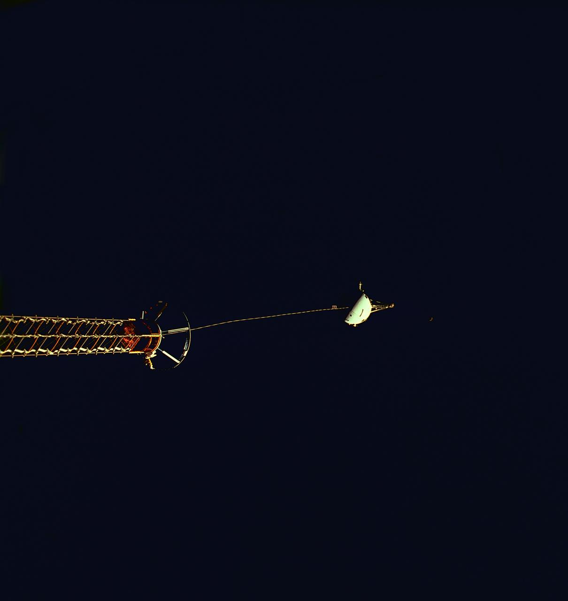
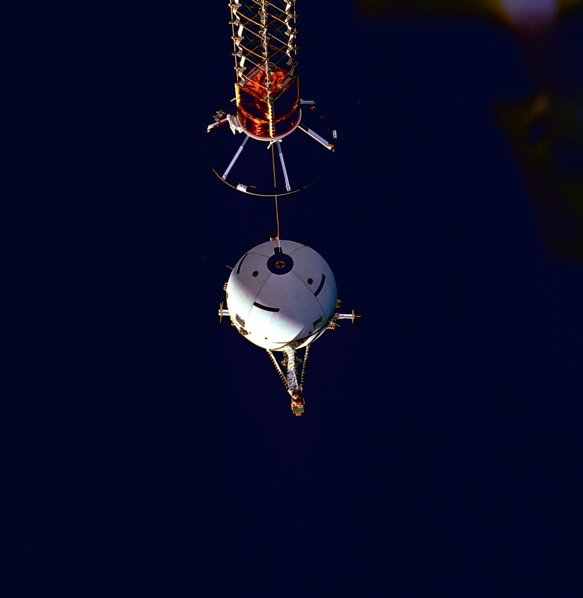
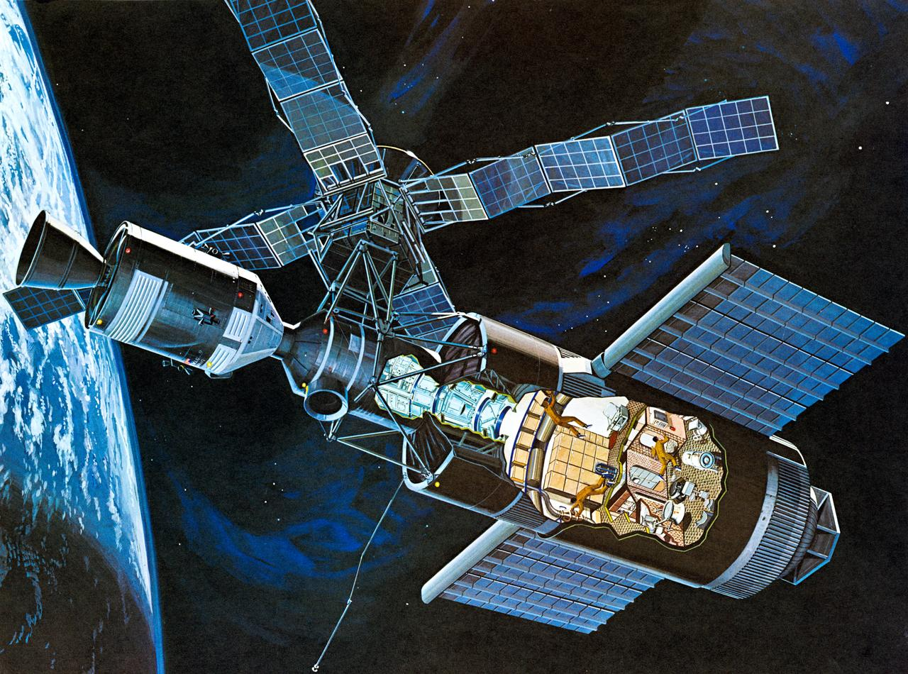
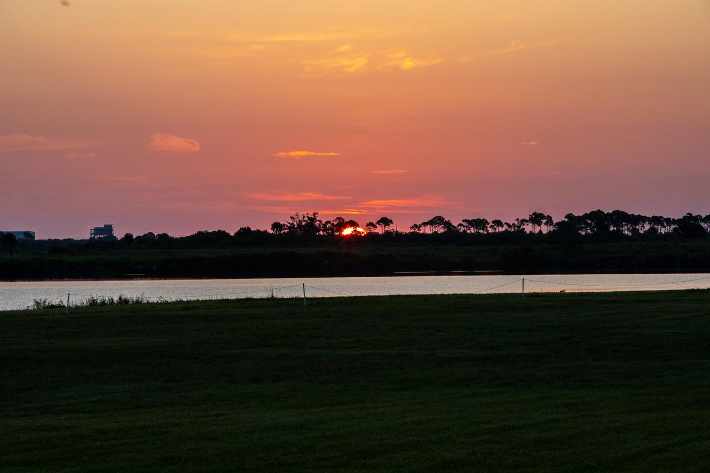
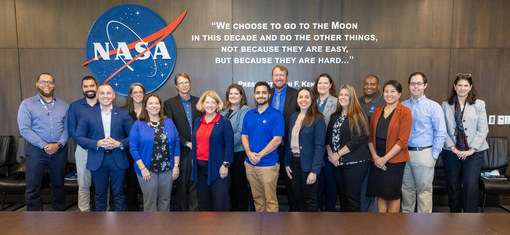
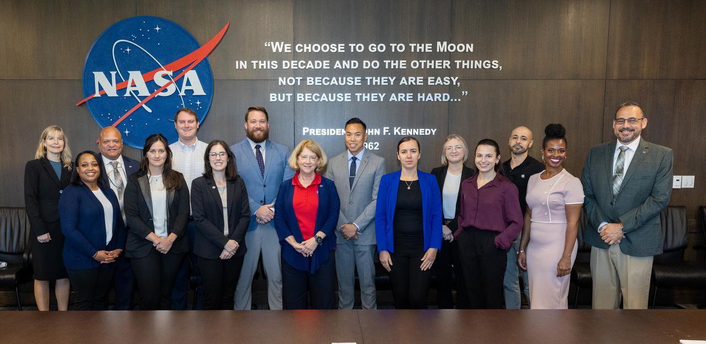

# 22_太空电梯概念图 - 图片来源索引

> **来源**: NASA Images API (https://images.nasa.gov)  
> **许可**: 所有NASA图片均为Public Domain，可自由使用  
> **生成时间**: 2026-02-01 23:56:48

## 📊 统计

| 指标 | 数量 |
|-----|------|
| 成功下载 | 13 |
| 下载失败 | 2 |
| 总计 | 15 |

---

## ✅ 已下载图片

### Research Technology

| 属性 | 值 |
|-----|-----|
| **文件名** | `9906385.jpg` |
| **来源** | [MSFC](https://images.nasa.gov/details-9906385) |
| **日期** | 2004-04-15 |
| **摄影师** | NASA |
| **许可** | Public Domain (NASA) |
| **文件大小** | 107 KB |

This is an artist's concept of an orbiting space vehicle in the Jovian system using an electrodynamic tether propellantless propulsion system. Electrodynamic tethers offer the potential to greatly extend and enhance future scientific missions to Jupiter and the Jovian system. Like Earth, Jupiter pos

---

### STS-46 Tethered Satellite System 1 (TSS-1) satellite deployment from OV-104

| 属性 | 值 |
|-----|-----|
| **文件名** | `sts46-73-052.jpg` |
| **来源** | [JSC](https://images.nasa.gov/details-sts46-73-052) |
| **日期** | 1992-08-04 |
| **摄影师** | NASA |
| **许可** | Public Domain (NASA) |
| **文件大小** | 37 KB |

STS046-73-052 (4 Aug 1992) --- A 70mm handheld camera was used by the crew members to capture this medium close-up view of early operations with the Tethered Satellite System (TSS).  The sphere can be seen moving away from the ring structure on the boom device in the Space Shuttle Atlantis' cargo ba

---

### Tethered Satellite System (TSS)-1R survey photography

| 属性 | 值 |
|-----|-----|
| **文件名** | `sts075-325-014.jpg` |
| **来源** | [JSC](https://images.nasa.gov/details-sts075-325-014) |
| **日期** | 1996-03-18 |
| **摄影师** | NASA |
| **许可** | Public Domain (NASA) |
| **文件大小** | 31 KB |

STS075-325-014 (25 Feb. 1996) --- The frayed end of the tether portion of the Tethered Satellite System (TSS) is seen at the end of the supportive boom. On February 25, 1996, the crew deployed the TSS, which later broke free. The seven member crew was launched aboard the Space Shuttle Columbia on Fe

---

### TSS-1R during deployment

| 属性 | 值 |
|-----|-----|
| **文件名** | `sts075-711-024.jpg` |
| **来源** | [JSC](https://images.nasa.gov/details-sts075-711-024) |
| **日期** | 1996-02-25 |
| **摄影师** | NASA |
| **许可** | Public Domain (NASA) |
| **文件大小** | 40 KB |

STS075-711-024 (25 Feb. 1996) --- The Tethered Satellite System (TSS) is seen as it is reeled out during early stages of deployment operations.  The crew deployed the TSS, which later broke free.  The seven member crew was launched aboard the space shuttle Columbia on Feb. 22, 1996, and landed on Ma

---

### TSS-1R deployment

| 属性 | 值 |
|-----|-----|
| **文件名** | `sts075-701-087.jpg` |
| **来源** | [JSC](https://images.nasa.gov/details-sts075-701-087) |
| **日期** | 1996-02-24 |
| **摄影师** | NASA |
| **许可** | Public Domain (NASA) |
| **文件大小** | 55 KB |

STS075-701-087 (25 Feb. 1996) --- A medium close-up view, captured with a 70mm camera, shows the Tethered Satellite System (TSS) and part of its supportive boom device prior to deployment operations. On Feb. 25, 1996, the crew deployed the TSS, which later broke free.  The seven member crew was laun

---

### Artist's concept of Skylab space station cluster in Earth's orbit

| 属性 | 值 |
|-----|-----|
| **文件名** | `S71-52192.jpg` |
| **来源** | [JSC](https://images.nasa.gov/details-S71-52192) |
| **日期** | 1971-10-01 |
| **摄影师** | NASA |
| **许可** | Public Domain (NASA) |
| **文件大小** | 264 KB |

S71-52192 (1971) --- An artist's concept of the Skylab space station cluster in Earth's orbit. The cutaway view shows astronaut activity in the Orbital Workshop (OWS). The Skylab cluster is composed of the OWS, Airlock Module (AM), Multiple Docking Adapter (MDA), Apollo Telescope Mount (ATM), and th

---

### International Space Station (ISS)

| 属性 | 值 |
|-----|-----|
| **文件名** | `0101424.jpg` |
| **来源** | [MSFC](https://images.nasa.gov/details-0101424) |
| **日期** | 2000-11-01 |
| **摄影师** | NASA |
| **许可** | Public Domain (NASA) |
| **文件大小** | 159 KB |

This concept depicts the International Space Station in orbit following its solar array deployment by the crew of the Space Shuttle STS-97 mission.

---

### Artist Concept - Illustration Cutaway View - Skylab (SL)-1 Orbital Workshop (OWS)

| 属性 | 值 |
|-----|-----|
| **文件名** | `S73-23918.jpg` |
| **来源** | [JSC](https://images.nasa.gov/details-S73-23918) |
| **日期** | 1973-05-23 |
| **摄影师** | NASA |
| **许可** | Public Domain (NASA) |
| **文件大小** | 181 KB |

S73-23918 (May 1973) --- An artist's concept illustrating a cutaway view of the Skylab 1 Orbital Workshop (OWS). The OWS is one of the five major components of the Skylab 1 space station cluster which was launched by a Saturn V on May 14, 1973 into Earth orbit. Photo credit: NASA

---

### Creative Photography - Sunrise

| 属性 | 值 |
|-----|-----|
| **文件名** | `KSC-20200715-PH-JBS01_0008.jpg` |
| **来源** | [KSC](https://images.nasa.gov/details-KSC-20200715-PH-JBS01_0008) |
| **日期** | 2020-07-15 |
| **摄影师** | NASA/Ben Smegelsky |
| **许可** | Public Domain (NASA) |
| **文件大小** | 116 KB |

A sunrise over NASA’s Kennedy Space Center in Florida is captured on July 15, 2020. A multi-user spaceport, Kennedy has partnerships with both government and commercial entities, providing the facilities and infrastructure necessary for venturing to space.

---

### Creative Photography - Sunrise

| 属性 | 值 |
|-----|-----|
| **文件名** | `KSC-20200715-PH-JBS01_0003.jpg` |
| **来源** | [KSC](https://images.nasa.gov/details-KSC-20200715-PH-JBS01_0003) |
| **日期** | 2020-07-15 |
| **摄影师** | NASA/Ben Smegelsky |
| **许可** | Public Domain (NASA) |
| **文件大小** | 77 KB |

The Sun just begins to rise over NASA’s Kennedy Space Center in Florida on July 15, 2020. A multi-user spaceport, Kennedy has partnerships with both government and commercial entities, providing the facilities and infrastructure necessary for venturing to space.

---

### Pam Melroy 2024 Round Table Presentation

| 属性 | 值 |
|-----|-----|
| **文件名** | `KSC-20241113-PH-GEB01_0010.jpg` |
| **来源** | [KSC](https://images.nasa.gov/details-KSC-20241113-PH-GEB01_0010) |
| **日期** | 2024-11-13 |
| **摄影师** | NASA/Glenn Benson |
| **许可** | Public Domain (NASA) |
| **文件大小** | 119 KB |

NASA Deputy Administrator Pam Melroy (front third from left) discusses NASA 2040, the agency's strategic initiative for aligning workforce, infrastructure, and technologies to meet the needs of the future, on Nov. 13, 2024, with various groups of employees at the agency's Kennedy Space Center in Flo

---

### Pam Melroy 2024 Round Table Presentation

| 属性 | 值 |
|-----|-----|
| **文件名** | `KSC-20241113-PH-GEB01_0005.jpg` |
| **来源** | [KSC](https://images.nasa.gov/details-KSC-20241113-PH-GEB01_0005) |
| **日期** | 2024-11-13 |
| **摄影师** | NASA/Glenn Benson |
| **许可** | Public Domain (NASA) |
| **文件大小** | 105 KB |

NASA Deputy Administrator Pam Melroy (front center left) discusses NASA 2040, the agency's strategic initiative for aligning workforce, infrastructure, and technologies to meet the needs of the future, on Nov. 13, 2024, with various groups of employees at the agency's Kennedy Space Center in Florida

---

### Pam Melroy 2024 Round Table Presentation

| 属性 | 值 |
|-----|-----|
| **文件名** | `KSC-20241113-PH-GEB01_0004.jpg` |
| **来源** | [KSC](https://images.nasa.gov/details-KSC-20241113-PH-GEB01_0004) |
| **日期** | 2024-11-13 |
| **摄影师** | NASA/Glenn Benson |
| **许可** | Public Domain (NASA) |
| **文件大小** | 118 KB |

NASA Deputy Administrator Pam Melroy (front center left) discusses NASA 2040, the agency's strategic initiative for aligning workforce, infrastructure, and technologies to meet the needs of the future, on Nov. 13, 2024, with various groups of employees at the agency's Kennedy Space Center in Florida

---

## ❌ 下载失败的图片

| 标题 | 来源链接 | 错误信息 |
|-----|---------|----------|
| Early Program Development... | [链接](https://images.nasa.gov/details-8667000) | RetryError[<Future at 0x1bf9ffc2750 state=finished raised HTTPStatusError>] |
| Early Program Development... | [链接](https://images.nasa.gov/details-9902044) | RetryError[<Future at 0x1bf9ffc3dd0 state=finished raised HTTPStatusError>] |
