# 23_轨道与航天器 - 图片来源索引

> **来源**: NASA Images API (https://images.nasa.gov)  
> **许可**: 所有NASA图片均为Public Domain，可自由使用  
> **生成时间**: 2026-02-01 23:58:42

## 📊 统计

| 指标 | 数量 |
|-----|------|
| 成功下载 | 16 |
| 下载失败 | 4 |
| 总计 | 20 |

---

## ✅ 已下载图片

### KENNEDY SPACE CENTER, FLA. -  The orbiter Atlantis rolls toward the Orbiter Processing Facility afte

| 属性 | 值 |
|-----|-----|
| **文件名** | `KSC-03pd3236.jpg` |
| **来源** | [KSC](https://images.nasa.gov/details-KSC-03pd3236) |
| **日期** | 2003-12-16 |
| **摄影师** | NASA |
| **许可** | Public Domain (NASA) |
| **文件大小** | 123 KB |

KENNEDY SPACE CENTER, FLA. -  The orbiter Atlantis rolls toward the Orbiter Processing Facility after spending 10 days in the Vehicle Assembly Building.  The hiatus in the VAB allowed work to be performed in the OPF that can only be accomplished while the bay is empty. Work included annual validatio

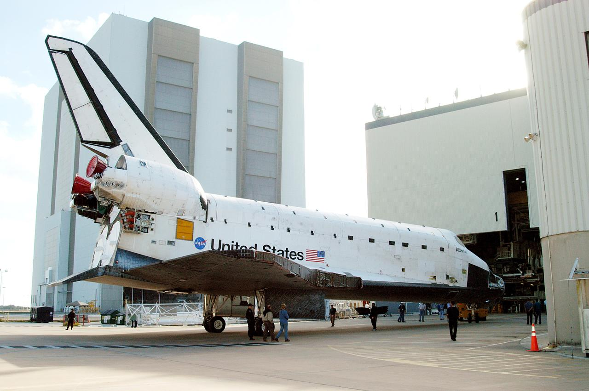

---

### KENNEDY SPACE CENTER, FLA. -  The orbiter Atlantis rolls out of the Vehicle Assembly Building for tr

| 属性 | 值 |
|-----|-----|
| **文件名** | `KSC-03pd3233.jpg` |
| **来源** | [KSC](https://images.nasa.gov/details-KSC-03pd3233) |
| **日期** | 2003-12-16 |
| **摄影师** | NASA |
| **许可** | Public Domain (NASA) |
| **文件大小** | 164 KB |

KENNEDY SPACE CENTER, FLA. -  The orbiter Atlantis rolls out of the Vehicle Assembly Building for transfer back to the Orbiter Processing Facility.  Atlantis spent 10 days in the VAB to allow work to be performed in the OPF that can only be accomplished while the bay is empty. Work included annual v

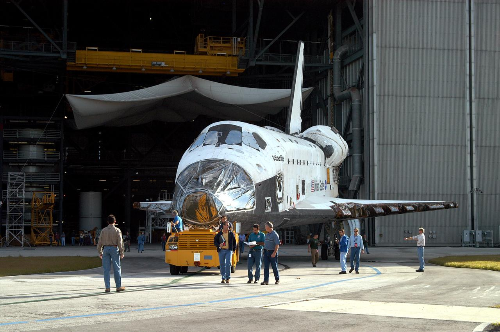

---

### KENNEDY SPACE CENTER, FLA. -  In the Orbiter Processing Facility, Mike Hyatt, with United Space Alli

| 属性 | 值 |
|-----|-----|
| **文件名** | `KSC-03pd2537.jpg` |
| **来源** | [KSC](https://images.nasa.gov/details-KSC-03pd2537) |
| **日期** | 2003-09-04 |
| **摄影师** | NASA |
| **许可** | Public Domain (NASA) |
| **文件大小** | 144 KB |

KENNEDY SPACE CENTER, FLA. -  In the Orbiter Processing Facility, Mike Hyatt, with United Space Alliance, installs a spar on the wing of the orbiter Atlantis.  Reinforced Carbon Carbon (RCC) panels are mechanically attached to the wing with a series of floating joints - spars - to reduce loading on 

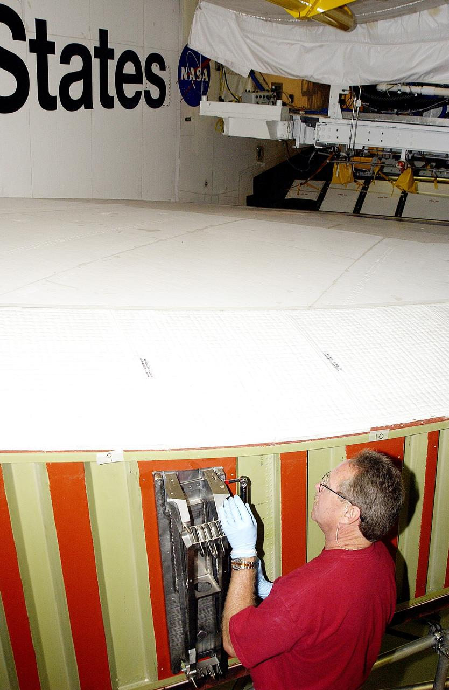

---

### KENNEDY SPACE CENTER, FLA. - In the Orbiter Processing Facility, John Newport, with United Space All

| 属性 | 值 |
|-----|-----|
| **文件名** | `KSC-03pd2532.jpg` |
| **来源** | [KSC](https://images.nasa.gov/details-KSC-03pd2532) |
| **日期** | 2003-09-04 |
| **摄影师** | NASA |
| **许可** | Public Domain (NASA) |
| **文件大小** | 210 KB |

KENNEDY SPACE CENTER, FLA. - In the Orbiter Processing Facility, John Newport, with United Space Alliance, inspects a spar to be installed on the wing of the orbiter Atlantis.  Reinforced Carbon Carbon (RCC) panels are mechanically attached to the wing with a series of floating joints - spars - to r

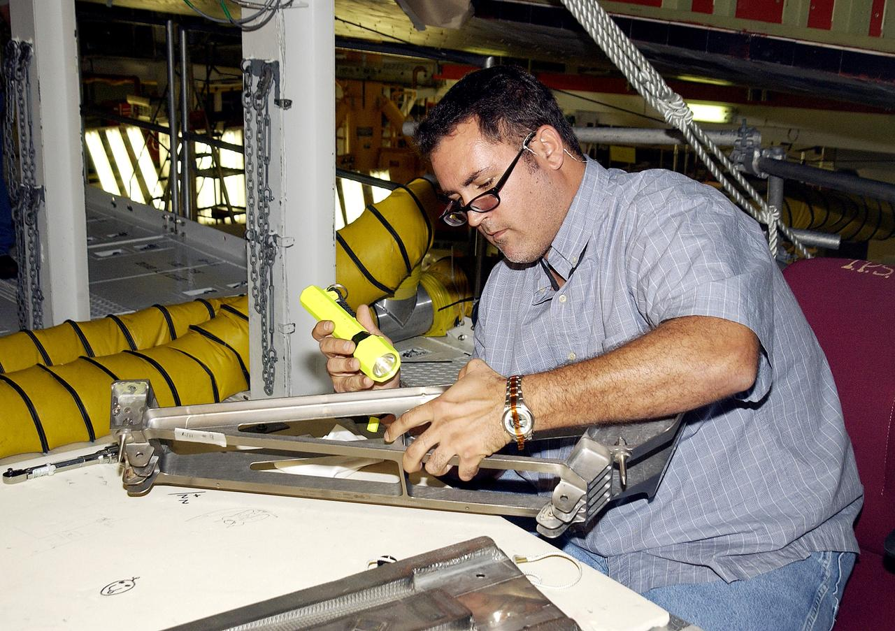

---

### KENNEDY SPACE CENTER, FLA. -  Workers accompany the orbiter Atlantis as it is towed back to the Orbi

| 属性 | 值 |
|-----|-----|
| **文件名** | `KSC-03pd3234.jpg` |
| **来源** | [KSC](https://images.nasa.gov/details-KSC-03pd3234) |
| **日期** | 2003-12-16 |
| **摄影师** | NASA |
| **许可** | Public Domain (NASA) |
| **文件大小** | 135 KB |

KENNEDY SPACE CENTER, FLA. -  Workers accompany the orbiter Atlantis as it is towed back to the Orbiter Processing Facility after spending 10 days in the Vehicle Assembly Building.  The hiatus in the VAB allowed work to be performed in the OPF that can only be accomplished while the bay is empty. Wo

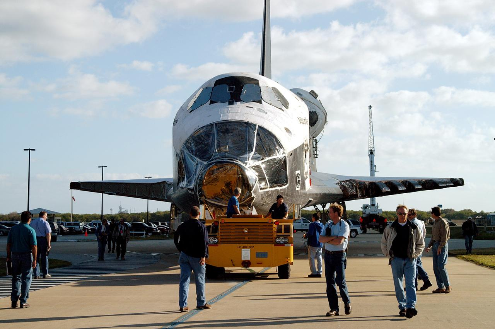

---

### Apollo 13 spacecraft in trans-lunar trajectory

| 属性 | 值 |
|-----|-----|
| **文件名** | `S70-34857.jpg` |
| **来源** | [JSC](https://images.nasa.gov/details-S70-34857) |
| **日期** | 1970-04-14 |
| **摄影师** | NASA |
| **许可** | Public Domain (NASA) |
| **文件大小** | 298 KB |

S70-34857 (13 April 1970) --- A telescopic photograph showing the Apollo 13 spacecraft in trans-lunar trajectory in the distant sky.  Arrows point to the spacecraft, to the oxygen cloud, and to the expended Saturn V third stage. Apollo 13 was tracked at the Manned Spacecraft Center (MSC) using a 16 

---

### Nap Time for New Horizons: NASA Spacecraft Enters Hibernation

| 属性 | 值 |
|-----|-----|
| **文件名** | `PIA21589.jpg` |
| **来源** | [JPL](https://images.nasa.gov/details-PIA21589) |
| **日期** | 2017-04-11 |
| **摄影师** | NASA |
| **许可** | Public Domain (NASA) |
| **文件大小** | 123 KB |

This is an overhead view of NASA's New Horizons full trajectory; the spacecraft has entered a hibernation phase on April 7 that will last until early September.  The full article is available at https://photojournal.jpl.nasa.gov/catalog/PIA21589

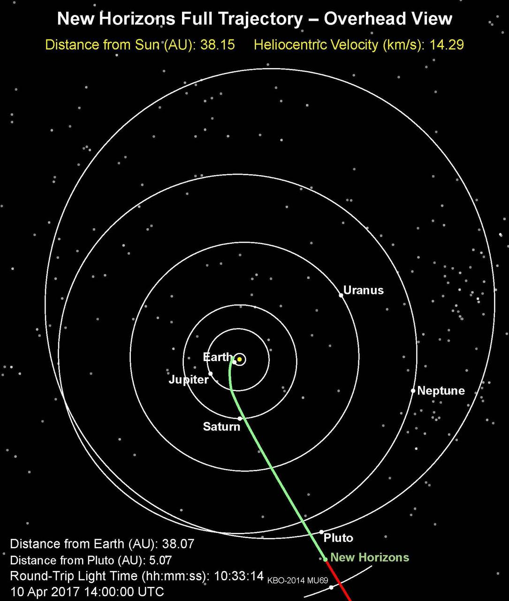

---

### View of the Syncom IV satellite in orbit over the earth

| 属性 | 值 |
|-----|-----|
| **文件名** | `41d-32-0067.jpg` |
| **来源** | [JSC](https://images.nasa.gov/details-41d-32-0067) |
| **日期** | 1984-08-31 |
| **摄影师** | NASA |
| **许可** | Public Domain (NASA) |
| **文件大小** | 186 KB |

41D-32-067 (31 Aug 1984) --- The Atlantic Oceans coastline of Angola forms the backdrop for this scene of the Syncom IV (Leasat-2) spacecraft as it and the Space Shuttle Discovery begin their relative separation on Day Two of a busy-six-day 41-D mission.  Moments, earlier in a Frisbee-like fashion, 

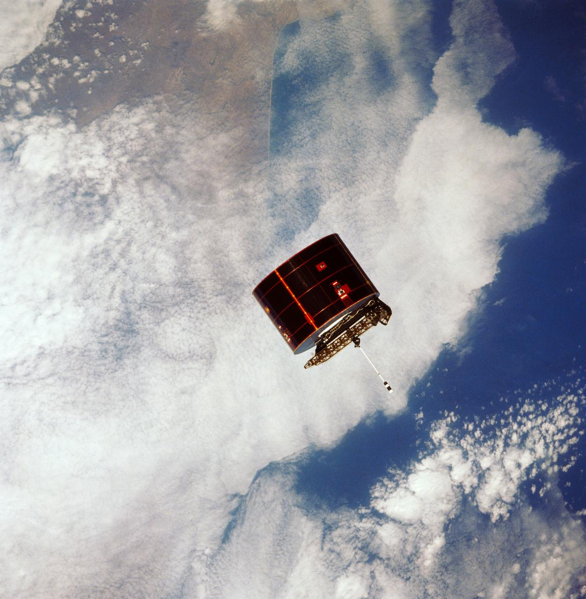

---

### Artist concept of satellite in orbit above the earth

| 属性 | 值 |
|-----|-----|
| **文件名** | `S81-38291.jpg` |
| **来源** | [JSC](https://images.nasa.gov/details-S81-38291) |
| **日期** | 1981-10-09 |
| **摄影师** | NASA |
| **许可** | Public Domain (NASA) |
| **文件大小** | 91 KB |

Artist concept of satellite with solar panels deployed in orbit above the earth.

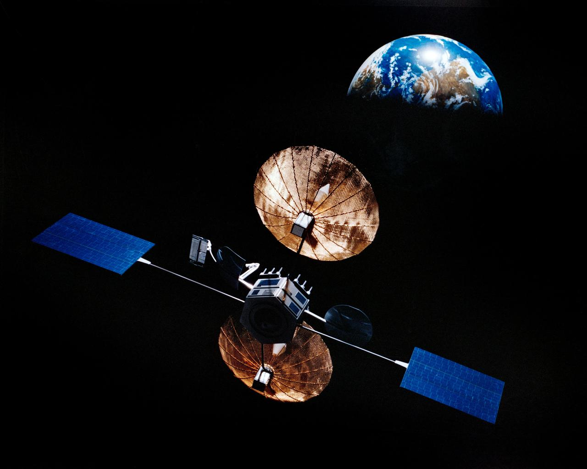

---

### MISR Records the View as NASA's Terra Satellite Passes Its 100,000th Orbit

| 属性 | 值 |
|-----|-----|
| **文件名** | `PIA22836.jpg` |
| **来源** | [JPL](https://images.nasa.gov/details-PIA22836) |
| **日期** | 2018-10-16 |
| **摄影师** | NASA |
| **许可** | Public Domain (NASA) |
| **文件大小** | 135 KB |

On Oct. 6, 2018, NASA's Terra satellite became one of a handful of NASA satellite ever to complete 100,000 orbits. Launched in 1999, Terra and its five scientific instruments were originally slated to last six years. More than 18 years later, the Multi-angle Imaging SpectroRadiometer (MISR), built b

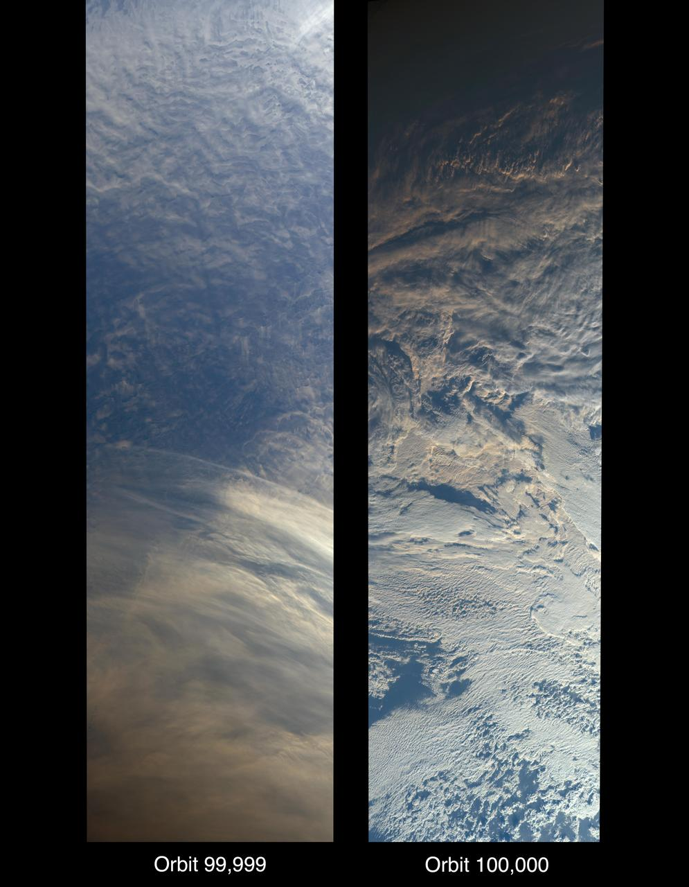

---

### The Sentinel-6 Michael Freilich Satellite Orbits Earth (Illustration)

| 属性 | 值 |
|-----|-----|
| **文件名** | `PIA24105.jpg` |
| **来源** | [JPL](https://images.nasa.gov/details-PIA24105) |
| **日期** | 2020-10-02 |
| **摄影师** | NASA |
| **许可** | Public Domain (NASA) |
| **文件大小** | 86 KB |

This illustration shows the Sentinel-6 Michael Freilich spacecraft in orbit above Earth with its deployable solar panels extended. As the world's latest ocean-monitoring satellite, it will collect the most accurate data yet on global sea level and how our oceans are rising in response to climate cha

---

### Gateway Close-up - Deep Space Logistics (DSL)

| 属性 | 值 |
|-----|-----|
| **文件名** | `GatewaySummerReqImagesRev2_4.jpg` |
| **来源** | [JSC](https://images.nasa.gov/details-Gateway Summer Req Images Rev2_4) |
| **日期** | 2023-08-18 |
| **摄影师** | Alberto Bertolin, Bradley Reynolds |
| **许可** | Public Domain (NASA) |
| **文件大小** | 121 KB |

NASA has awarded the first Gateway Logistics Services contract to SpaceX to deliver cargo, experiments and other supplies to Gateway for the Artemis IV mission in September 2028, the first time that crew will travel to Gateway.

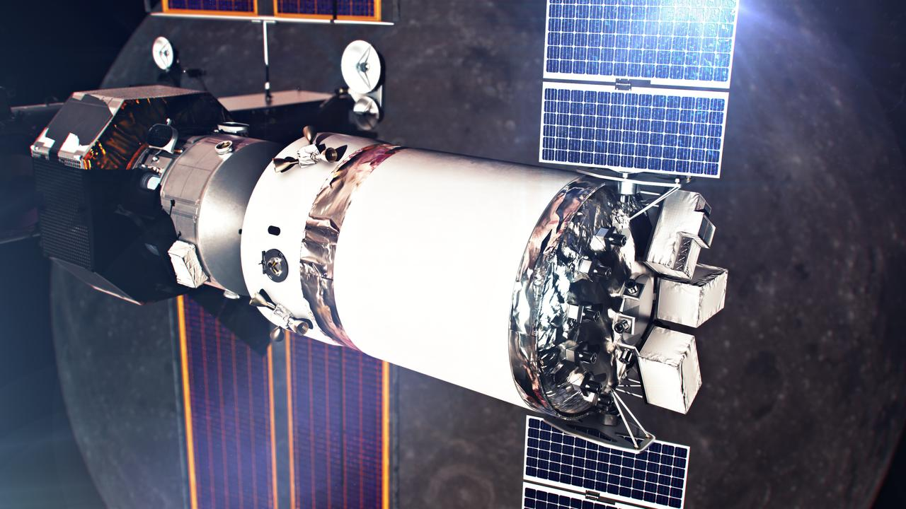

---

### NextSTEP Hab Testing with Astronauts

| 属性 | 值 |
|-----|-----|
| **文件名** | `KSC-20190325-PH_KLS01_0082.jpg` |
| **来源** | [KSC](https://images.nasa.gov/details-KSC-20190325-PH_KLS01_0082) |
| **日期** | 2019-03-25 |
| **摄影师** | NASA/Kim Shiflett |
| **许可** | Public Domain (NASA) |
| **文件大小** | 135 KB |

NASA astronaut Raja Chari climbs through a hatch of Lockheed Martin’s deep space habitat ground prototype at NASA’s Kennedy Space Center in Florida on March 25, 2019. Chari is one of the astronauts helping engineers refine requirements for the design of an American-made deep space habitat for the Ga

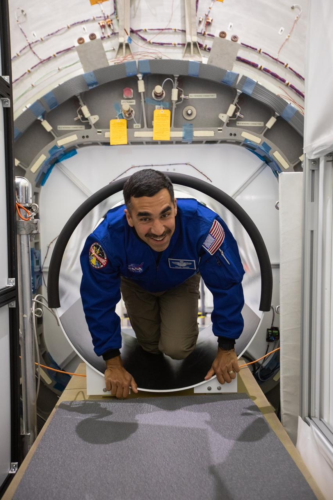

---

### NextSTEP Hab Testing with Astronauts

| 属性 | 值 |
|-----|-----|
| **文件名** | `KSC-20190325-PH_KLS01_0017.jpg` |
| **来源** | [KSC](https://images.nasa.gov/details-KSC-20190325-PH_KLS01_0017) |
| **日期** | 2019-03-25 |
| **摄影师** | NASA/Kim Shiflett |
| **许可** | Public Domain (NASA) |
| **文件大小** | 103 KB |

NASA began evaluating five habitat prototypes developed through NASA’s Next Space Exploration for Technologies Partnerships, or NextSTEP, to help engineers refine requirements for the design of an American-made deep space habitat for the Gateway. Lockheed Martin turned over its prototype to NASA, an

---

### Habitat Crew Photos Wrap Up

| 属性 | 值 |
|-----|-----|
| **文件名** | `KSC-20190326-PH_CMS01_0004.jpg` |
| **来源** | [KSC](https://images.nasa.gov/details-KSC-20190326-PH_CMS01_0004) |
| **日期** | 2019-03-26 |
| **摄影师** | NASA/Chris Swanson |
| **许可** | Public Domain (NASA) |
| **文件大小** | 166 KB |

NASA began evaluating five habitat prototypes developed through NASA’s Next Space Exploration for Technologies Partnerships, or NextSTEP, to help engineers refine requirements for the design of an American-made deep space habitat for the Gateway. Lockheed Martin turned over its prototype to NASA, an

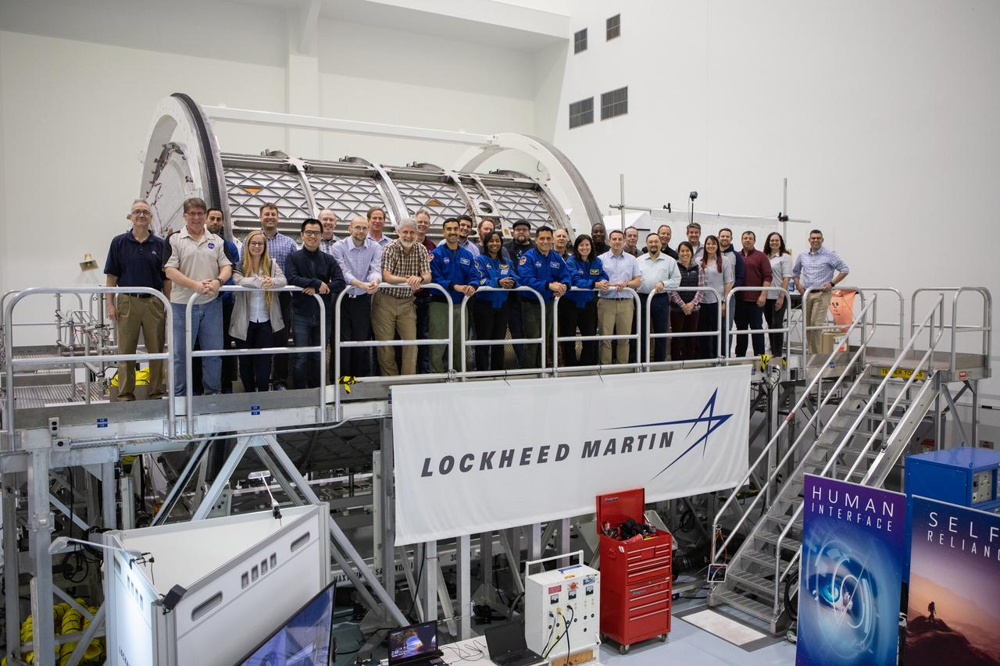

---

### NextSTEP Hab Testing with Astronauts

| 属性 | 值 |
|-----|-----|
| **文件名** | `KSC-20190325-PH_KLS01_0132.jpg` |
| **来源** | [KSC](https://images.nasa.gov/details-KSC-20190325-PH_KLS01_0132) |
| **日期** | 2019-03-25 |
| **摄影师** | NASA/Kim Shiflett |
| **许可** | Public Domain (NASA) |
| **文件大小** | 114 KB |

NASA began evaluating five habitat prototypes developed through NASA’s Next Space Exploration for Technologies Partnerships, or NextSTEP, to help engineers refine requirements for the design of an American-made deep space habitat for the Gateway. Lockheed Martin turned over its prototype to NASA, an

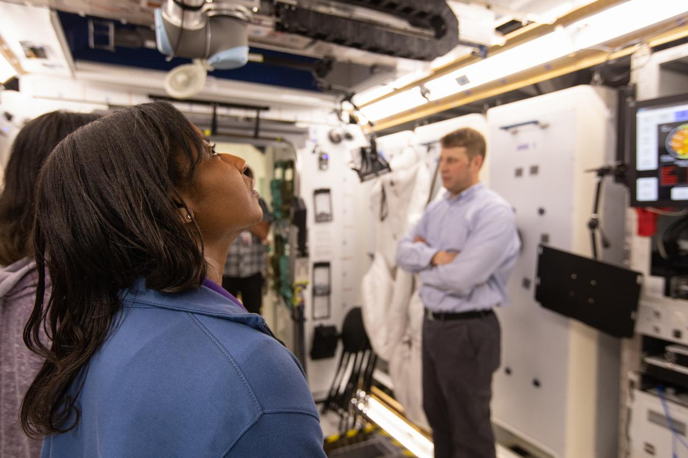

---

## ❌ 下载失败的图片

| 标题 | 来源链接 | 错误信息 |
|-----|---------|----------|
| Spacecraft Trajectory Animation... | [链接](https://images.nasa.gov/details-PIA03249) | RetryError[<Future at 0x1bf9ef74770 state=finished raised HTTPStatusError>] |
| Post-encounter View of Neptune South Pol... | [链接](https://images.nasa.gov/details-PIA01539) | RetryError[<Future at 0x1bf9ef66420 state=finished raised HTTPStatusError>] |
| Simulations of the Tendrils... | [链接](https://images.nasa.gov/details-PIA17191) | RetryError[<Future at 0x1bf9ef671d0 state=finished raised HTTPStatusError>] |
| Aqua Satellite Orbiting Earth Artist Con... | [链接](https://images.nasa.gov/details-PIA18156) | RetryError[<Future at 0x1bf9ef75eb0 state=finished raised HTTPStatusError>] |
