# 24_月球基地概念 - 图片来源索引

> **来源**: NASA Images API (https://images.nasa.gov)  
> **许可**: 所有NASA图片均为Public Domain，可自由使用  
> **生成时间**: 2026-02-02 00:00:19

## 📊 统计

| 指标 | 数量 |
|-----|------|
| 成功下载 | 15 |
| 下载失败 | 3 |
| 总计 | 18 |

---

## ✅ 已下载图片

### Advanced Concept

| 属性 | 值 |
|-----|-----|
| **文件名** | `0800206.jpg` |
| **来源** | [MSFC](https://images.nasa.gov/details-0800206) |
| **日期** | 2008-02-15 |
| **摄影师** | NASA |
| **许可** | Public Domain (NASA) |
| **文件大小** | 141 KB |

THIS CONCEPT IMAGE SHOWS THE ARES V CARGO LAUNCH VEHICLE. THE HEAVY LIFTING ARES V IS NASA'S PRIMARY VEHICLE FOR SAFE AND RELIABLE DELIVERY OF LARGE SCALE HARDWARE TO SPACE. THIS INCLUDES THE LUNAR LANDER, MATERIALS FOR ESTABLISHING A PERMANENT MOON BASE, AND THE VEHICLES AND HARDWARE NEEDED TO EXTE

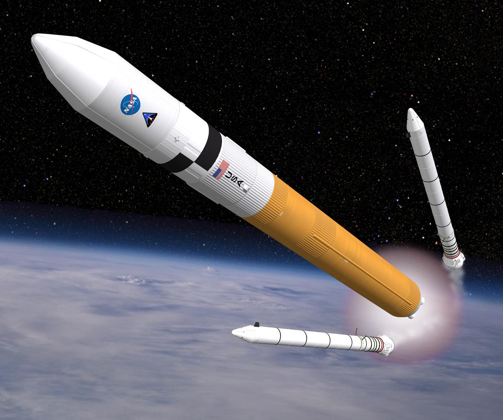

---

### CADRE Rover on the Moon (Artist's Concept)

| 属性 | 值 |
|-----|-----|
| **文件名** | `PIA26161.jpg` |
| **来源** | [JPL](https://images.nasa.gov/details-PIA26161) |
| **日期** | 2023-12-13 |
| **摄影师** | NASA |
| **许可** | Public Domain (NASA) |
| **文件大小** | 240 KB |

This artist's concept depicts a small rover – part of NASA's CADRE (Cooperative Autonomous Distributed Robotic Exploration) technology demonstration headed for the Moon – on the lunar surface. Motiv Space Systems in Pasadena, California, created the rendering and is collaborating with NASA's Jet Pro

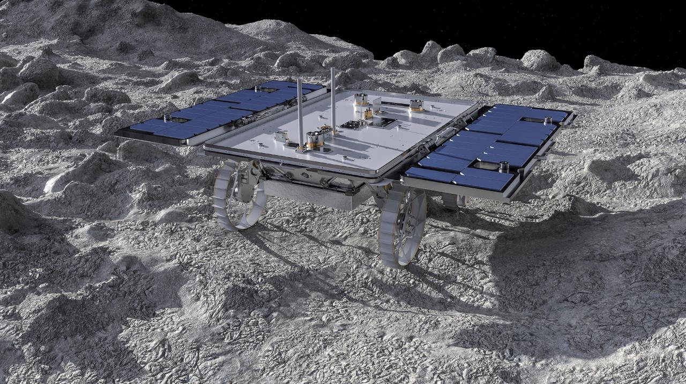

---

### CADRE Rovers Explore the Moon Together (Artist's Concept)

| 属性 | 值 |
|-----|-----|
| **文件名** | `PIA26296.jpg` |
| **来源** | [JPL](https://images.nasa.gov/details-PIA26296) |
| **日期** | 2024-05-13 |
| **摄影师** | NASA |
| **许可** | Public Domain (NASA) |
| **文件大小** | 131 KB |

This animated artist's concept depicts three small rovers – part of NASA's CADRE (Cooperative Autonomous Distributed Robotic Exploration) technology demonstration headed for the Moon – driving together on the lunar surface. Motiv Space Systems in Pasadena, California, created the rendering and colla

---

### SSPF - 25 Year Anniversary Then & Now

| 属性 | 值 |
|-----|-----|
| **文件名** | `KSC-20190516-PH_KLS01_0059.jpg` |
| **来源** | [KSC](https://images.nasa.gov/details-KSC-20190516-PH_KLS01_0059) |
| **日期** | 2019-05-16 |
| **摄影师** | NASA/Kim Shiflett |
| **许可** | Public Domain (NASA) |
| **文件大小** | 119 KB |

The Lockheed Martin prototype habitat for NASA’s lunar orbital platform, called the Gateway, is in view at left in the high bay of the Space Station Processing Facility (SSPF) at NASA's Kennedy Space Center in Florida, on May 16, 2019. The center is celebrating the SSPF’s 25th anniversary. The facil

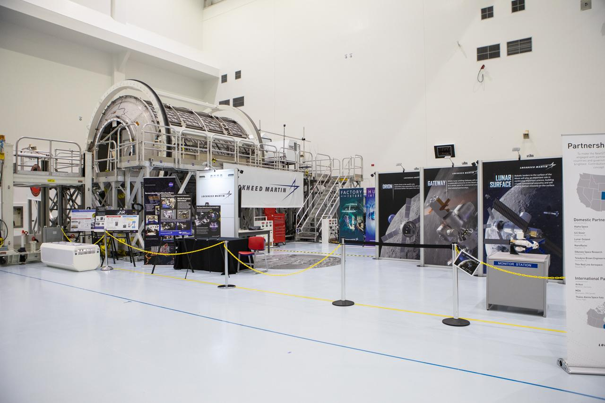

---

### SSPF - 25 Year Anniversary Then & Now

| 属性 | 值 |
|-----|-----|
| **文件名** | `KSC-20190516-PH_KLS01_0055.jpg` |
| **来源** | [KSC](https://images.nasa.gov/details-KSC-20190516-PH_KLS01_0055) |
| **日期** | 2019-05-16 |
| **摄影师** | NASA/Kim Shiflett |
| **许可** | Public Domain (NASA) |
| **文件大小** | 128 KB |

The Lockheed Martin prototype habitat for NASA’s lunar orbital platform, called the Gateway, is in view at far left in the high bay of the Space Station Processing Facility (SSPF) at NASA's Kennedy Space Center in Florida, on May 16, 2019. The center is celebrating the SSPF’s 25th anniversary. The f

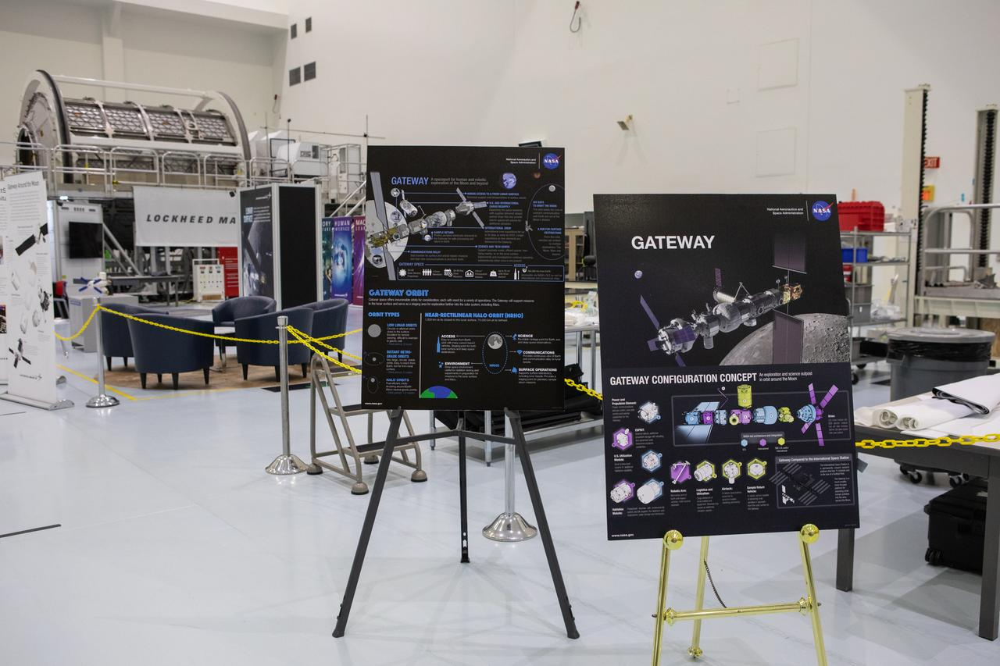

---

### NASA 3D-Printed Habitat Challenge

| 属性 | 值 |
|-----|-----|
| **文件名** | `MSFC-201900588.jpg` |
| **来源** | [MSFC](https://images.nasa.gov/details-MSFC-201900588) |
| **日期** | 2019-05-01 |
| **摄影师** | Emmett Given |
| **许可** | Public Domain (NASA) |
| **文件大小** | 232 KB |

Team Penn State prepares their 3D-printer to begin printing a subscale habitat structure at NASA's 3D-Printed Habitat Challenge, held at the Caterpillar Edwards Demonstration & Learning Center in Edwards, Illinois, May 1-4, 2019. The habitat print is the final level of the multi-phase competition, w

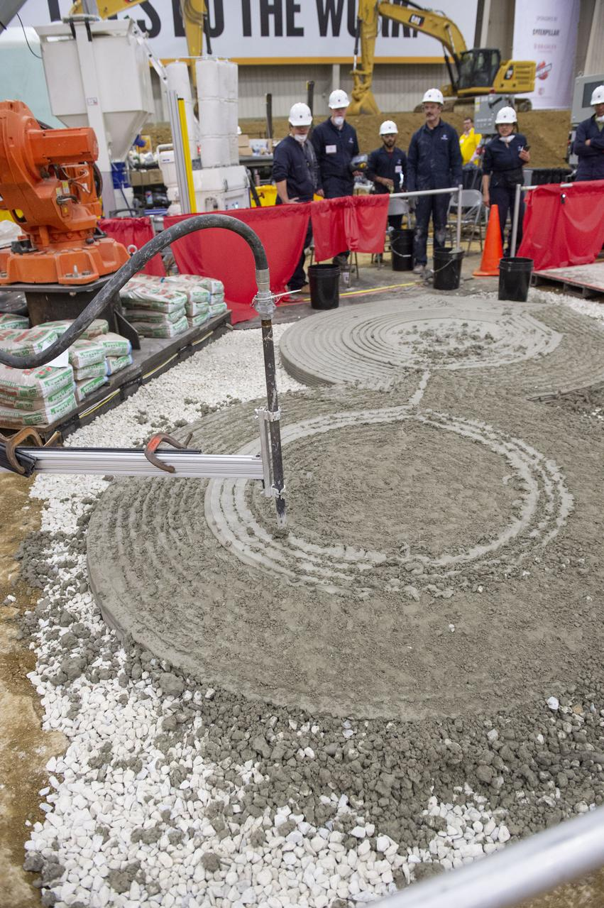

---

### NASA 3D-Printed Habitat Challenge

| 属性 | 值 |
|-----|-----|
| **文件名** | `MSFC-201900637.jpg` |
| **来源** | [MSFC](https://images.nasa.gov/details-MSFC-201900637) |
| **日期** | 2019-05-01 |
| **摄影师** | Emmett Given |
| **许可** | Public Domain (NASA) |
| **文件大小** | 170 KB |

Team Penn State prepares their 3D-printer to begin printing a subscale habitat structure at NASA's 3D-Printed Habitat Challenge, held at the Caterpillar Edwards Demonstration & Learning Center in Edwards, Illinois, May 1-4, 2019. The habitat print is the final level of the multi-phase competition, w

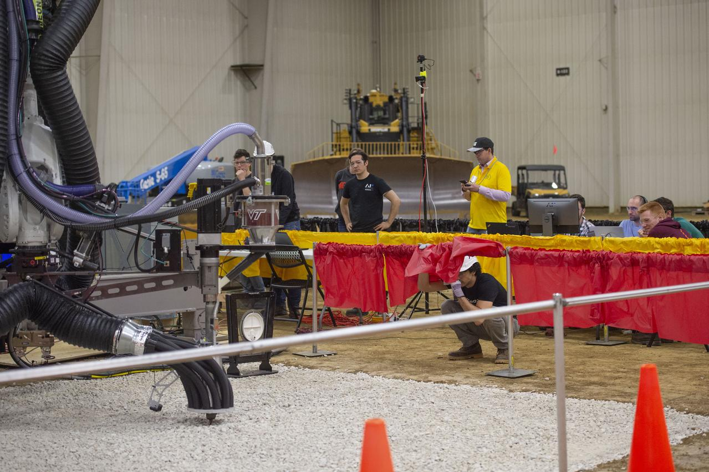

---

### NASA 3D-Printed Habitat Challenge

| 属性 | 值 |
|-----|-----|
| **文件名** | `MSFC-201900627.jpg` |
| **来源** | [MSFC](https://images.nasa.gov/details-MSFC-201900627) |
| **日期** | 2019-05-04 |
| **摄影师** | Emmett Given |
| **许可** | Public Domain (NASA) |
| **文件大小** | 125 KB |

Two teams - Penn State (left) and AI. SpaceFactory (right) competed to 3D-print subscale habitat structures at NASA's 3D-Printed Habitat Challenge, held at the Caterpillar Edwards Demonstration & Learning Center in Edwards, Illinois, May 1-4, 2019. The habitat print is the final level of the multi-p

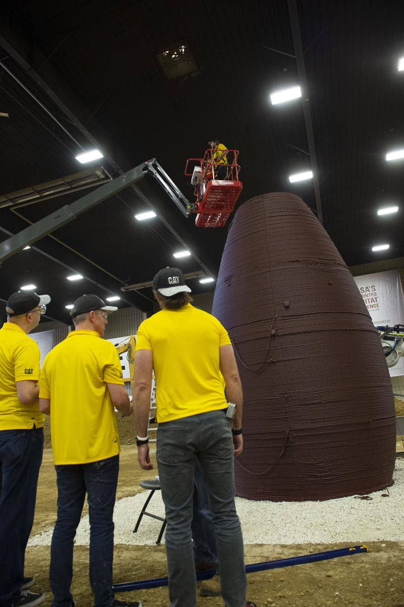

---

### NASA 3D-Printed Habitat Challenge

| 属性 | 值 |
|-----|-----|
| **文件名** | `MSFC-201900630.jpg` |
| **来源** | [MSFC](https://images.nasa.gov/details-MSFC-201900630) |
| **日期** | 2019-05-04 |
| **摄影师** | Emmett Given |
| **许可** | Public Domain (NASA) |
| **文件大小** | 184 KB |

Two teams - Penn State (left) and AI. SpaceFactory (right) competed to 3D-print subscale habitat structures at NASA's 3D-Printed Habitat Challenge, held at the Caterpillar Edwards Demonstration & Learning Center in Edwards, Illinois, May 1-4, 2019. The habitat print is the final level of the multi-p

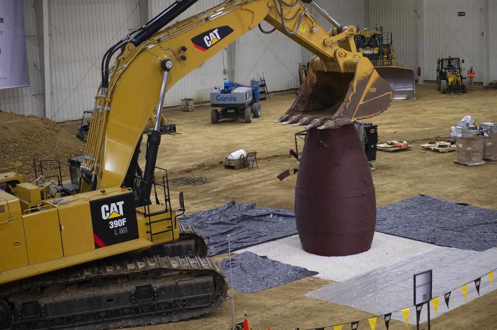

---

### The Lunar Gateway Launch Map (jsc2025e037586)

| 属性 | 值 |
|-----|-----|
| **文件名** | `jsc2025e037586.jpg` |
| **来源** | [JSC](https://images.nasa.gov/details-jsc2025e037586) |
| **日期** | 2025-04-10 |
| **摄影师** | NASA |
| **许可** | Public Domain (NASA) |
| **文件大小** | 164 KB |

The Lunar Gateway Launch, mapped. Gateway's first elements, the Power and Propulsion Element and HALO (Habitation and Logistics Outpost), will launch together to lunar orbit, where they’ll set the stage for Artemis IV: the first Gateway assembly mission. During this milestone mission, the Artemis IV

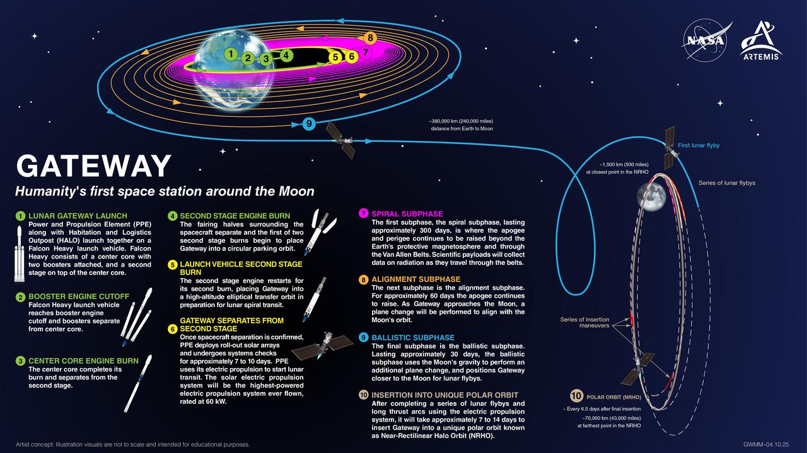

---

### jsc2024e063114 -- Advanced Modeling Enhances Gateway’s Lunar Dust Defense

| 属性 | 值 |
|-----|-----|
| **文件名** | `jsc2024e063114_alt.jpg` |
| **来源** | [JSC](https://images.nasa.gov/details-jsc2024e063114_alt) |
| **日期** | 2024-09-19 |
| **摄影师** | NASA/PHOTO        BILL STAFFORD |
| **许可** | Public Domain (NASA) |
| **文件大小** | 165 KB |

Josh Litofsky leads a Gateway lunar dust adhesion testing campaign at NASA’s Johnson Space Center in Houston. His team studies how lunar dust interacts with materials chosen for Gateway's construction. Here, Litofsky scoops lunar stimulant into a sample holder.  Litofksy’s work seeks to validate the

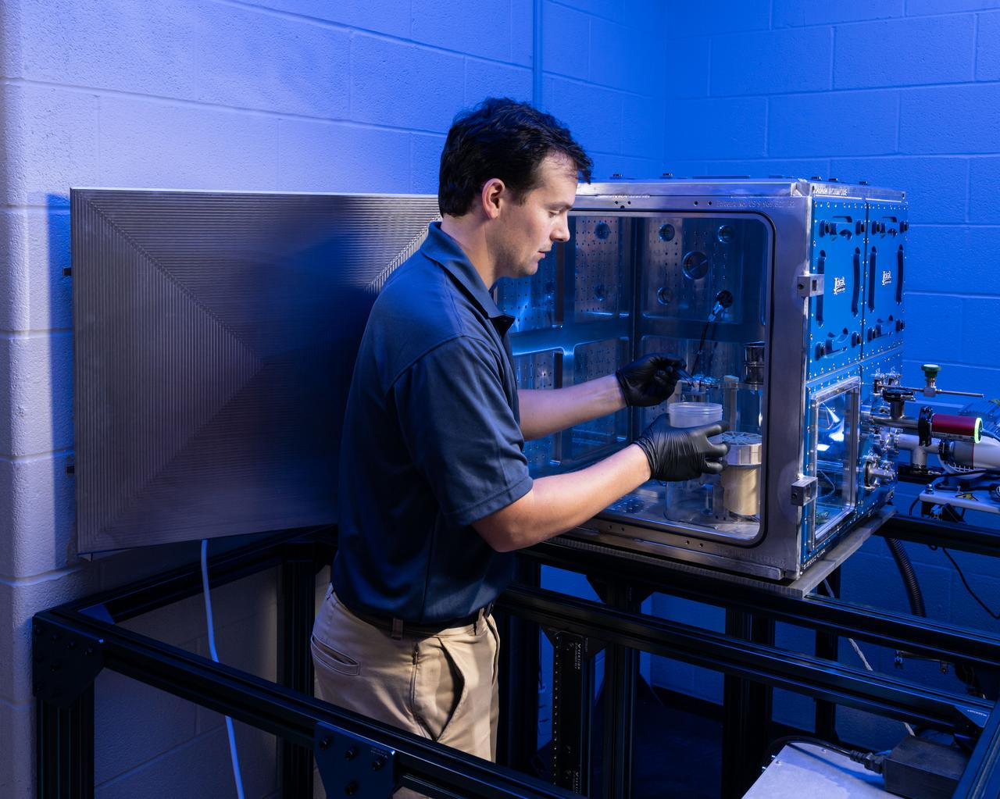

---

### jsc2024e063104 -- Advanced Modeling Enhances Gateway’s Lunar Dust Defense

| 属性 | 值 |
|-----|-----|
| **文件名** | `jsc2024e0631042.jpg` |
| **来源** | [JSC](https://images.nasa.gov/details-jsc2024e063104 (2)) |
| **日期** | 2024-09-19 |
| **摄影师** | NASA/PHOTO        BILL STAFFORD |
| **许可** | Public Domain (NASA) |
| **文件大小** | 131 KB |

Josh Litofsky leads a Gateway lunar dust adhesion testing campaign at NASA’s Johnson Space Center in Houston. His team studies how lunar dust interacts with materials chosen for Gateway's construction. Here, Litofsky carefully positions a sample holder inside a vacuum chamber.   Litofksy’s work seek

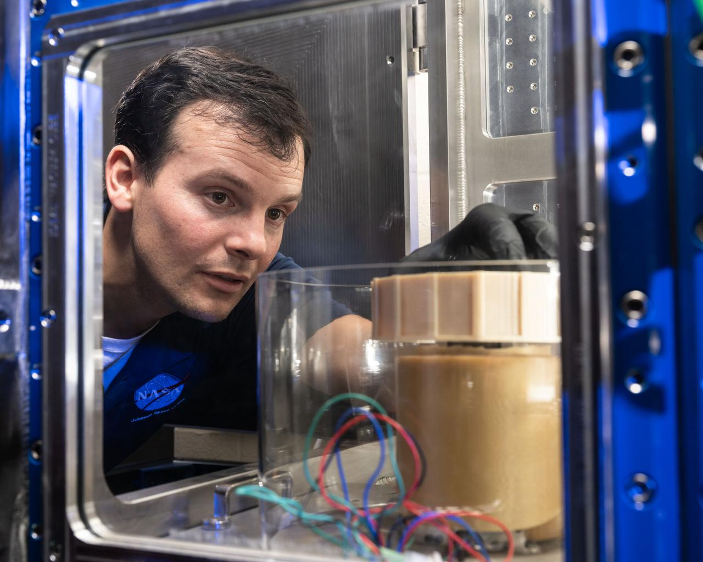

---

### Gateway Lunar Space Station Configuration

| 属性 | 值 |
|-----|-----|
| **文件名** | `jsc2024e0417881.jpg` |
| **来源** | [JSC](https://images.nasa.gov/details-jsc2024e041788 (1)) |
| **日期** | 2024-06-13 |
| **摄影师** | NASA |
| **许可** | Public Domain (NASA) |
| **文件大小** | 143 KB |

The Gateway lunar space station configuration and major international and commercial partners. 

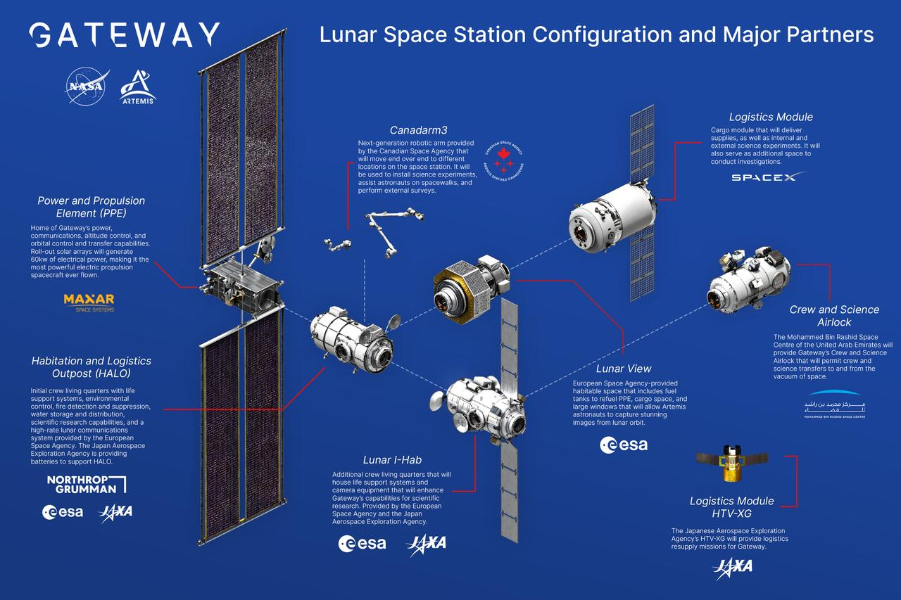

---

### Gateway Program Manager on Gateway lunar space station  

| 属性 | 值 |
|-----|-----|
| **文件名** | `jsc2024e055764.jpg` |
| **来源** | [JSC](https://images.nasa.gov/details-jsc2024e055764) |
| **日期** | 2024-07-26 |
| **摄影师** | Andrew Carlsen |
| **许可** | Public Domain (NASA) |
| **文件大小** | 93 KB |

jsc2024e055764 (July 26, 2024) -- Dr. Jon Olansen discusses lunar habitation during the "Living the Lunar Life" forum at EAA AirVenture Oshkosh 2024. As Gateway Program Manager, Olansen highlights the innovative technologies and mission planning essential for living and working in the harsh environm

---

### jsc2024e024935

| 属性 | 值 |
|-----|-----|
| **文件名** | `jsc2024e024935.jpg` |
| **来源** | [JSC](https://images.nasa.gov/details-jsc2024e024935) |
| **日期** | 2024-04-09 |
| **摄影师** | NASA |
| **许可** | Public Domain (NASA) |
| **文件大小** | 97 KB |

What astronauts see as they tour the Gateway lunar space station in virtual reality.

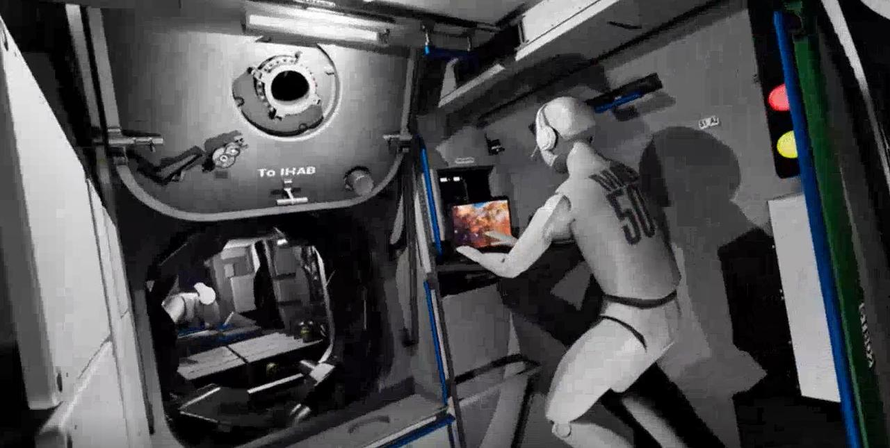

---

## ❌ 下载失败的图片

| 标题 | 来源链接 | 错误信息 |
|-----|---------|----------|
| Early Program Development... | [链接](https://images.nasa.gov/details-9902061) | RetryError[<Future at 0x1bf9ffe5eb0 state=finished raised HTTPStatusError>] |
| Early Program Development... | [链接](https://images.nasa.gov/details-9902063) | RetryError[<Future at 0x1bf9ef751c0 state=finished raised HTTPStatusError>] |
| Space Station... | [链接](https://images.nasa.gov/details-8562087) | RetryError[<Future at 0x1bf9ffee270 state=finished raised HTTPStatusError>] |
