# 25_火箭与发射设施 - 图片来源索引

> **来源**: NASA Images API (https://images.nasa.gov)  
> **许可**: 所有NASA图片均为Public Domain，可自由使用  
> **生成时间**: 2026-02-02 00:01:55

## 📊 统计

| 指标 | 数量 |
|-----|------|
| 成功下载 | 20 |
| 下载失败 | 2 |
| 总计 | 22 |

---

## ✅ 已下载图片

### 3D-printed Rotating Detonation Rocket Engine Test 

| 属性 | 值 |
|-----|-----|
| **文件名** | `09-27-2023-HF-12_062.jpg` |
| **来源** | [MSFC](https://images.nasa.gov/details-09-27-2023-HF-12 _062) |
| **日期** | 2023-09-27 |
| **摄影师** | NASA |
| **许可** | Public Domain (NASA) |
| **文件大小** | 97 KB |

Engineers at NASA’s Marshall Space Flight Center in Huntsville, Alabama, conduct a successful, 251-second hot fire test of a full-scale Rotating Detonation Rocket Engine combustor in fall 2023, achieving more than 5,800 pounds of thrust. 

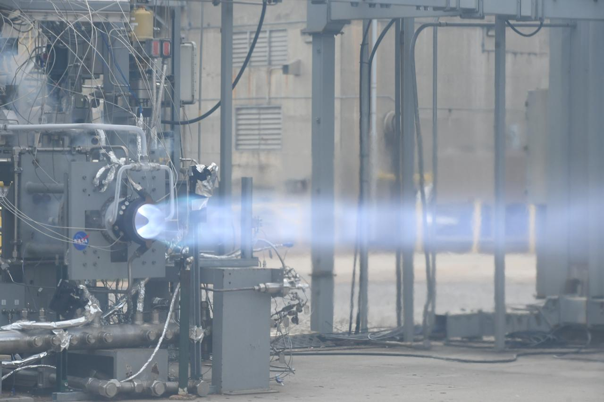

---

### Engine Section for NASA’s SLS Rocket Prepared for Joining to Rest of Stage

| 属性 | 值 |
|-----|-----|
| **文件名** | `MAF_20190912_P_CS1ESBreakoverPt2-45.jpg` |
| **来源** | [MAF](https://images.nasa.gov/details-MAF_20190912_P_CS1 ES Breakover Pt. 2-45) |
| **日期** | 2019-09-12 |
| **摄影师** | Jude L. Guidry |
| **许可** | Public Domain (NASA) |
| **文件大小** | 105 KB |

Technicians at NASA’s Michoud Assembly Facility in New Orleans rotated the engine section for NASA’s Space Launch System rocket from a vertical to horizontal position to prepare it for joining to the rest of the rocket’s core stage on Sept. 13. The engine section, which comprises the lowest portion 

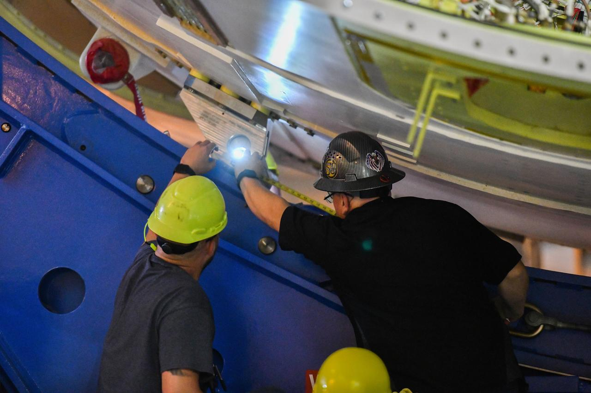

---

### Engine Section for NASA’s SLS Rocket Prepared for Joining to Rest of Stage

| 属性 | 值 |
|-----|-----|
| **文件名** | `MAF_20190912_P_CS1ESBreakoverPt2-88.jpg` |
| **来源** | [MAF](https://images.nasa.gov/details-MAF_20190912_P_CS1 ES Breakover Pt. 2-88) |
| **日期** | 2019-09-12 |
| **摄影师** | Jude L. Guidry |
| **许可** | Public Domain (NASA) |
| **文件大小** | 102 KB |

Technicians at NASA’s Michoud Assembly Facility in New Orleans rotated the engine section for NASA’s Space Launch System rocket from a vertical to horizontal position to prepare it for joining to the rest of the rocket’s core stage on Sept. 13. The engine section, which comprises the lowest portion 

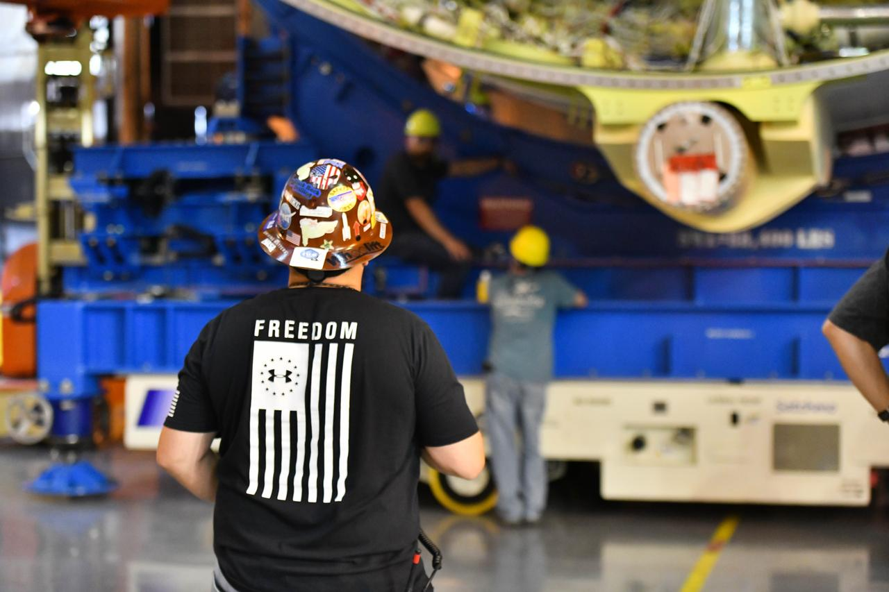

---

### Engine Section for NASA’s SLS Rocket Prepared for Joining to Rest of Stage

| 属性 | 值 |
|-----|-----|
| **文件名** | `MAF_20190912_P_CS1ESBreakoverPt2-18.jpg` |
| **来源** | [MAF](https://images.nasa.gov/details-MAF_20190912_P_CS1 ES Breakover Pt. 2-18) |
| **日期** | 2019-09-12 |
| **摄影师** | Jude L. Guidry |
| **许可** | Public Domain (NASA) |
| **文件大小** | 134 KB |

Technicians at NASA’s Michoud Assembly Facility in New Orleans rotated the engine section for NASA’s Space Launch System rocket from a vertical to horizontal position to prepare it for joining to the rest of the rocket’s core stage on Sept. 13. The engine section, which comprises the lowest portion 

---

### Engine Section for NASA’s SLS Rocket Prepared for Joining to Rest of Stage

| 属性 | 值 |
|-----|-----|
| **文件名** | `MAF_20190912_P_CS1ESBreakoverPt2-108.jpg` |
| **来源** | [MAF](https://images.nasa.gov/details-MAF_20190912_P_CS1 ES Breakover Pt. 2-108) |
| **日期** | 2019-09-12 |
| **摄影师** | Jude L. Guidry |
| **许可** | Public Domain (NASA) |
| **文件大小** | 132 KB |

Technicians at NASA’s Michoud Assembly Facility in New Orleans rotated the engine section for NASA’s Space Launch System rocket from a vertical to horizontal position to prepare it for joining to the rest of the rocket’s core stage on Sept. 13. The engine section, which comprises the lowest portion 

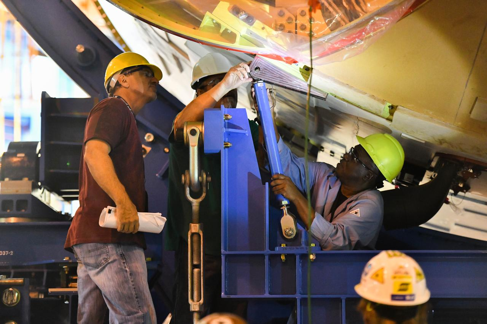

---

### AJ26 rocket engine testing news briefing

| 属性 | 值 |
|-----|-----|
| **文件名** | `SSC-20100224-S00263.jpg` |
| **来源** | [SSC](https://images.nasa.gov/details-SSC-20100224-S00263) |
| **日期** | 2010-02-24 |
| **摄影师** | NASA |
| **许可** | Public Domain (NASA) |
| **文件大小** | 161 KB |

Operators at NASA's John C. Stennis Space Center are completing modifications to the E-1 Test Stand to begin testing Aerojet AJ26 rocket engines in early summer of 2010. Modifications include construction of a 27-foot-deep flame deflector trench. The AJ26 rocket engines will be used to power Orbital

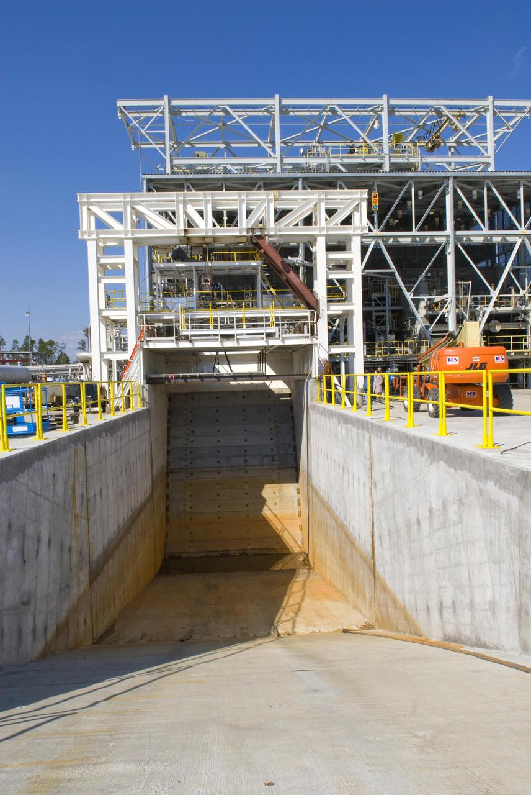

---

### Commerical Crew Astronauts Visit Launch Complex 39A

| 属性 | 值 |
|-----|-----|
| **文件名** | `KSC-20180327-PH_SPX01_0001.jpg` |
| **来源** | [KSC](https://images.nasa.gov/details-KSC-20180327-PH_SPX01_0001) |
| **日期** | 2018-03-27 |
| **摄影师** | SpaceX |
| **许可** | Public Domain (NASA) |
| **文件大小** | 124 KB |

Commercial Crew Program astronauts, from the left, Suni Williams, Eric Boe, Bob Behnken and Doug Hurley take in the view from the top of Launch Complex 39A at Kennedy Space Center. The astronauts toured the pad for an up-close look at modifications that are in work for the SpaceX Crew Dragon flight 

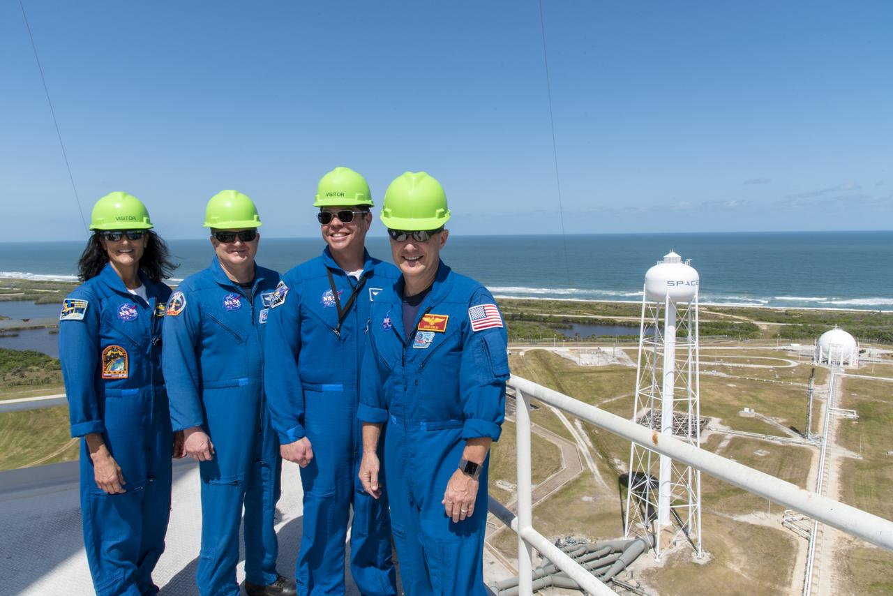

---

### Commerical Crew Astronauts Visit Launch Complex 39A

| 属性 | 值 |
|-----|-----|
| **文件名** | `KSC-20180327-PH_SPX01_0002.jpg` |
| **来源** | [KSC](https://images.nasa.gov/details-KSC-20180327-PH_SPX01_0002) |
| **日期** | 2018-03-27 |
| **摄影师** | SpaceX |
| **许可** | Public Domain (NASA) |
| **文件大小** | 108 KB |

Commercial Crew Program astronauts, from the left Doug Hurley, Eric Boe, Bob Behnken and Suni Williams, pose just outside Launch Complex 39A at NASA's Kennedy Space Center in Florida. The astronauts toured the pad for an up-close look at modifications that are in work for the SpaceX Crew Dragon flig

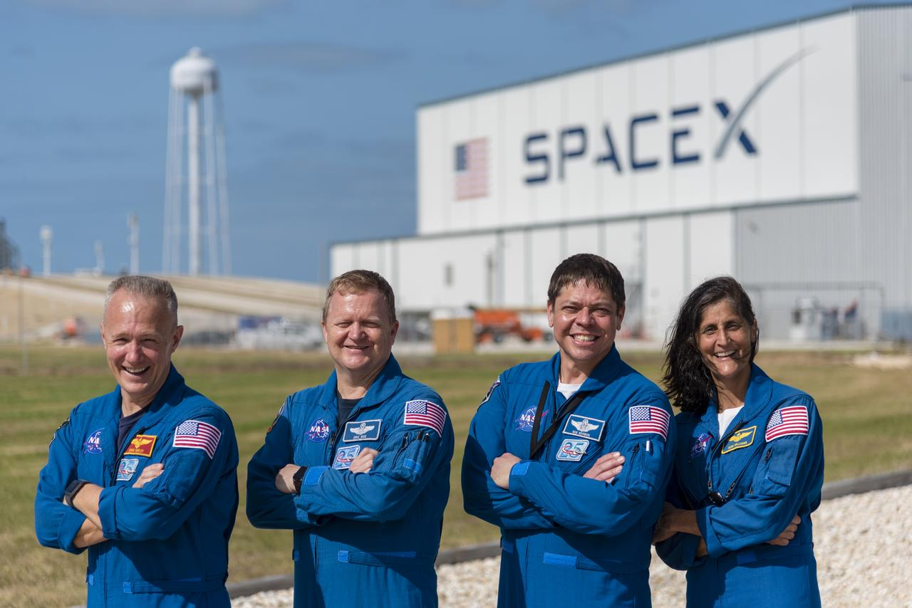

---

### Launch Complex 49 Site

| 属性 | 值 |
|-----|-----|
| **文件名** | `KSC-20211220-PH-KLS01_0006.jpg` |
| **来源** | [KSC](https://images.nasa.gov/details-KSC-20211220-PH-KLS01_0006) |
| **日期** | 2021-12-20 |
| **摄影师** | NASA/Kim Shiflett |
| **许可** | Public Domain (NASA) |
| **文件大小** | 120 KB |

A view of a proposed new launch site, Launch Complex 49, on Dec. 20, 2021, at NASA’s Kennedy Space Center in Florida. In response to an inquiry from SpaceX, NASA is preparing to conduct environmental assessments to develop the proposed launch site. The 175-acre site, located north of Launch Complex 

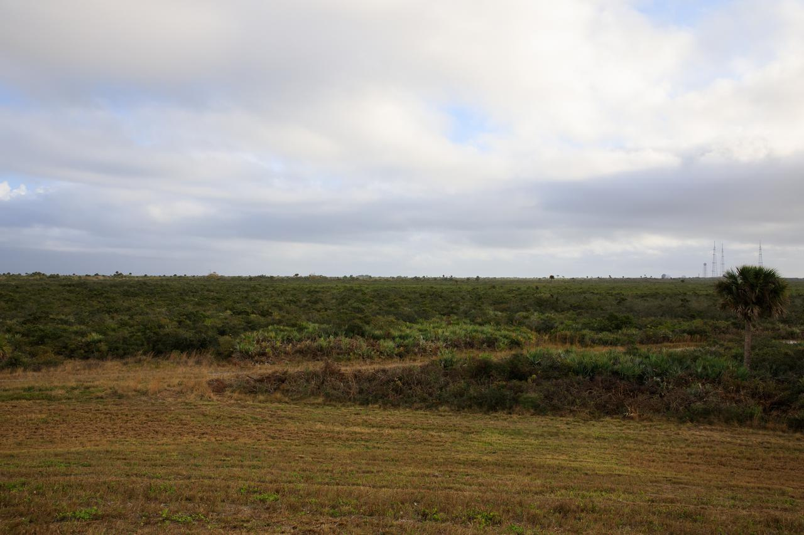

---

### Launch Complex 49 Site

| 属性 | 值 |
|-----|-----|
| **文件名** | `KSC-20211220-PH-KLS01_0002.jpg` |
| **来源** | [KSC](https://images.nasa.gov/details-KSC-20211220-PH-KLS01_0002) |
| **日期** | 2021-12-20 |
| **摄影师** | NASA/Kim Shiflett |
| **许可** | Public Domain (NASA) |
| **文件大小** | 133 KB |

A view of a proposed new launch site, Launch Complex 49, on Dec. 20, 2021, at NASA’s Kennedy Space Center in Florida. In response to an inquiry from SpaceX, NASA is preparing to conduct environmental assessments to develop the proposed launch site. The 175-acre site, located north of Launch Complex 

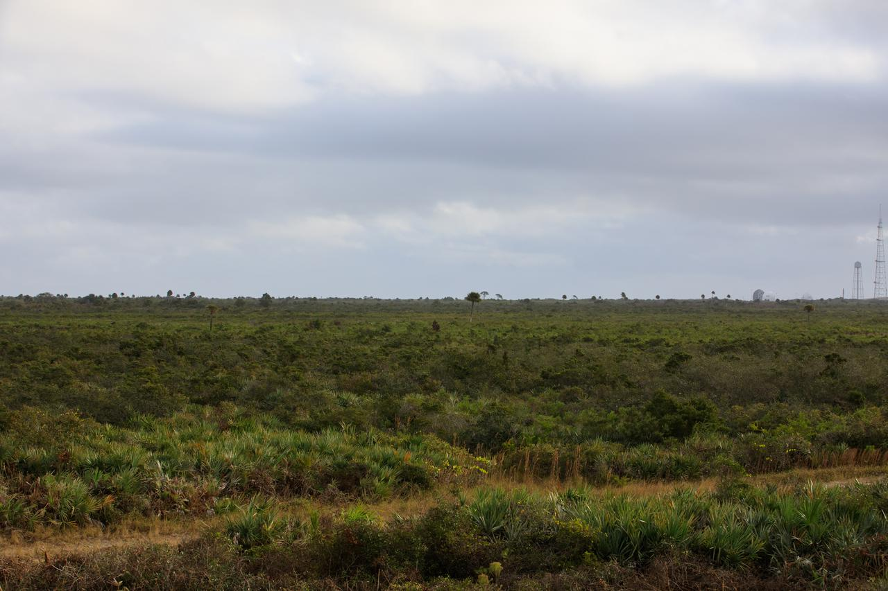

---

### Launch Complex 49 Area

| 属性 | 值 |
|-----|-----|
| **文件名** | `KSC-20211228-PH-MTD01_0862.jpg` |
| **来源** | [KSC](https://images.nasa.gov/details-KSC-20211228-PH-MTD01_0862) |
| **日期** | 2021-12-28 |
| **摄影师** | NASA/Mike Downs |
| **许可** | Public Domain (NASA) |
| **文件大小** | 218 KB |

An aerial view of a proposed new launch site, Launch Complex 49, on Dec. 28, 2021, at NASA’s Kennedy Space Center in Florida. In response to an inquiry from SpaceX, NASA is preparing to conduct environmental assessments to develop the proposed launch site. The 175-acre site, located north of Launch 

---

### Launch Complex 49 Area

| 属性 | 值 |
|-----|-----|
| **文件名** | `KSC-20211228-PH-MTD01_0874.jpg` |
| **来源** | [KSC](https://images.nasa.gov/details-KSC-20211228-PH-MTD01_0874) |
| **日期** | 2021-12-28 |
| **摄影师** | NASA/Mike Downs |
| **许可** | Public Domain (NASA) |
| **文件大小** | 216 KB |

An aerial view of a proposed new launch site, Launch Complex 49, on Dec. 28, 2021, at NASA’s Kennedy Space Center in Florida. In response to an inquiry from SpaceX, NASA is preparing to conduct environmental assessments to develop the proposed launch site. The 175-acre site, located north of Launch 

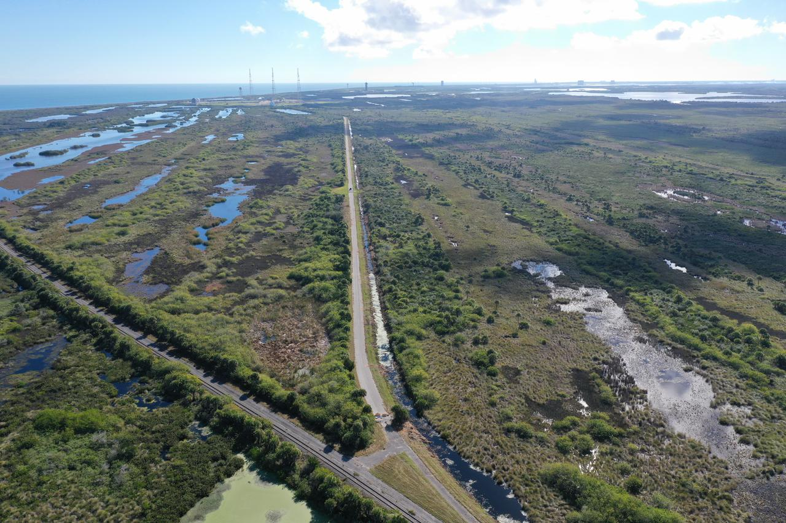

---

### Dawn Spacecraft Being Assembled

| 属性 | 值 |
|-----|-----|
| **文件名** | `PIA12028.jpg` |
| **来源** | [JPL](https://images.nasa.gov/details-PIA12028) |
| **日期** | 2009-05-29 |
| **摄影师** | NASA |
| **许可** | Public Domain (NASA) |
| **文件大小** | 171 KB |

NASA Dawn spacecraft being assembled.

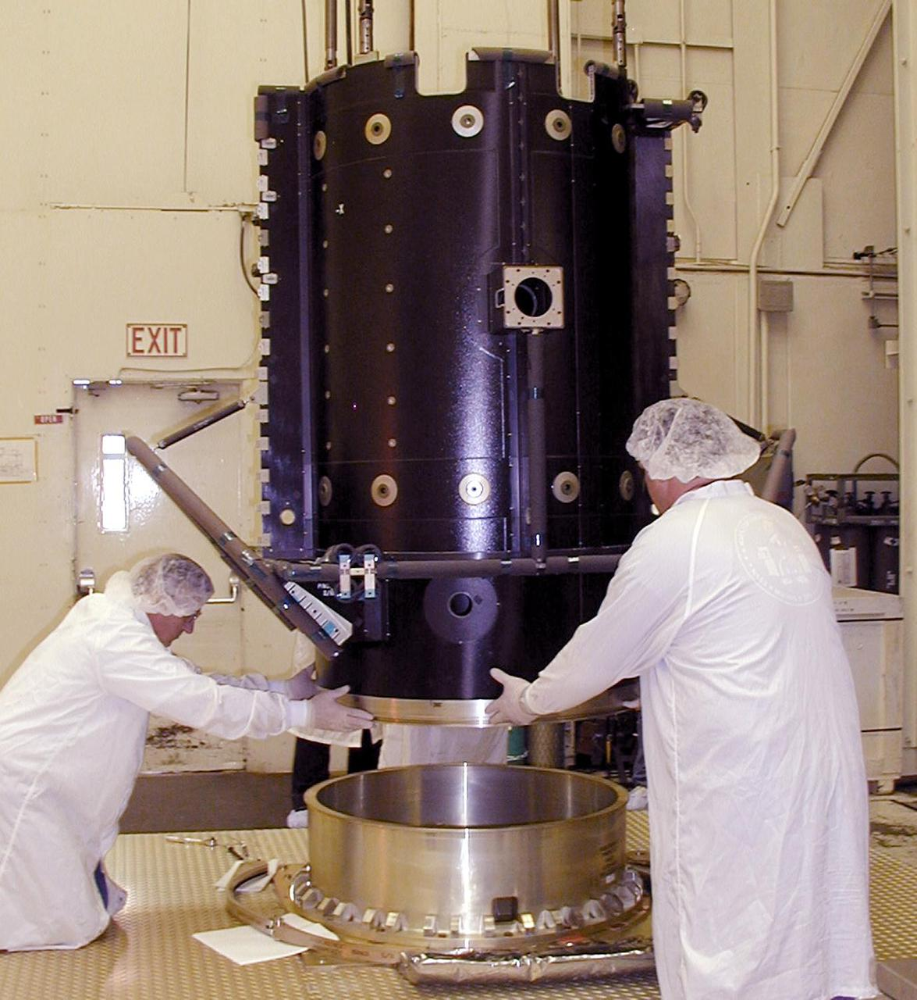

---

### Working on Curiosity in JPL Spacecraft Assembly Facility

| 属性 | 值 |
|-----|-----|
| **文件名** | `PIA14126.jpg` |
| **来源** | [JPL](https://images.nasa.gov/details-PIA14126) |
| **日期** | 2011-05-12 |
| **摄影师** | NASA |
| **许可** | Public Domain (NASA) |
| **文件大小** | 205 KB |

This wide-angle view shows the High Bay 1 cleanroom inside the Spacecraft Assembly Facility at NASA Jet Propulsion Laboratory, Pasadena, Calif. Specialists are working on components of NASA Mars Science Laboratory spacecraft.

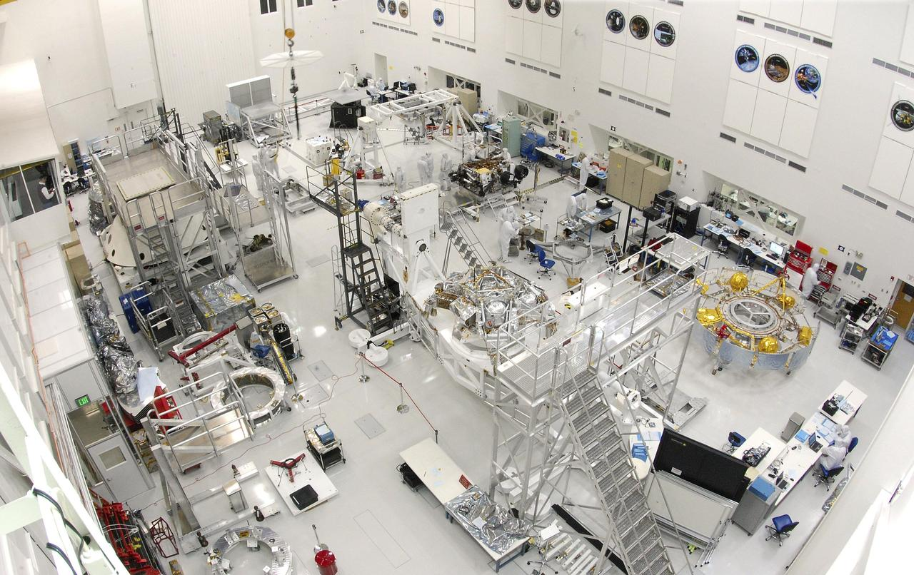

---

### Mariner 1 in JPL's Spacecraft Assembly Facility

| 属性 | 值 |
|-----|-----|
| **文件名** | `PIA23310.jpg` |
| **来源** | [JPL](https://images.nasa.gov/details-PIA23310) |
| **日期** | 2019-12-23 |
| **摄影师** | NASA |
| **许可** | Public Domain (NASA) |
| **文件大小** | 205 KB |

JPL's Spacecraft Assembly Facility looks more like a hangar in this photo of two engineers standing with Mariner 1 on May 2, 1962. However, the gowning procedures were far less rigorous than they are today. Mariner 1 was destroyed during its attempted launch to Venus.  https://photojournal.jpl.nasa.

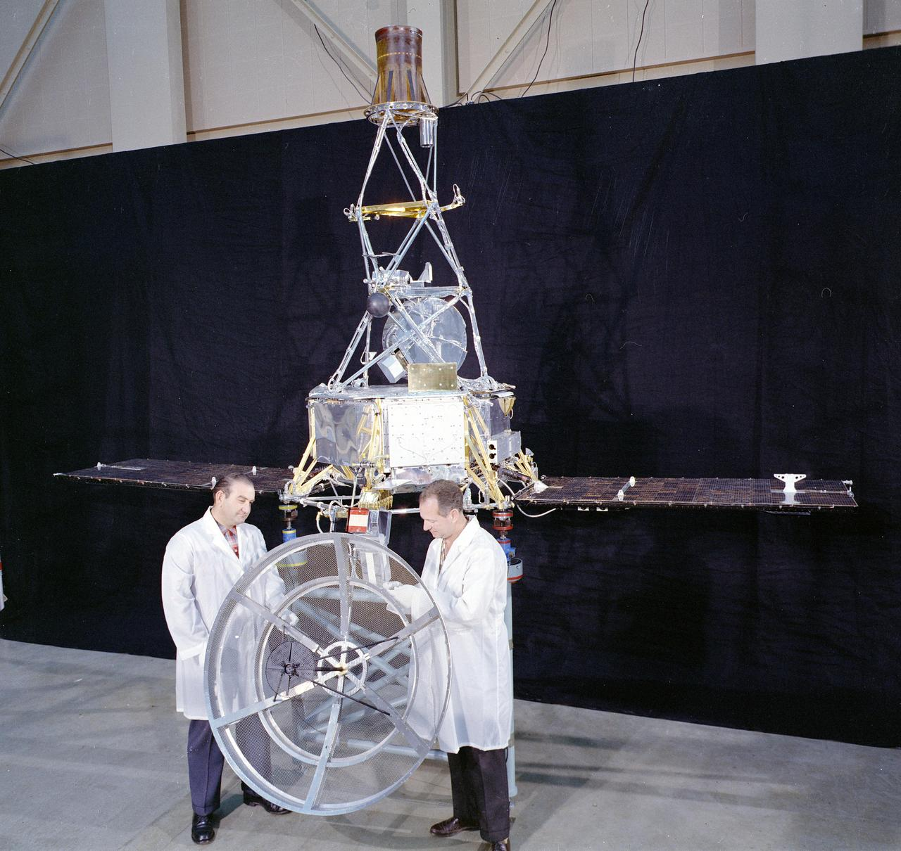

---

### Wide angle view of the Flight control room of Mission control center

| 属性 | 值 |
|-----|-----|
| **文件名** | `41g-90128.jpg` |
| **来源** | [JSC](https://images.nasa.gov/details-41g-90128) |
| **日期** | 1984-10-06 |
| **摄影师** | NASA |
| **许可** | Public Domain (NASA) |
| **文件大小** | 110 KB |

Wide angle view of the flight control room (FCR) of the Mission Control Center (MCC). Some of the STS 41-G crew can be seen on a large screen at the front of the MCC along with a map tracking the progress of the orbiter.

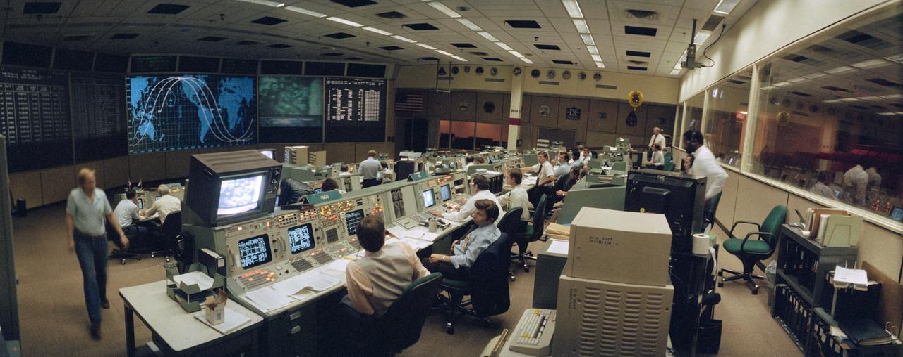

---

### Wide angle view of the Flight control room of Mission control center

| 属性 | 值 |
|-----|-----|
| **文件名** | `41g-90111.jpg` |
| **来源** | [JSC](https://images.nasa.gov/details-41g-90111) |
| **日期** | 1984-10-06 |
| **摄影师** | NASA |
| **许可** | Public Domain (NASA) |
| **文件大小** | 157 KB |

Wide angle view of the flight control room (FCR) of the Mission Control Center (MCC). Some of the STS 41-G crew can be seen on a large screen at the front of the MCC along with a map tracking the progress of the orbiter.

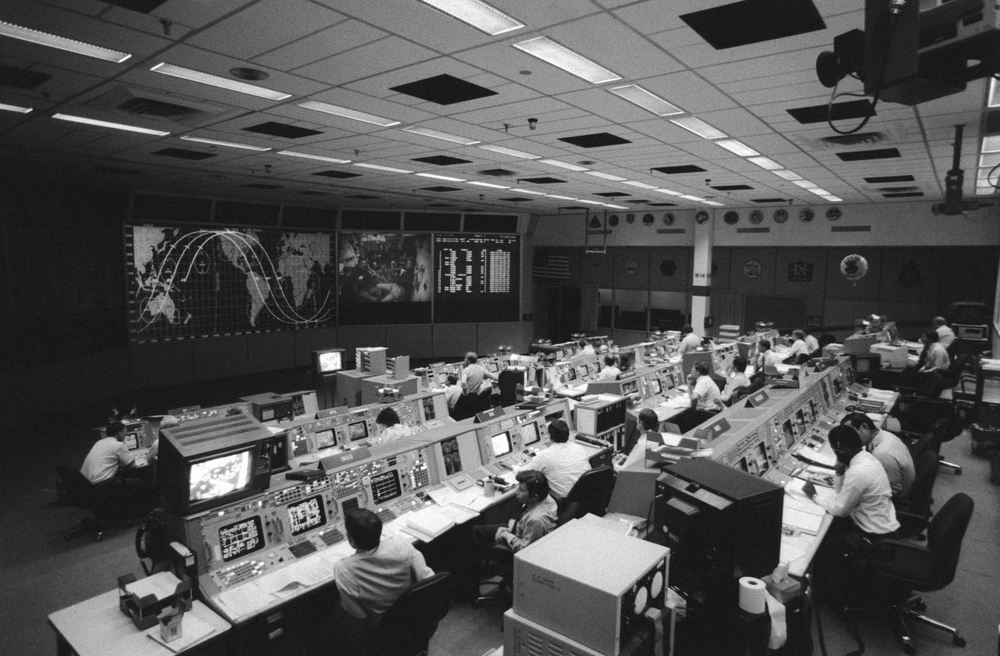

---

### Christopher Kraft, flight director during Project Mercury

| 属性 | 值 |
|-----|-----|
| **文件名** | `423257main_Shannahs_66_full.jpg` |
| **来源** | [KSC](https://images.nasa.gov/details-423257main_Shannahs_66_full) |
| **日期** | 1962-01-01 |
| **摄影师** | NASA |
| **许可** | Public Domain (NASA) |
| **文件大小** | 140 KB |

Christopher Kraft, flight director during Project Mercury, works at his console inside the Flight Control area at Mercury Mission Control.

---

### Overall view of Mission Operations Control in Mission Control Center

| 属性 | 值 |
|-----|-----|
| **文件名** | `S69-34316.jpg` |
| **来源** | [JSC](https://images.nasa.gov/details-S69-34316) |
| **日期** | 1969-05-18 |
| **摄影师** | NASA |
| **许可** | Public Domain (NASA) |
| **文件大小** | 147 KB |

S69-34316 (18 May 1969) --- Overall view of the Mission Operations Control Room in the Mission Control Center, Building 30, on the first day of the Apollo 10 lunar orbit mission. A color television transmission was being received from Apollo 10. This picture was made following Command and Service Mo

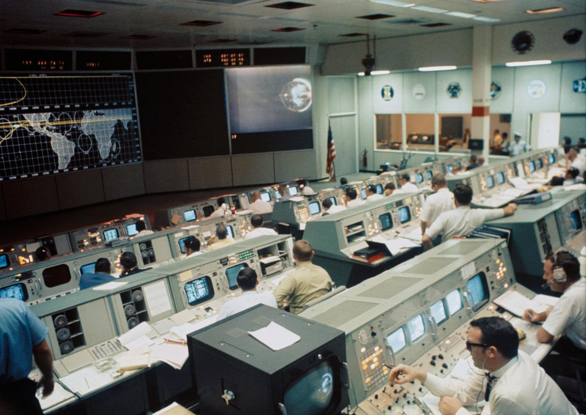

---

### Mission Control Center (MCC) - Apollo 15 Launch - MSC

| 属性 | 值 |
|-----|-----|
| **文件名** | `S71-41357.jpg` |
| **来源** | [JSC](https://images.nasa.gov/details-S71-41357) |
| **日期** | 1971-07-26 |
| **摄影师** | NASA |
| **许可** | Public Domain (NASA) |
| **文件大小** | 95 KB |

S71-41357 (26 July 1971) --- An overall, wide-angle lens view of activity in the Mission Operations Control Room in the Mission Control Center minutes after the launch of the Apollo 15 lunar landing mission. Ground elapsed time was 45 minutes and 42 seconds when this photograph was taken.

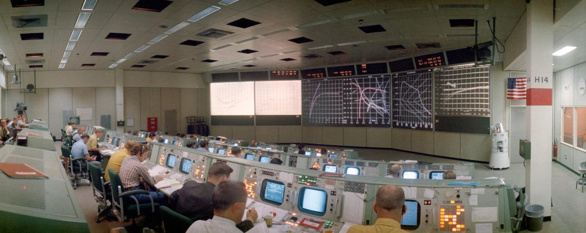

---

## ❌ 下载失败的图片

| 标题 | 来源链接 | 错误信息 |
|-----|---------|----------|
| Spacecraft Assembly Facility... | [链接](https://images.nasa.gov/details-PIA18664) | RetryError[<Future at 0x1bf9eef9040 state=finished raised HTTPStatusError>] |
| Looking for Microbes in a Spacecraft Ass... | [链接](https://images.nasa.gov/details-PIA17368) | RetryError[<Future at 0x1bf9ffe47d0 state=finished raised HTTPStatusError>] |
