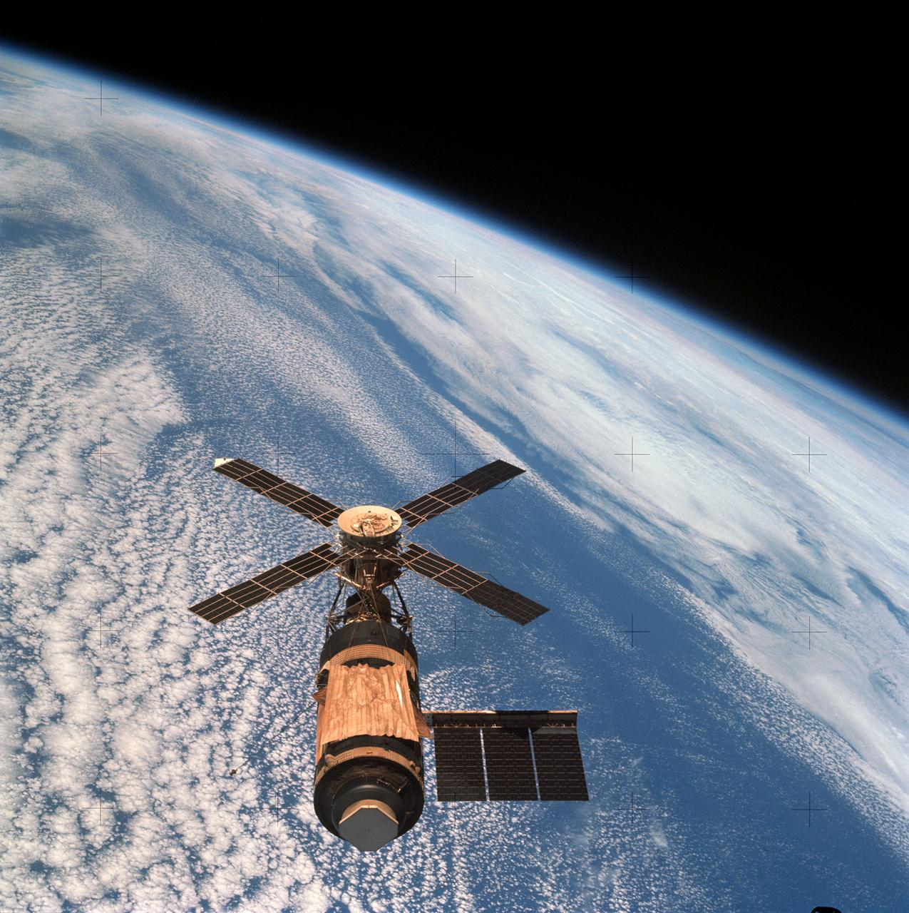
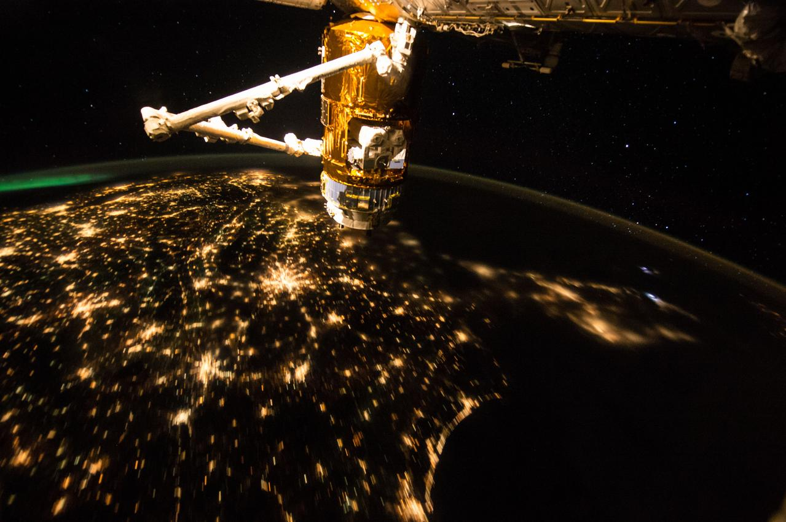
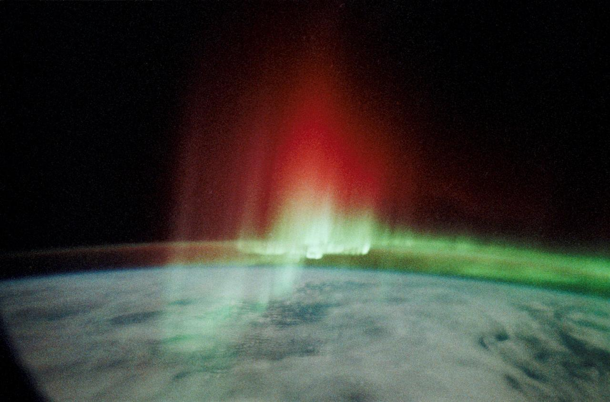
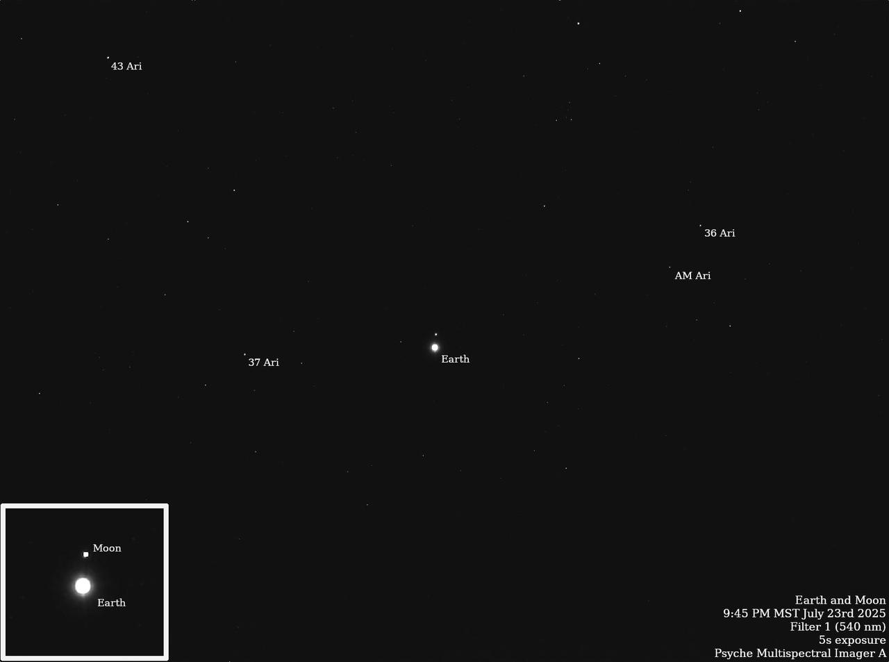
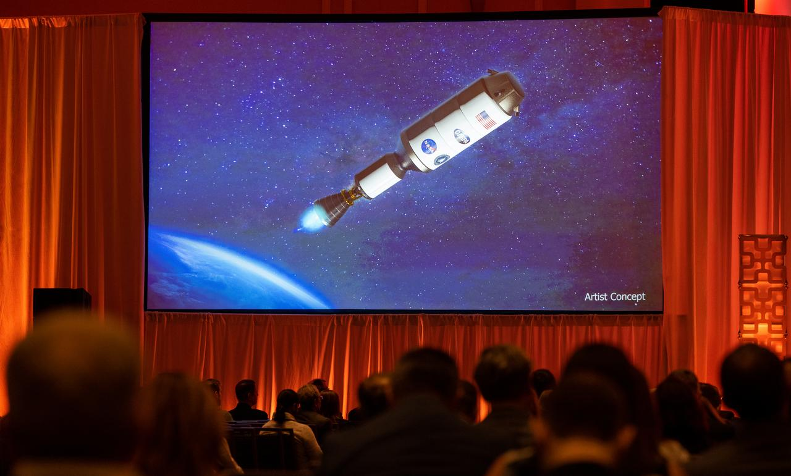
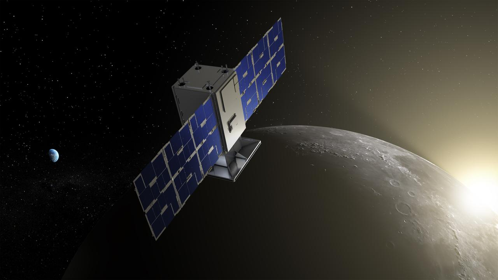
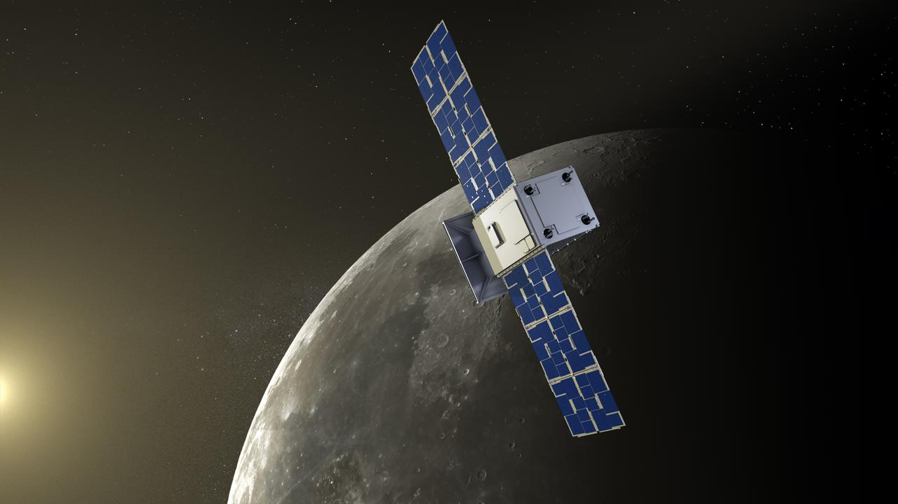
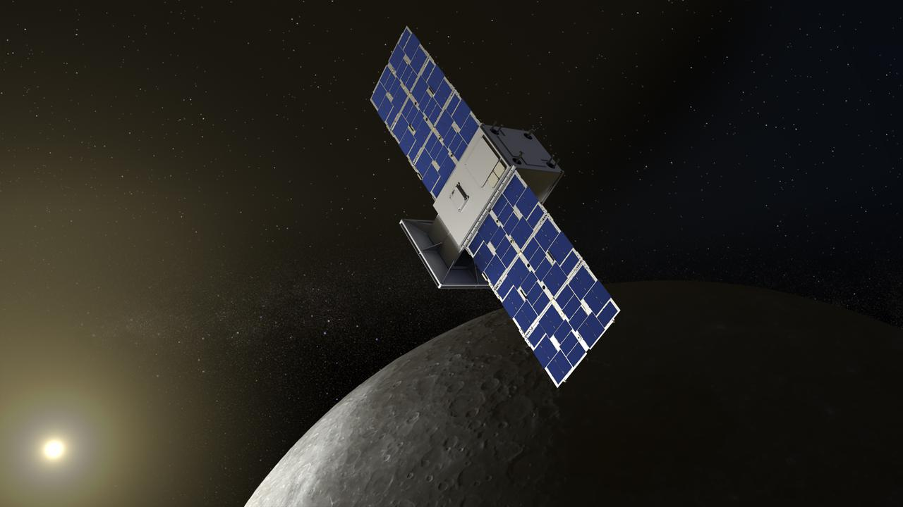
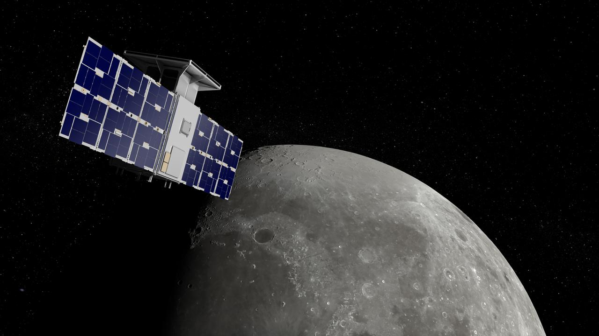

# 26_地月系统与深空 - 图片来源索引

> **来源**: NASA Images API (https://images.nasa.gov)  
> **许可**: 所有NASA图片均为Public Domain，可自由使用  
> **生成时间**: 2026-02-02 00:03:39

## 📊 统计

| 指标 | 数量 |
|-----|------|
| 成功下载 | 18 |
| 下载失败 | 3 |
| 总计 | 21 |

---

## ✅ 已下载图片

### View of Skylab space station cluster in Earth orbit from CSM

| 属性 | 值 |
|-----|-----|
| **文件名** | `sl4-143-4707.jpg` |
| **来源** | [JSC](https://images.nasa.gov/details-sl4-143-4707) |
| **日期** | 1974-02-08 |
| **摄影师** | NASA |
| **许可** | Public Domain (NASA) |
| **文件大小** | 267 KB |

SL4-143-4707 (8 Feb. 1974) --- An overhead view of the Skylab space station cluster in Earth orbit as photographed from the Skylab 4 Command and Service Modules (CSM) during the final fly-around by the CSM before returning home. The space station is contrasted against a cloud-covered Earth. Note the

---

### View of Skylab space station cluster in Earth orbit from CSM

| 属性 | 值 |
|-----|-----|
| **文件名** | `sl4-143-4706.jpg` |
| **来源** | [JSC](https://images.nasa.gov/details-sl4-143-4706) |
| **日期** | 2008-08-18 |
| **摄影师** | NASA |
| **许可** | Public Domain (NASA) |
| **文件大小** | 260 KB |

SL4-143-4706 (8 Feb. 1974) --- An overhead view of the Skylab space station cluster in Earth orbit as photographed from the Skylab 4 Command and Service Modules (CSM) during the final fly-around by the CSM before returning home. The space station is contrasted against a cloud-covered Earth. Note the

---

### Earth Observation from the International Space Station

| 属性 | 值 |
|-----|-----|
| **文件名** | `iss045e013851.jpg` |
| **来源** | [JSC](https://images.nasa.gov/details-iss045e013851) |
| **日期** | 2015-09-17 |
| **摄影师** | NASA |
| **许可** | Public Domain (NASA) |
| **文件大小** | 127 KB |

Night Earth Observation from the International Space Station

---

### Earth observations taken during STS-75

| 属性 | 值 |
|-----|-----|
| **文件名** | `sts075-722-013.jpg` |
| **来源** | [JSC](https://images.nasa.gov/details-sts075-722-013) |
| **日期** | 1996-02-26 |
| **摄影师** | NASA |
| **许可** | Public Domain (NASA) |
| **文件大小** | 336 KB |

Earth observations taken during the STS-75 mission from the space shuttle Columbia.

---

### Aurora Australis, Red Crown

| 属性 | 值 |
|-----|-----|
| **文件名** | `S39-23-036.jpg` |
| **来源** | [JSC](https://images.nasa.gov/details-S39-23-036) |
| **日期** | 1991-05-06 |
| **摄影师** | NASA |
| **许可** | Public Domain (NASA) |
| **文件大小** | 127 KB |

STS039-23-036 (28 April-6 May 1991) --- A 35mm frame of the Aurora Australis, also known as the Southern Lights, photographed from the Space Shuttle Discovery's flight deck by one of its seven crew members. One of the mission objectives was to measure the spectral and spatial characteristics of auro

---

###  NASA's Psyche Images Earth and Moon

| 属性 | 值 |
|-----|-----|
| **文件名** | `PIA26569.jpg` |
| **来源** | [JPL](https://images.nasa.gov/details-PIA26569) |
| **日期** | 2025-08-19 |
| **摄影师** | NASA |
| **许可** | Public Domain (NASA) |
| **文件大小** | 29 KB |

NASA's Psyche spacecraft captured images of Earth and our Moon from about 180 million miles (290 kilometers) away in July 2025. The images were obtained during one of the mission team's periodic maintenance and calibration tests for the twin cameras that make up the imager instrument.  Scientists on

---

### The Earth & Moon

| 属性 | 值 |
|-----|-----|
| **文件名** | `PIA00342.jpg` |
| **来源** | [JPL](https://images.nasa.gov/details-PIA00342) |
| **日期** | 1998-06-04 |
| **摄影师** | NASA |
| **许可** | Public Domain (NASA) |
| **文件大小** | 119 KB |

During its flight, NASA’s Galileo spacecraft returned images of the Earth and Moon. Separate images of the Earth and Moon were combined to generate this view.  http://photojournal.jpl.nasa.gov/catalog/PIA00342

---

### Topography of Earth's moon

| 属性 | 值 |
|-----|-----|
| **文件名** | `GSFC_20171208_Archive_e000954.jpg` |
| **来源** | [GSFC](https://images.nasa.gov/details-GSFC_20171208_Archive_e000954) |
| **日期** | 2017-12-08 |
| **摄影师** | NASA |
| **许可** | Public Domain (NASA) |
| **文件大小** | 153 KB |

Topography of Earth's moon generated from data collected by the Lunar Orbiter Laser Altimeter, aboard NASA's Lunar Reconnaissance Orbiter, with the gravity anomalies bordering the Procellarum region superimposed in blue. The border structures are shown using gravity gradients calculated with data fr

---

### NASA and DARPA Collaboration on Rocket Propulsion Technology Ann

| 属性 | 值 |
|-----|-----|
| **文件名** | `NHQ202301240005.jpg` |
| **来源** | [HQ](https://images.nasa.gov/details-NHQ202301240005) |
| **日期** | 2023-01-24 |
| **摄影师** | NASA/Joel Kowsky |
| **许可** | Public Domain (NASA) |
| **文件大小** | 107 KB |

An artists concept of the Demonstration Rocket for Agile Cislunar Operations, or DRACO, spacecraft is seen on a screen during a fireside chat announcing a new collaboration on nuclear thermal propulsion at the American Institute of Aeronautics and Astronautics SciTech Forum, Tuesday, Jan. 24, 2023, 

---

### CAPSTONE revealed in lunar Sunrise (Illustration)

| 属性 | 值 |
|-----|-----|
| **文件名** | `ACD22-0003-005.jpg` |
| **来源** | [ARC](https://images.nasa.gov/details-ACD22-0003-005) |
| **日期** | 2022-02-02 |
| **摄影师** | Daniel J. Rutter |
| **许可** | Public Domain (NASA) |
| **文件大小** | 58 KB |

CAPSTONE, a microwave oven-sized CubeSat, will fly in cislunar space – the orbital space near and around the Moon. The mission will demonstrate an innovative spacecraft-to-spacecraft navigation solution at the Moon from a near rectilinear halo orbit slated for Artemis’ Gateway. Illustration by Danie

---

### CAPSTONE in orbit near the Moon (Illustration)

| 属性 | 值 |
|-----|-----|
| **文件名** | `ACD22-0003-003.jpg` |
| **来源** | [ARC](https://images.nasa.gov/details-ACD22-0003-003) |
| **日期** | 2022-02-02 |
| **摄影师** | Daniel J. Rutter |
| **许可** | Public Domain (NASA) |
| **文件大小** | 56 KB |

CAPSTONE, a microwave oven-sized CubeSat, will fly in cislunar space – the orbital space near and around the Moon. The mission will demonstrate an innovative spacecraft-to-spacecraft navigation solution at the Moon from a near rectilinear halo orbit slated for Artemis’ Gateway. Illustration by Danie

---

### CAPSTONE facing the Sun (Illustration)

| 属性 | 值 |
|-----|-----|
| **文件名** | `ACD22-0003-004.jpg` |
| **来源** | [ARC](https://images.nasa.gov/details-ACD22-0003-004) |
| **日期** | 2022-02-02 |
| **摄影师** | Daniel J. Rutter |
| **许可** | Public Domain (NASA) |
| **文件大小** | 61 KB |

CAPSTONE, a microwave oven-sized CubeSat, will fly in cislunar space – the orbital space near and around the Moon. The mission will demonstrate an innovative spacecraft-to-spacecraft navigation solution at the Moon from a near rectilinear halo orbit slated for Artemis’ Gateway. Illustration by Danie

---

### CAPSTONE approaches the lunar North Pole (Illustration)

| 属性 | 值 |
|-----|-----|
| **文件名** | `ACD22-0003-001.jpg` |
| **来源** | [ARC](https://images.nasa.gov/details-ACD22-0003-001) |
| **日期** | 2022-02-02 |
| **摄影师** | Daniel J. Rutter |
| **许可** | Public Domain (NASA) |
| **文件大小** | 82 KB |

CAPSTONE, a microwave oven-sized CubeSat, will fly in cislunar space – the orbital space near and around the Moon. The mission will demonstrate an innovative spacecraft-to-spacecraft navigation solution at the Moon from a near rectilinear halo orbit slated for Artemis’ Gateway. Illustration by Danie

---

### House Hearing on Deep Space Exploration

| 属性 | 值 |
|-----|-----|
| **文件名** | `NHQ201909180013.jpg` |
| **来源** | [HQ](https://images.nasa.gov/details-NHQ201909180013) |
| **日期** | 2019-09-18 |
| **摄影师** | NASA/Aubrey Gemignani |
| **许可** | Public Domain (NASA) |
| **文件大小** | 69 KB |

Acting NASA Associate Administrator for Human Exploration and Operations, Ken Bowersox, takes notes during a Space and Aeronautics Subcommittee of the House Science, Space, and Technology Committee hearing titled, “Developing Core Capabilities for Deep Space Exploration: An Update on NASA's SLS, Ori

---

### House Hearing on Deep Space Exploration

| 属性 | 值 |
|-----|-----|
| **文件名** | `NHQ201909180009.jpg` |
| **来源** | [HQ](https://images.nasa.gov/details-NHQ201909180009) |
| **日期** | 2019-09-18 |
| **摄影师** | NASA/Aubrey Gemignani |
| **许可** | Public Domain (NASA) |
| **文件大小** | 78 KB |

Acting NASA Associate Administrator for Human Exploration and Operations, Ken Bowersox, testifies during a Space and Aeronautics Subcommittee of the House Science, Space, and Technology Committee hearing titled, “Developing Core Capabilities for Deep Space Exploration: An Update on NASA's SLS, Orion

---

### House Hearing on Deep Space Exploration

| 属性 | 值 |
|-----|-----|
| **文件名** | `NHQ201909180011.jpg` |
| **来源** | [HQ](https://images.nasa.gov/details-NHQ201909180011) |
| **日期** | 2019-09-18 |
| **摄影师** | NASA/Aubrey Gemignani |
| **许可** | Public Domain (NASA) |
| **文件大小** | 69 KB |

Acting NASA Associate Administrator for Human Exploration and Operations, Ken Bowersox, takes notes during a Space and Aeronautics Subcommittee of the House Science, Space, and Technology Committee hearing titled, “Developing Core Capabilities for Deep Space Exploration: An Update on NASA's SLS, Ori

---

### House Hearing on Deep Space Exploration

| 属性 | 值 |
|-----|-----|
| **文件名** | `NHQ201909180012.jpg` |
| **来源** | [HQ](https://images.nasa.gov/details-NHQ201909180012) |
| **日期** | 2019-09-18 |
| **摄影师** | NASA/Aubrey Gemignani |
| **许可** | Public Domain (NASA) |
| **文件大小** | 84 KB |

Acting NASA Associate Administrator for Human Exploration and Operations, Ken Bowersox, testifies during a Space and Aeronautics Subcommittee of the House Science, Space, and Technology Committee hearing titled, “Developing Core Capabilities for Deep Space Exploration: An Update on NASA's SLS, Orion

---

### House Hearing on Deep Space Exploration

| 属性 | 值 |
|-----|-----|
| **文件名** | `NHQ201909180014.jpg` |
| **来源** | [HQ](https://images.nasa.gov/details-NHQ201909180014) |
| **日期** | 2019-09-18 |
| **摄影师** | NASA/Aubrey Gemignani |
| **许可** | Public Domain (NASA) |
| **文件大小** | 80 KB |

Acting NASA Associate Administrator for Human Exploration and Operations, Ken Bowersox, testifies during a Space and Aeronautics Subcommittee of the House Science, Space, and Technology Committee hearing titled, “Developing Core Capabilities for Deep Space Exploration: An Update on NASA's SLS, Orion

---

## ❌ 下载失败的图片

| 标题 | 来源链接 | 错误信息 |
|-----|---------|----------|
| NASA Google+ Hangout: 'Earthrise' A New ... | [链接](https://images.nasa.gov/details-GSFC_20171208_Archive_e001282) | RetryError[<Future at 0x1bf9ef76f90 state=finished raised HTTPStatusError>] |
| The Earth from the Moon... | [链接](https://images.nasa.gov/details-PIA13227) | RetryError[<Future at 0x1bf9ef75a30 state=finished raised HTTPStatusError>] |
| Earth and Its Moon, as Seen From Mars... | [链接](https://images.nasa.gov/details-PIA21260) | RetryError[<Future at 0x1bf9ef64e60 state=finished raised HTTPStatusError>] |
