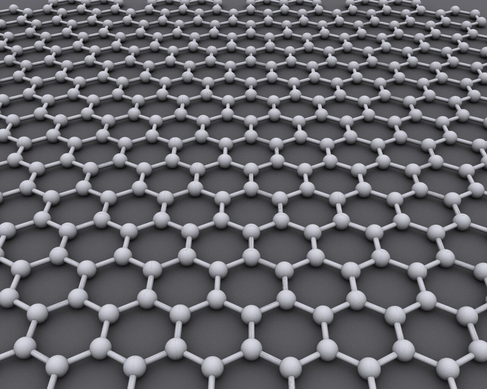

# 26_碳纳米管与材料 - 图片索引

> 碳纳米管、石墨烯材料结构图
> 生成时间: 2026-02-01 23:27:01

## 统计
- 图片数量: 1

---

## 图片列表

| 预览 | 标题 | 来源 | 许可协议 |
|------|------|------|----------|
|  | Graphene Molecular Structure | [Wikimedia Commons](https://commons.wikimedia.org/wiki/File:Graphen.jpg) | CC BY-SA 3.0 |

---

## 详细信息

### Graphene Molecular Structure

- **文件名**: `graphene_structure.jpg`
- **来源**: [Wikimedia Commons](https://commons.wikimedia.org/wiki/File:Graphen.jpg)
- **许可协议**: CC BY-SA 3.0
- **原始链接**: [点击查看](https://commons.wikimedia.org/wiki/File:Graphen.jpg)

---

